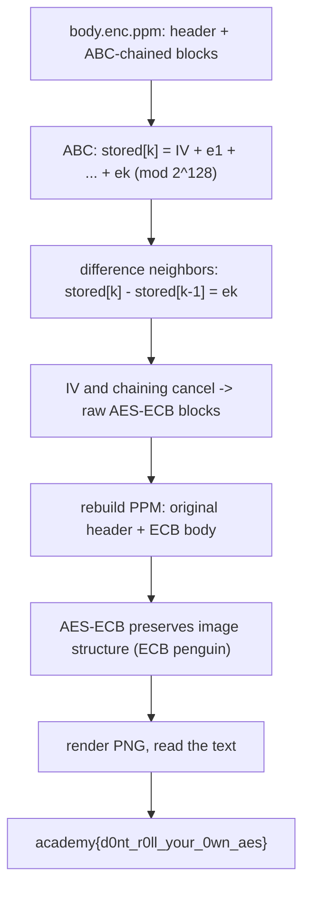

<h1 align="center">🖼️ AES-ABC</h1>
<p align="center">
  <b>picoCTF 2019 Cryptography Write-Up</b>
</p>
<p align="center">
  
  
  
  
</p>
<p align="center">
  A Homemade Chaining Mode, a Telescoping Sum, and the ECB Penguin
</p>

---

# 📋 Environment

| Item       | Value                                                        |
| ---------- | ------------------------------------------------------------ |
| Event      | picoCTF 2019 (run on CyLab Security Academy)                 |
| Category   | Cryptography                                                |
| Author     | waituckw                                                    |
| Handout    | `aes-abc.py` (encryptor), `body.enc.ppm` (encrypted image)  |
| Task       | Recover the flag from the encrypted PPM                     |
| Tools Used | `python`, ImageMagick                                        |

---

# 🗺️ Overview

> The author replaced AES-ECB's block independence with "Addition Block Chaining": each stored block is the running sum (mod 2^128) of the IV and all AES-ECB blocks up to that point. That sum telescopes, so subtracting each stored block from the one before it cancels the IV and the chaining and hands back the raw AES-ECB blocks. AES-ECB encrypts identical plaintext blocks to identical ciphertext blocks, so an encrypted image still shows its outline: the "ECB penguin." Rebuild the PPM from the recovered ECB blocks and the flag is legible in the picture. No key needed.

Steps:
* Read `aes-abc.py` and see the running-sum chaining
* Difference consecutive stored blocks to recover the AES-ECB blocks
* Rebuild the PPM and read the flag off the image

---

# 📑 Table of Contents

1. [What ABC Actually Does](#what-abc-actually-does)
2. [The Sum Telescopes](#the-sum-telescopes)
3. [Recovering the ECB Blocks](#recovering-the-ecb-blocks)
4. [The ECB Penguin](#the-ecb-penguin)
5. [Flag](#-flag)
6. [Solution Summary](#solution-summary)
7. [Lessons and Takeaways](#lessons-and-takeaways)

---

# What ABC Actually Does

The encryptor first does plain AES-ECB on the image body, then post-processes the ciphertext blocks with its own chaining:

```python
blocks = [ct blocks...]          # e1, e2, ..., en  (AES-ECB output)
iv = os.urandom(16)
blocks.insert(0, iv)             # [iv, e1, e2, ..., en]

for i in range(len(blocks) - 1):
    prev_blk = int(blocks[i].hex(), 16)      # already-updated block i
    curr_blk = int(blocks[i + 1].hex(), 16)  # raw ECB block i+1
    n_curr_blk = (prev_blk + curr_blk) % UMAX  # UMAX = 2**128
    blocks[i + 1] = to_bytes(n_curr_blk)
```

Each block is added, as a 128-bit integer, to the block before it, modulo `2^128`.

> **In plain terms:** the author tried to hide AES-ECB's tell (identical input blocks give identical output blocks) by adding every block into the next, like a rolling total. The problem is that a rolling total is trivially reversible.

---

# The Sum Telescopes

Because `prev_blk` is the already-modified block, the stored blocks are cumulative sums:

```text
stored[0] = IV
stored[1] = IV + e1
stored[2] = IV + e1 + e2
stored[k] = IV + (e1 + e2 + ... + ek)          (all mod 2^128)
```

Subtracting neighbors cancels everything except one ECB block:

```text
stored[k] - stored[k-1] = ek   (mod 2^128)
```

The IV and the entire chain drop out. No key, no IV recovery, just subtraction.

---

# Recovering the ECB Blocks

Keep the three-line PPM header, split the body into 16-byte blocks (`stored[0]` is the IV), and difference consecutive blocks to rebuild the AES-ECB image body:

```python
BLOCK = 16; UMAX = 256**BLOCK
d = open('body.enc.ppm','rb').read()

hdr = b''; rest = d
for _ in range(3):                      # P6 / "W H" / 255
    i = rest.index(b'\n') + 1
    hdr += rest[:i]; rest = rest[i:]

blocks = [rest[i*BLOCK:(i+1)*BLOCK] for i in range(len(rest)//BLOCK)]
ecb = b''
for k in range(1, len(blocks)):
    a = int.from_bytes(blocks[k], 'big')
    b = int.from_bytes(blocks[k-1], 'big')
    ecb += ((a - b) % UMAX).to_bytes(16, 'big')

open('ecb_body.ppm','wb').write(hdr + ecb)   # header: P6  1895 820  255
```

---

# The ECB Penguin

`ecb_body.ppm` is the image encrypted with raw AES-ECB. Since ECB maps equal plaintext blocks to equal ciphertext blocks, the flat background of the flag image stays uniform and the lettering stays distinct, so the text is readable straight out of the ciphertext:

```bash
convert ecb_body.ppm ecb.png      # then just look at it
```

The rendered image shows the flag text in the classic ECB-penguin style against a uniform background.

---

# 🚩 Flag

```text
academy{d0nt_r0ll_your_0wn_aes}
```

The flag is the lesson: do not roll your own AES.

---

# Solution Summary



---

# Lessons and Takeaways

* **A reversible chain is no chain.** Adding each block into the next is a cumulative sum, and neighbor subtraction undoes it completely, IV included. Real chaining (CBC) feeds ciphertext through the block cipher, which is not linearly invertible.
* **ECB leaks structure.** Once the ABC layer is peeled off, the underlying mode is ECB, whose equal-block-to-equal-block property renders any image's outline visible without the key. That is the whole "ECB penguin" phenomenon.
* **The hint named the method.** "Figure out what the flag looks like in ECB form" points exactly at reducing ABC back to ECB and viewing the picture.
* **Don't roll your own crypto.** A homemade mode bolted onto AES reintroduced the very weakness ECB is infamous for. Use vetted authenticated modes (such as AES-GCM) instead.

---

Written by **TheDingo8MyBaby**
picoCTF 2019 • AES-ABC • flag: academy{d0nt_r0ll_your_0wn_aes}
