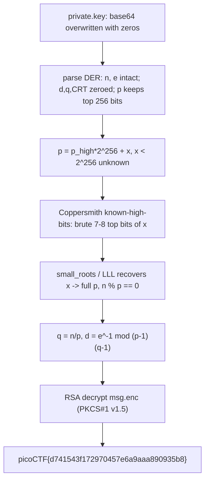

<h1 align="center">🗝️ corrupt-key-1</h1>
<p align="center">
  <b>picoMini by redpwn Cryptography Write-Up</b>
</p>
<p align="center">
  
  
  
  
</p>
<p align="center">
  A Half-Zeroed RSA Key, the Known-High-Bits Factor Attack, and a Short Brute-Force
</p>

---

# 📋 Environment

| Item       | Value                                                        |
| ---------- | ------------------------------------------------------------ |
| Event      | picoMini by redpwn (run on CyLab Security Academy)           |
| Category   | Cryptography                                                |
| Author     | Tux                                                         |
| Handout    | `private.key` (corrupted RSA key), `msg.enc`                |
| Task       | Repair the key and decrypt the message                      |
| Tools Used | `python` (`pycryptodome`), Coppersmith / LLL (`fpylll` or Sage) |

---

# 🗺️ Overview

> The private key is a PEM RSA key whose base64 has been overwritten with `A`s (zero bytes) in several places. Parsing the DER shows `n` and `e` survive intact, `d`, `q`, and the CRT parameters are entirely zeroed, and the prime `p` keeps only its **top 256 bits** (its low 256 bits are zeroed). Knowing half of a factor's bits is exactly Coppersmith's "known high bits" attack: brute-force a handful of the unknown top bits to clear the boundary, then recover the rest with lattice reduction. With `p` recovered, `q = n/p`, rebuild `d`, and decrypt `msg.enc`.

Steps:
* Parse the corrupted DER and see which fields survived
* Recognize 256 known high bits of `p` as a Coppersmith instance
* Brute a few top unknown bits + `small_roots` to recover `p`
* Standard RSA: `q = n/p`, `d`, decrypt

---

# 📑 Table of Contents

1. [Parsing the Corrupted Key](#parsing-the-corrupted-key)
2. [Why Half of p Is Enough](#why-half-of-p-is-enough)
3. [Recovering p with Coppersmith](#recovering-p-with-coppersmith)
4. [Standard RSA Decryption](#standard-rsa-decryption)
5. [Flag](#-flag)
6. [Solution Summary](#solution-summary)
7. [Lessons and Takeaways](#lessons-and-takeaways)

---

# Parsing the Corrupted Key

An RSA private key is a DER `SEQUENCE` of nine integers: `version, n, e, d, p, q, dP, dQ, qInv`. Walking the TLV structure of the decoded base64 shows what the corruption left behind:

```text
version : 0
n       : 1024-bit   (intact)   0xb8cb1cca...9c024f
e       : 0x10001    (intact)
d       : 0          (zeroed, 128 bytes)
p       : 512-bit, but only the TOP 256 bits are real:
          0xe700568ff506bd5892af92592125e06cbe9bd45dfeafe931a333c13463023d4f
          followed by 256 zero bits
q,dP,dQ,qInv : 0     (zeroed)
```

So we hold `n`, `e`, and the high half of `p`. Everything needed to decrypt (`d`) is gone, but `d` follows from the factorization, and we are halfway to factoring already.

> **In plain terms:** the key file got partially wiped. The public parts (`n`, `e`) are fine, and crucially the top half of one secret prime survived. Half a prime turns out to be enough to recover the whole thing.

---

# Why Half of p Is Enough

Coppersmith's theorem on factoring with known bits says: if you know roughly half the bits of a factor `p` of `n`, you can recover `p` in polynomial time. Concretely, write

```text
p = p_high * 2^256 + x,     0 <= x < 2^256   (x = the unknown low 256 bits)
```

and look for the small root `x` of `f(x) = p_high*2^256 + x` modulo the unknown factor `p` (which divides `n`). Lattice reduction (LLL) finds such a root when `x` is below `n^(1/4) = 2^256`.

Here `x < 2^256` sits exactly at that boundary, which is the one awkward spot where plain Coppersmith stalls. The fix is to **brute-force the top few unknown bits** (7 or 8), which shrinks the remaining unknown to `2^248`-`2^249`, strictly under the bound, so `small_roots` succeeds for the correct guess.

---

# Recovering p with Coppersmith

Using Sage's `small_roots` (or an equivalent `fpylll` lattice), iterate the top bits and reduce:

```python
# n, e, p_high as parsed above; p = p_high<<256 + x
PR.<x> = PolynomialRing(Zmod(n))
for guess in range(2**7, -1, -1):
    a = (p_high << 256) + (guess << (256 - 7))
    f = (a + x).monic()
    for r in f.small_roots(X=2**(256-7), beta=0.4, m=18):
        p = int(a + int(r))
        if n % p == 0:
            break
```

The recovered prime (this instance):

```text
p = 12098520864598198757294135341465388062087431109285224283440
    314414683283061468500249596026217234382854875647811812632201
    834942205849073893715844547051090363
```

and `n % p == 0` confirms it.

(No Sage available? The same works in pure Python with `fpylll` for the LLL step: brute the top 8 bits across CPU cores and reduce a Howgrave-Graham lattice with `m = 24`.)

---

# Standard RSA Decryption

With one prime known, the rest is textbook RSA:

```python
from Crypto.Util.number import long_to_bytes, inverse
q = n // p
d = inverse(e, (p - 1) * (q - 1))
c = int.from_bytes(open('msg.enc', 'rb').read(), 'big')
m = pow(c, d, n)
print(long_to_bytes(m))
```

The plaintext is PKCS#1 v1.5 padded and ends with the flag:

```text
\x02 ...random padding... \x00 Here is your flag: picoCTF{d741543f172970457e6a9aaa890935b8}
```

---

# 🚩 Flag

```text
picoCTF{d741543f172970457e6a9aaa890935b8}
```

The flag is submitted exactly as it appears in the decrypted message.

---

# Solution Summary



---

# Lessons and Takeaways

* **Half a prime is a full compromise.** Coppersmith's theorem recovers `p` from ~50% of its bits, so leaking the top half of one RSA prime is fatal. There is no safe partial exposure of a factor.
* **Parse the DER, not the PEM.** Walking the TLV structure reveals exactly which fields survived the corruption and how many bits of `p` remain, which is what frames the attack.
* **Brute the boundary.** Exactly-half-known sits at Coppersmith's `n^(1/4)` limit, where plain `small_roots` stalls. Guessing 7-8 top bits drops the unknown strictly under the bound and makes each lattice reduction succeed.
* **Rebuild, don't recompute.** Once any one prime is known, the entire private key (`q`, `d`, CRT values) follows from `n` and `e`, so a single recovered factor "fixes" the whole corrupted key.

---

Written by **TheDingo8MyBaby**
picoMini by redpwn • corrupt-key-1 • flag: picoCTF{d741543f172970457e6a9aaa890935b8}
