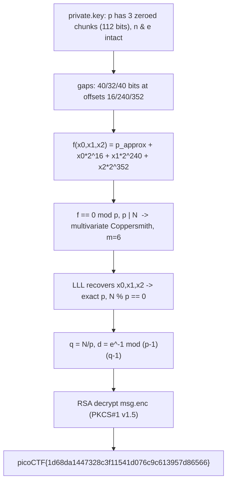

<h1 align="center">🗝️ corrupt-key-2</h1>
<p align="center">
  <b>picoMini by redpwn Cryptography Write-Up</b>
</p>
<p align="center">
  
  
  
  
</p>
<p align="center">
  Three Zeroed Chunks in a Prime, One Trivariate Polynomial, and LLL
</p>

---

# 📋 Environment

| Item       | Value                                                          |
| ---------- | -------------------------------------------------------------- |
| Event      | picoMini by redpwn (run on CyLab Security Academy)             |
| Category   | Cryptography                                                  |
| Author     | Tux                                                           |
| Handout    | `private.key` (corrupted RSA key), `msg.enc`                  |
| Task       | Repair the key and decrypt the message                        |
| Tools Used | `python` (`pycryptodome`), multivariate Coppersmith / LLL      |

---

# 🗺️ Overview

> This is the sequel to corrupt-key-1. The key is again a PEM RSA key with its base64 partly overwritten by zeros, but this time the damage to prime `p` is worse: instead of one missing half, there are **three separate zeroed chunks** inside `p` totalling **112 unknown bits**. Those bits are too many and too scattered to brute-force (2^112) and they are not one contiguous block, so single-variable Coppersmith does not apply. The fix is **multivariate** Coppersmith: model the three gaps as three unknowns in one polynomial that is zero modulo `p`, and solve with LLL. Recover `p`, then standard RSA decryption gives the flag.

Steps:
* Parse the DER and locate the three zeroed chunks in `p`
* Build `f(x0,x1,x2) = p_approx + x0*2^16 + x1*2^240 + x2*2^352`
* Run multivariate Coppersmith to recover the three chunks
* `q = N/p`, rebuild `d`, decrypt

---

# 📑 Table of Contents

1. [Parsing the Damage](#parsing-the-damage)
2. [Why This Needs Multivariate Coppersmith](#why-this-needs-multivariate-coppersmith)
3. [Building the Polynomial](#building-the-polynomial)
4. [Recovering p with LLL](#recovering-p-with-lll)
5. [Standard RSA Decryption](#standard-rsa-decryption)
6. [Flag](#-flag)
7. [Solution Summary](#solution-summary)
8. [Lessons and Takeaways](#lessons-and-takeaways)

---

# Parsing the Damage

Walking the DER `SEQUENCE` of the key shows `n` and `e` intact, `d`/`q`/CRT params zeroed, and `p` present but pocked with three zero gaps. `openssl rsa -text` makes the gaps obvious:

```text
prime1:
    00:fe:89:84:40:7b:08:16:cc:28:e5:cc:c6:bb:73:
    79:00:00:00:00:00:ca:38:06:dd:2c:fd:fc:8d:61:   <- gap 1 (5 zero bytes)
    6b:00:00:00:00:61:09:a4:db:e3:87:6b:8d:1b:8a:   <- gap 2 (4 zero bytes)
    dc:91:75:df:ba:0e:1e:f3:18:80:16:48:d6:00:00:
    00:00:00:a0:5b                                  <- gap 3 (5 zero bytes)
```

As a single hex string the known prime (gaps as zeros) is:

```text
p_approx = 0xfe8984407b0816cc28e5ccc6bb7379 0000000000 ca3806dd2cfdfc8d616b
           00000000 6109a4dbe3876b8d1b8adc9175dfba0e1ef318801648d6 0000000000 a05b
```

The three gaps are **40, 32, and 40 bits** wide, at bit offsets **16, 240, and 352** from the bottom of `p`.

> **In plain terms:** we have almost the whole secret prime, but three little windows in the middle got blanked out. 112 blanked bits in three places is far too many to guess, and because they sit in separate windows the simpler one-unknown attack from corrupt-key-1 no longer fits.

---

# Why This Needs Multivariate Coppersmith

Coppersmith's method finds small roots of a polynomial modulo an unknown divisor of `N`. In corrupt-key-1 the single missing block was one unknown, so a one-variable polynomial sufficed. Here the three gaps are three independent unknowns at fixed, known positions, so the natural model is a polynomial in three variables that vanishes modulo `p`. The total unknown (112 bits) is below the limit that multivariate Coppersmith can handle for a 512-bit prime of a 1024-bit modulus (~150 bits), so it is solvable.

---

# Building the Polynomial

Let `x0, x1, x2` be the integer values of the three chunks. The true prime is the known skeleton plus each chunk shifted into place:

```text
f(x0, x1, x2) = p_approx + x0 * 2^16 + x1 * 2^240 + x2 * 2^352
with bounds   x0 < 2^40,  x1 < 2^32,  x2 < 2^40
```

Since `p | N`, the true `(x0,x1,x2)` is a root of `f` modulo `p`:

```text
f(x0, x1, x2) ≡ 0  (mod p),   p | N
```

---

# Recovering p with LLL

This is the part to reproduce from scratch, with no prior knowledge of `p`. The multivariate Coppersmith routine below (chrsow's implementation) builds the shift-polynomial lattice, reduces it with LLL, reconstructs integer polynomials from the short vectors, and solves the resulting system by Newton iteration. Run it in **SageMath** (`sage solve.sage`):

```python
# chrsow multivariate Coppersmith -- https://gist.github.com/chrsow/f766786bfcb0034d8c6c9372b822222c
class IIter:
    def __init__(self, m, n):
        self.m, self.n = m, n
        self.arr = [0]*n; self.sum = 0; self.stop = False
    def __iter__(self): return self
    def __next__(self):
        if self.stop: raise StopIteration
        ret = tuple(self.arr); self.stop = True
        for i in range(self.n-1, -1, -1):
            if self.sum == self.m or self.arr[i] == self.m:
                self.sum -= self.arr[i]; self.arr[i] = 0; continue
            self.arr[i] += 1; self.sum += 1; self.stop = False; break
        return ret

def coppersmith(f, bounds, m=1, t=1):
    n = f.nvariables(); N = f.base_ring().cardinality()
    f /= f.coefficients().pop(0)          # make monic
    f = f.change_ring(ZZ); x = f.parent().objgens()[1]
    g, monomials, Xmul = [], [], []
    for ii in IIter(m, n):
        k = ii[0]
        g_tmp = f^k * N^max(t-k, 0); monomial = x[0]^k; Xmul_tmp = bounds[0]^k
        for j in range(1, n):
            g_tmp *= x[j]^ii[j]; monomial *= x[j]^ii[j]; Xmul_tmp *= bounds[j]^ii[j]
        g.append(g_tmp); monomials.append(monomial); Xmul.append(Xmul_tmp)
    B = Matrix(ZZ, len(g), len(g))
    for i in range(B.nrows()):
        for j in range(i+1):
            if j == 0: B[i,j] = g[i].constant_coefficient()
            else:      B[i,j] = g[i].monomial_coefficient(monomials[j]) * Xmul[j]
    B = B.LLL()
    h = []
    for i in range(B.nrows()):
        h_tmp = 0
        for j in range(B.ncols()):
            if j == 0: h_tmp += B[i,j]
            else:
                assert B[i,j] % Xmul[j] == 0
                h_tmp += ZZ(B[i,j] // Xmul[j]) * monomials[j]
        h.append(h_tmp)
    x_ = [var(f'x{i}') for i in range(n)]
    for ii in Combinations(range(len(h)), k=n):
        F = symbolic_expression([h[i](x) for i in ii]).function(x_)
        jac = jacobian(F, x_); v = vector([b // 2 for b in bounds])
        for _ in range(200):
            kwargs = {f'x{i}': v[i] for i in range(n)}
            v = vector(numerical_approx(d, prec=200)
                       for d in (v - jac(**kwargs).inverse() * F(**kwargs)))
        v = [int(_.round()) for _ in v]
        if h[0](v) == 0: return v
    return []

# --- driver: our exact values (nothing here reveals p) ---
N  = 0xc20d4f0792f162e3f3486f47c2c5b05696ba5c81ec09f5386bf741b7289b85e2d744559825a23b0ae094da214f3158344e5d5ba86fb1ecd1f40c8682a7bee55021eba772e23793001a38b9cccbfdc1d9316cccc3b79acd045c512b44e0f3697383958113a280791e17c23fe80fa38099e4907f70f4d228285aac69ed2d3bcf99
hp = 0xfe8984407b0816cc28e5ccc6bb73790000000000ca3806dd2cfdfc8d616b000000006109a4dbe3876b8d1b8adc9175dfba0e1ef318801648d60000000000a05b
PR.<x0,x1,x2> = PolynomialRing(Zmod(N), 3)
f = hp + 2^16*x0 + 2^240*x1 + 2^352*x2        # the three gaps as unknowns
x0, x1, x2 = coppersmith(f, bounds=(2^40, 2^32, 2^40), m=6)
p = int(f(x0, x1, x2))
assert N % p == 0
print(p)
```

Running it recovers the exact prime:

```text
p = 13331193528989238711281209084398307362804767638940062463831686
    008684031051105241659991501990308217733345218358352985573809576
    597628552151562857633661821019
```

and `N % p == 0` confirms it. (No SageMath available? The identical lattice can be built with `fpylll` in pure Python: construct the same shift polynomials over the integers, reduce with `LLL.reduction`, reconstruct the `h` polynomials, and solve the small system with an `mpmath` Newton iteration. The lattice construction is identical; only the host language changes.)

> **In plain terms:** the lattice treats "the three missing numbers must make `p` divide `N`" as a geometry problem, and LLL snaps straight to the one short vector that encodes the true chunk values.

---

# Standard RSA Decryption

With `p` known the rest is textbook RSA:

```python
from Crypto.Util.number import long_to_bytes, inverse
q = N // p
d = inverse(e, (p - 1) * (q - 1))
c = int.from_bytes(open('msg.enc', 'rb').read(), 'big')
print(long_to_bytes(pow(c, d, N)))
```

The plaintext is PKCS#1 v1.5 padded and ends with the flag:

```text
\x02 ...random padding... \x00 Message successfully decrypted - your flag: picoCTF{1d68da1447328c3f11541d076c9c613957d86566}
```

---

# 🚩 Flag

```text
picoCTF{1d68da1447328c3f11541d076c9c613957d86566}
```

The flag is submitted exactly as it appears in the decrypted message.

---

# Solution Summary



---

# Lessons and Takeaways

* **Scattered unknowns call for multivariate Coppersmith.** One contiguous gap is univariate; several gaps at known positions become one variable each in a single polynomial that is zero modulo `p`.
* **Count the bits before choosing an attack.** 112 unknown bits defeats brute force (2^112) but stays under the multivariate Coppersmith ceiling for this prime size, so lattice reduction is the right, and feasible, tool.
* **Positions matter as much as sizes.** The bit offsets (16, 240, 352) define the `2^S` shifts in the polynomial; reading them off the `openssl rsa -text` dump is what makes the model exact.
* **One prime repairs the whole key.** As in corrupt-key-1, recovering `p` yields `q`, `d`, and every CRT value from `N` and `e`, so the "corrupted" key is fully reconstructable.

---

Written by **TheDingo8MyBaby**
picoMini by redpwn • corrupt-key-2 • flag: picoCTF{1d68da1447328c3f11541d076c9c613957d86566}
