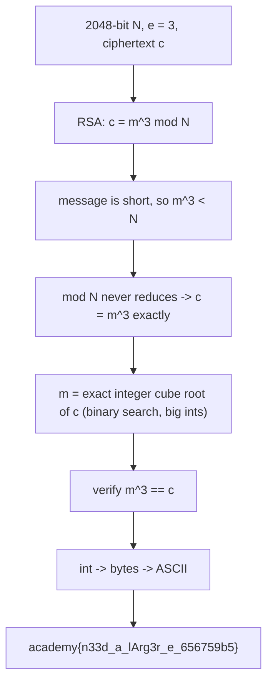

<h1 align="center">🔓 miniRSA</h1>
<p align="center">
  <b>picoCTF 2019 Cryptography Write-Up</b>
</p>
<p align="center">
  
  
  
  
</p>
<p align="center">
  A Tiny Public Exponent, No Modular Wraparound, and a Plain Cube Root
</p>

---

# 📋 Environment

| Item       | Value                                                        |
| ---------- | ------------------------------------------------------------ |
| Event      | picoCTF 2019 (run on CyLab Security Academy)                 |
| Category   | Cryptography                                                |
| Author     | speeeday / Danny                                            |
| Handout    | `ciphertext` (2048-bit `N`, `e = 3`, ciphertext `c`)        |
| Task       | Decrypt the RSA ciphertext                                  |
| Tools Used | `python` (integer arithmetic only)                          |

---

# 🗺️ Overview

> The key is a full 2048-bit modulus, but the public exponent is `e = 3`. RSA encryption is `c = m^e mod N`. When the message `m` is short, `m^3` is smaller than `N`, so the `mod N` never actually reduces anything and `c = m^3` as plain integers. Recovering `m` is then just taking the exact integer cube root of `c`. No private key, no factoring.

Steps:
* Notice `e = 3` and suspect the message is small (the hint: "Something seems a bit small")
* Take the exact integer cube root of `c`
* Confirm `m^3 == c`, then decode the bytes to ASCII

---

# 📑 Table of Contents

1. [The Small-Exponent Weakness](#the-small-exponent-weakness)
2. [Why the Modulus Does Nothing Here](#why-the-modulus-does-nothing-here)
3. [Taking the Cube Root Without Losing Precision](#taking-the-cube-root-without-losing-precision)
4. [Decoding the Message](#decoding-the-message)
5. [Flag](#-flag)
6. [Solution Summary](#solution-summary)
7. [Lessons and Takeaways](#lessons-and-takeaways)

---

# The Small-Exponent Weakness

RSA encrypts as:

```text
c = m^e mod N
```

with `e = 3` here. The modulus `N` is 2048 bits, which is fine for the key, but `e = 3` is dangerous whenever the plaintext is short. The third hint ("How could having too small an e affect the security of this 2048 bit key?") points straight at it.

> **In plain terms:** encryption cubes the message and then wraps it around a huge number. If the cubed message is still smaller than that huge number, the wrap never happens, and cubing is something we can simply undo by taking a cube root.

---

# Why the Modulus Does Nothing Here

The message `m` is a short flag, so `m` is on the order of a few hundred bits. Cubing it gives `m^3`, at most roughly three times that bit length, which is still far below the 2048-bit modulus `N`. Since `m^3 < N`:

```text
c = m^3 mod N = m^3      (the reduction never triggers)
```

So `c` is literally the cube of the message, and:

```text
m = c^(1/3)
```

---

# Taking the Cube Root Without Losing Precision

The catch (hint 3: "Make sure you don't lose precision, the numbers are pretty big") is that a floating-point cube root of a ~600-bit integer loses accuracy. Use an exact integer cube root by binary search, all in Python's big integers:

```python
c = 1434021793376841821609560098489408479192223685550855374859777664048210617936350723292752755757488572951771692237582464563840658139882111821336866522567705568800265307534002852794784325687092814938597383602540453460860128473220932360168549

def icbrt(n):
    lo, hi = 0, 1 << ((n.bit_length() + 2)//3 + 2)
    while lo < hi:
        mid = (lo + hi)//2
        if mid**3 < n: lo = mid + 1
        else:          hi = mid
    return lo

m = icbrt(c)
assert m**3 == c            # exact: no modular reduction happened
```

The assertion `m**3 == c` passes, which confirms the message really did fit under the modulus and the cube root is exact.

---

# Decoding the Message

Convert the recovered integer to bytes (hex, padded to an even length) and read it as ASCII:

```python
h = format(m, 'x')
if len(h) % 2: h = '0' + h
print(bytes.fromhex(h).decode())
# academy{n33d_a_lArg3r_e_656759b5}
```

---

# 🚩 Flag

```text
academy{n33d_a_lArg3r_e_656759b5}
```

The flag text spells out the lesson: need a larger e.

---

# Solution Summary



---

# Lessons and Takeaways

* **Small `e` plus small `m` breaks RSA.** With `e = 3`, if `m^3 < N` the ciphertext is just the cube of the message and a cube root recovers it, no private key required.
* **The modulus size is a red herring.** A 2048-bit `N` looks strong, but it is irrelevant when the reduction never fires. Security here depends on the padding and exponent, not the key length.
* **Use exact integer roots.** A floating-point `c ** (1/3)` loses precision on big integers; integer binary search with a `m**3 == c` check gives a provably exact answer.
* **Proper padding prevents this.** Real RSA pads the message (OAEP) so `m` is always near the size of `N`, which keeps `m^e` above `N` and forces a genuine modular reduction.

---

Written by **TheDingo8MyBaby**
picoCTF 2019 • miniRSA • flag: academy{n33d_a_lArg3r_e_656759b5}
