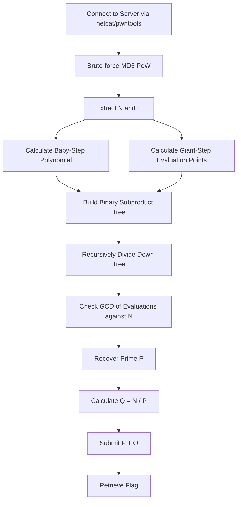

<h1 align="center">🧮 It's Not My Fault 2</h1>
<p align="center">
  <b>picoCTF Cryptography Write-Up</b>
</p>
<p align="center">
  
  
  
</p>
<p align="center">
  RSA, Chinese Remainder Theorem, Baby-Step Giant-Step, and Fast Multipoint Evaluation
</p>

---

# 📋 Environment

| Item       | Value                                                                                                            |
| ---------- | ---------------------------------------------------------------------------------------------------------------- |
| Category   | Cryptography                                                                                                     |
| Difficulty | Medium (400 pts)                                                                                                 |
| Tools Used | SageMath, Python 3, pwntools, Docker, Kali Linux                                                                 |
| Techniques | Proof of Work (MD5), Fast Multipoint Evaluation, Subproduct Trees, Fermat's Little Theorem                       |

---

# 🗺️ Overview

It's Not My Fault 2 is a heavy cryptography challenge centered around a specific vulnerability in RSA implementations using the Chinese Remainder Theorem (CRT). Unlike traditional fault attacks, this challenge exploits an exceptionally small CRT exponent (dp). 

The challenge walks through:
* 🔓 Bypassing a dynamic Proof of Work (PoW) check
* 🧮 Understanding the math behind breaking small dp exponents
* 🌲 Implementing a subproduct tree for fast polynomial evaluation
* 🐛 Debugging recursion and array sizing limits in SageMath
* 🔑 Recovering the prime factors P and Q to retrieve the flag

Standard brute-forcing is mathematically infeasible here. Success requires splitting the exponent search space using a baby-step giant-step algorithm and evaluating it efficiently using SageMath.

---

# 📑 Table of Contents

1. [Step 1 - The Proof of Work](#step-1---the-proof-of-work)
2. [Step 2 - The Mathematical Theory](#step-2---the-mathematical-theory)
3. [Step 3 - Building the Subproduct Tree](#step-3---building-the-subproduct-tree)
4. [Step 4 - Fixing the Logic Bugs](#step-4---fixing-the-logic-bugs)
5. [Step 5 - Executing the Attack](#step-5---executing-the-attack)
6. [Attack Chain Summary](#attack-chain-summary)
7. [Lessons and Takeaways](#lessons-and-takeaways)

---

# Step 1 - The Proof of Work

Upon connecting to the server at `wily-courier.picoctf.net:61924`, the application immediately halts and demands a Proof of Work (PoW). 

The server provides a 5-character prefix and requests a string that, when hashed with MD5, ends in a specific 6-character hexadecimal suffix.

Since the string space is small, this can be brute-forced locally using Python's `itertools` and `hashlib`:

```python
def solve_pow(prefix, suffix):
    print(f"Solving PoW for prefix {prefix} and suffix {suffix}...")
    for length in range(1, 6):
        for combo in itertools.product(string.ascii_letters + string.digits, repeat=length):
            test_str = prefix + "".join(combo)
            if hashlib.md5(test_str.encode()).hexdigest()[-6:] == suffix:
                print(f"PoW Solved! String: {test_str}")
                return test_str
```

Once authenticated, the server dynamically generates and provides the public modulus N and a "Clue" exponent E.

> [!TIP]
> CTF servers often use Proof of Work checks to prevent denial-of-service attacks or to stop players from constantly reconnecting to brute-force weak parameters. Always script the PoW solver directly into your exploit to save time.

---

# Step 2 - The Mathematical Theory

The challenge description implies that the exponent dp is at most 36 bits (dp <= 2^36).

To avoid testing 2^36 individual possibilities, we split the search space using a baby-step giant-step technique. We define an integer L = 2^18 and express dp as:

dp = a * L + b

By Fermat's Little Theorem, we know that for any integer m:

m^(e * dp - 1) ≡ 1 (mod p)

Substituting our split equation into this theorem yields:

m^(e * (a * L + b) - 1) ≡ 1 (mod p)
m^(e * a * L) * m^(e * b - 1) - 1 ≡ 0 (mod p)

This equation allows us to construct a polynomial f(x) to handle the "baby steps" (b) and evaluate it at specific "giant step" points (a) to find our prime factor P.

---

# Step 3 - Building the Subproduct Tree

Evaluating a massive polynomial 2^18 times naively would take far too long. Instead, we use SageMath to perform fast multipoint evaluation via a subproduct tree.

The script constructs a binary tree where each node is the product of its children. The polynomial is then recursively divided down the branches using modulo arithmetic. 

```python
def subproductTree(points, mo):
    FR.<x> = PolynomialRing( IntegerModRing(mo) )
    base = [Node(x - p) for p in points]
    return constructTree(base, mo)

def downTree(f, tree, mo):
    FR.<x> = PolynomialRing( IntegerModRing(mo) )
    if len(f.coefficients()) == 1:
        return f.coefficients()
    
    r0 = f.quo_rem(tree.left.data)[1]
    r1 = f.quo_rem(tree.right.data)[1]
    
    return downTree(r0, tree.left, mo) + downTree(r1, tree.right, mo)
```

---

# Step 4 - Fixing the Logic Bugs

During initial execution, two major errors occurred that required patching.

1. **Recursion Limit:** SageMath's default recursion depth was too shallow for a tree of this size, causing a `RecursionError`. This was solved by injecting `sys.setrecursionlimit(50000)` into the script.
2. **Binary Tree Parity:** The original code evaluated the points across `range(1, L)`, which produced 262,143 items. Because binary trees require perfect pairs to divide cleanly, the odd number caused an infinite loop. This was fixed by evaluating exactly 262,144 giant steps using `range(0, L)`.

Corrected Giant-Step points array:

```python
L = 2**18
points = [m.powermod(e * L * a, n) for a in range(0, L)]
```

> [!IMPORTANT]
> When building custom binary tree functions from scratch, always ensure your input arrays are exact powers of 2. Failing to pad or truncate data will cause branching logic to fail silently or recursively loop.

---

# Step 5 - Executing the Attack

Because Kali Linux had dependency conflicts with `sagemath`, the exploit was executed safely inside a Docker container using the official SageMath image.

Execution output:

```text
sage@f6ee9d0caa65:~$ sage exploit.sage
[+] Opening connection to wily-courier.picoctf.net on port 61924: Done
Solving PoW for prefix 66169 and suffix 0f3fc7...
PoW Solved! String: 66169drUZY

[+] Extracted N: 116653205439005483683925635903686912559337034917995114272545683007751054002742231077506183478297193080748550371364505463513983758938432350978029652585796026708243723237997481399480868815172029046362822075322164618040197949427964314099814155173341405447500927978011376807877013915794095351167805407108086747523
[+] Extracted E: 95683337214007306978617334908249219432526389397713278439167233627916080773754024068784232924583019789655452255460194729915196316047168404554184207420927102545009671790160622219899093587914563329329202948481978151984862564546775865497671824223638308440553113195122977654559652999005336895915464797735645479923
Done building poly.
Building subproduct tree...
Done building base of subproduct tree. Took 0.08429261445999145 minutes.
Done building subproduct tree. Took 0.15924074252446493 minutes.

[+] Found P: 11911140123965467194916432352138482825085736689232850301718426836985943409158302238645382654730381859034807707661102218390752916796497726121113493853123887
[+] Found Q: 9793622123905397935338114809501726965624339612253079289391096990903161180520409212818846522715075547233100116545567448211920692579768506043618288301800429
[+] Sending P + Q: 21704762247870865130254547161640209790710076301485929591109523827889104589678711451464229177445457406267907824206669666602673609376266232164731782154924316
[+] Receiving all data: Done (72B)
[*] Closed connection to wily-courier.picoctf.net port 61924
```

After iterating through the subproduct tree evaluations, the script successfully calculates the greatest common divisor against N to find P. It derives Q by calculating N / P, and submits the sum P + Q to the server to receive the flag.

---

# 🚩 Flag

```text
picoCTF{REDACTED}
```

---

# Attack Chain Summary



---

# Lessons and Takeaways

## Vulnerabilities Encountered

|#|Vulnerability|CWE|Location|
|---|---|---|---|
|1|Small CRT Exponent Leakage|CWE-310|RSA Key Generation|
|2|Predictable Cryptographic Parameters|CWE-330|dp <= 2^36|

---

## Key Habits Reinforced

* **Script the Boring Stuff:** Always integrate PoW solvers directly into the main exploit script to maintain speed and efficiency during testing.
* **Isolate Environments:** When package managers fail due to dependency conflicts, drop into a Docker container. It guarantees a pristine execution environment without breaking the host OS.
* **Validate Mathematical Arrays:** When utilizing recursive divide-and-conquer algorithms, always ensure array boundaries and sizes perfectly align with mathematical expectations to prevent infinite loops.

---

Written by **TheDingo8MyBaby**
picoCTF • It's Not My Fault 2
