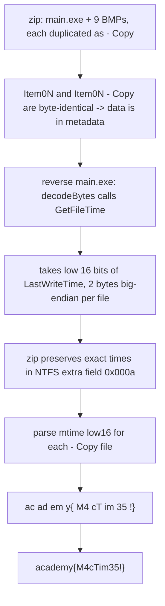

<h1 align="center">🍔 B1g_Mac</h1>
<p align="center">
  <b>picoCTF 2019 Forensics Write-Up</b>
</p>
<p align="center">
  
  
  
  
</p>
<p align="center">
  The Flag Was Never in the Pixels. It Was in the MAC Times.
</p>

---

# 📋 Environment

| Item       | Value                                                        |
| ---------- | ------------------------------------------------------------ |
| Event      | picoCTF 2019 (run on CyLab Security Academy)                 |
| Category   | Forensics                                                    |
| Author     | Santiago C.                                                  |
| Handout    | `b1g_mac.zip` (a `main.exe` plus a `test/` folder of BMPs)  |
| Task       | Recover the flag hidden in the archive                       |
| Tools Used | `objdump`, `python` (`zipfile`, `struct`)                    |

---

# 🗺️ Overview

> The archive holds `main.exe` and nine "Big Mac" layer images, each duplicated as `Item0N` and `Item0N - Copy`. The images and the executable are decoys. `main.exe` is a Windows program that hides data inside a file's timestamps using `GetFileTime`/`SetFileTime`. Reversing its `decodeBytes` routine shows the flag is stored in the low 16 bits of each `- Copy` file's LastWriteTime. The ZIP preserves those timestamps in its NTFS extra field, so parsing them out and reading two bytes per file spells the flag. The challenge name is the clue: B1g_Mac means MAC times (Modified, Accessed, Created).

Steps:
* Notice the `- Copy` files are byte-identical to the originals (so content is not the channel)
* Reverse `main.exe` and find the `GetFileTime`-based decoder
* Pull the NTFS timestamps out of the ZIP and read the low 16 bits per file

---

# 📑 Table of Contents

1. [What's in the Archive](#whats-in-the-archive)
2. [The Images and the EXE Are Decoys](#the-images-and-the-exe-are-decoys)
3. [Reversing the Timestamp Decoder](#reversing-the-timestamp-decoder)
4. [Reading the Timestamps from the ZIP](#reading-the-timestamps-from-the-zip)
5. [Assembling the Flag](#assembling-the-flag)
6. [Flag](#-flag)
7. [Solution Summary](#solution-summary)
8. [Lessons and Takeaways](#lessons-and-takeaways)

---

# What's in the Archive

```text
main.exe                       (PE32 console, mingw C)
test/Item01.bmp  Item01 - Copy.bmp
test/Item02.bmp  Item02 - Copy.bmp
...
test/Item08.bmp  Item08 - Copy.bmp
test/ItemTest.bmp  ItemTest - Copy.bmp
```

Nine unique 432x293 8-bit BMPs, each present twice. Every `Item0N` and its `- Copy` are **byte-for-byte identical**:

```text
Item01: identical   Item02: identical   ...   ItemTest: identical
```

If the copies carry different information but the same bytes, the difference has to live in file **metadata**, not content.

---

# The Images and the EXE Are Decoys

The BMPs are progressive "Big Mac" layer drawings (each adds ingredients). Stacking them, differencing consecutive layers, remapping palette indices, LSB extraction, and `strings` all yield nothing but tangled brush strokes. There is no appended data and the ZIP has no comment or trailing bytes.

`main.exe` looks tempting but is the server-side harness. Its strings give it away:

```text
flag.txt
No flag found, please make sure this is run on the server
error getting the times of the file     <- C-GFT-01
```

It reads an 18-byte `flag.txt` at runtime (so the flag is `academy{` + 9 chars + `}` = 18 bytes) and writes it into the timestamps of the files under `test/`. On our disk there is no `flag.txt`; what we have instead is the **output** of that process, frozen into the ZIP.

---

# Reversing the Timestamp Decoder

`main` opens `./test`, and `listdir` calls `decodeBytes` on each file. `decodeBytes` is the giveaway:

```asm
; open the file, then:
call   GetFileTime            ; (hFile, &creation, &lastaccess, &lastwrite)
...
mov    eax,[lastwrite_low]
and    eax,0xffff             ; take the LOW 16 BITS of LastWriteTime
mov    [buf+1],al             ; low byte
shr    eax,0x8
mov    [buf+0],al             ; high byte  -> 2 bytes, BIG-ENDIAN
```

So each file yields two flag bytes, taken from the low 16 bits of its **LastWriteTime**, stored high byte first. A `DECODE` control value (computed in `main` as `((0x31/2)+6)&1 = 0`) sets the per-file byte count to `(DECODE+1)*2 = 2`, and the collector stops once it has the 18-byte flag.

> **In plain terms:** every file on disk has hidden clock fields (when it was last written, opened, created). This program stuffed the flag into the least significant part of those clocks, two characters per file, and reads them back instead of looking at the picture at all.

---

# Reading the Timestamps from the ZIP

A DOS ZIP timestamp only has 2-second resolution, which is not enough to carry arbitrary bytes. But this ZIP includes the **NTFS extra field** (tag `0x000a`), which stores the full 64-bit Windows `FILETIME` for mtime, atime, and ctime at 100 ns resolution. That is where the bytes survived.

Parse the extra field for each BMP and take the low 16 bits of the mtime (LastWriteTime):

```python
import zipfile, struct

def ntfs_mtime(extra):
    i = 0
    while i + 4 <= len(extra):
        tag, sz = struct.unpack_from('<HH', extra, i); i += 4
        blob = extra[i:i+sz]; i += sz
        if tag == 0x000a:                       # NTFS timestamps
            j = 4
            while j + 4 <= len(blob):
                a1, a2 = struct.unpack_from('<HH', blob, j); j += 4
                if a1 == 0x0001 and a2 >= 24:
                    mt, at, ct = struct.unpack_from('<QQQ', blob, j)  # mtime, atime, ctime
                    return mt
                j += a2
    return None
```

Reading the low 16 bits for every file shows the pattern immediately. The plain `Item0N` files carry filler (values ending in `0x00` / `0x80`); the `- Copy` files carry the payload:

```text
Item01 - Copy : 0x6163 -> "ac"
Item02 - Copy : 0x6164 -> "ad"
Item03 - Copy : 0x656d -> "em"
Item04 - Copy : 0x797b -> "y{"
Item05 - Copy : 0x4d34 -> "M4"
Item06 - Copy : 0x6354 -> "cT"
Item07 - Copy : 0x696d -> "im"
Item08 - Copy : 0x3335 -> "35"
ItemTest - Copy : 0x217d -> "!}"
```

---

# Assembling the Flag

Concatenating the `- Copy` bytes in Item order:

```python
order = ['01','02','03','04','05','06','07','08','Test']
flag = b''
for n in order:
    low = ntfs_mtime(zip_info[f'test/Item{n} - Copy.bmp'].extra) & 0xffff
    flag += bytes([(low >> 8) & 0xff, low & 0xff])   # big-endian
# academy{M4cTim35!}   (18 bytes)
```

```text
ac ad em y{ M4 cT im 35 !}
= academy{M4cTim35!}
```

Eighteen bytes, exactly matching the program's `fread(..., 0x12, ...)`. `M4cTim35` reads as "MacTimes," the joke the whole challenge is built on.

---

# 🚩 Flag

```text
academy{M4cTim35!}
```

---

# Solution Summary



---

# Lessons and Takeaways

* **The name was the hint.** B1g_Mac means MAC times: Modified, Accessed, Created. When content channels come up empty, the timestamps are the channel.
* **Identical bytes point at metadata.** Byte-for-byte duplicate files that supposedly differ can only differ in metadata, which narrows the search instantly.
* **ZIP preserves high-resolution timestamps.** The NTFS extra field (`0x000a`) keeps the full 100 ns `FILETIME`, so sub-second stego survives archiving even though DOS ZIP time does not.
* **Reverse the tool to learn the encoding.** `decodeBytes` spelled out exactly which timestamp, how many bits, and the byte order (low 16 bits of LastWriteTime, big-endian, two per file), which turned guessing into a direct read.

---

Written by **TheDingo8MyBaby**
picoCTF 2019 • B1g_Mac • flag: academy{M4cTim35!}
