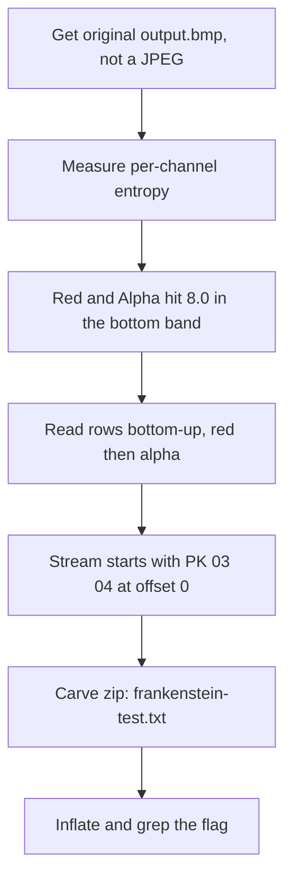

<h1 align="center">🖼️ Invisible WORDs</h1>
<p align="center">
  <b>picoCTF 2023 Forensics Write-Up</b>
</p>
<p align="center">
  
  
  
</p>
<p align="center">
  Channel Entropy, the Alpha Channel, and a Bottom-Up Zip
</p>

---

# 📋 Environment

| Item       | Value                                               |
| ---------- | --------------------------------------------------- |
| Event      | picoCTF 2023                                         |
| Category   | Forensics                                            |
| Difficulty | Hard                                                 |
| Author     | LT 'syreal' Jones                                    |
| Handout    | `output.bmp`, a 960x540 32-bit BMP                   |
| Tools Used | Python (struct, zlib)                                |
| Techniques | Per-channel entropy, red+alpha extraction, zip carve |

---

# 🗺️ Overview

> *Do you recognize this cyberpunk baddie? We don't either. AI art generators are all the rage nowadays, which makes it hard to get a reliable known cover image. But we know you'll figure it out. The suspect is believed to be trafficking in classics.*

The image hides a zip archive. Each pixel stores two payload bytes: one in the red channel and one in the invisible alpha channel. The title says it: a WORD is two bytes, one per pixel.

The steps:
* Get the real BMP
* Measure each channel to find the data
* Read two bytes per pixel, bottom-up
* Carve and unzip

---

# 📑 Table of Contents

1. [Step 1 - Get the Real File](#step-1---get-the-real-file)
2. [Step 2 - Find the Data Channels](#step-2---find-the-data-channels)
3. [Step 3 - Read Two Bytes Per Pixel](#step-3---read-two-bytes-per-pixel)
4. [Step 4 - Carve and Unzip](#step-4---carve-and-unzip)
5. [Full Solve Script](#full-solve-script)
6. [Attack Chain Summary](#attack-chain-summary)
7. [Lessons and Takeaways](#lessons-and-takeaways)

---

# Step 1 - Get the Real File

The payload lives in exact pixel byte values, so only the original `output.bmp` works. Any JPEG copy (a pasted image, a screenshot, a recompressed export) rewrites every pixel and destroys the data.

```text
$ file output.bmp
output.bmp: PC bitmap, Windows 3.x format, 960 x 540 x 32
```

> [!WARNING]
> If your file is a `.jpg`, or a `.bmp` that was recompressed, re-download the original. The bytes cannot be recovered from a lossy copy.

---

# Step 2 - Find the Data Channels

The image is 32-bit, so every pixel has blue, green, red, and alpha. Measure the entropy of each channel. Image data is low-entropy; compressed data maxes out near 8.0. Compare a normal row at the top against the noise band at the bottom:

```text
Row 100 (normal picture)          Bottom band (rows 451-539)
  Blue    entropy 6.94              Blue    entropy 6.97   visible art
  Green   entropy 5.88              Green   entropy 5.33   visible art
  Red     entropy 0.00  (all 255)   Red     entropy 8.00   data
  Alpha   entropy 0.00  (all 0)     Alpha   entropy 8.00   data
```

Outside the band, red is pinned to 255 and alpha to 0. Inside the band, both hit entropy 8.0. Red and alpha are the two data channels.

---

# Step 3 - Read Two Bytes Per Pixel

Each pixel gives two bytes: red, then alpha (the invisible channel). BMP rows are stored bottom-to-top, and the top row of the band is only partially filled, so read the image rows from the bottom upward.

Red-then-alpha, bottom-up, puts the zip signature `50 4B 03 04` at offset 0. No trimming needed.

---

# Step 4 - Carve and Unzip

From offset 0 the bytes are a complete zip with one deflate entry:

```text
name (b64): ZnJhbmtlbnN0ZWluLXRlc3QudHh0

$ echo ZnJhbmtlbnN0ZWluLXRlc3QudHh0 | base64 -d
frankenstein-test.txt
```

The archive holds the text of Mary Shelley's *Frankenstein* (the "classics"). Inflate it and grep for the flag:

```text
$ unzip -p hidden.zip frankenstein-test.txt | grep -o 'academy{[^}]*}'
academy{w0rd_d4wg_y0u_f0und_5h3113ys_m4573rp13c3_d856ed6b}
```

---

# Full Solve Script

```python
import struct, zlib, re

raw = open("output.bmp", "rb").read()

data_off = struct.unpack_from("<I", raw, 10)[0]
W        = struct.unpack_from("<i", raw, 18)[0]   # 960
H        = struct.unpack_from("<i", raw, 22)[0]   # 540
bpp      = struct.unpack_from("<H", raw, 28)[0]   # 32
row      = ((bpp * W + 31) // 32) * 4             # 3840

def pixel(x, y):                 # y = 0 is the top
    fr = H - 1 - y               # BMP rows are stored bottom-up
    p  = data_off + fr * row + x * 4
    return raw[p+2], raw[p+3]    # red, alpha

# Two bytes per pixel: red + invisible alpha, rows bottom to top.
payload = bytearray()
for y in range(H - 1, -1, -1):
    for x in range(W):
        r, a = pixel(x, y)
        payload += bytes([r, a])

z = bytes(payload)
z = z[z.index(b"PK\x03\x04"):]

name_len  = struct.unpack_from("<H", z, 26)[0]
extra_len = struct.unpack_from("<H", z, 28)[0]
comp_size = struct.unpack_from("<I", z, 18)[0]
start     = 30 + name_len + extra_len
book      = zlib.decompress(z[start:start + comp_size], -15).decode("latin-1")

print(re.search(r"academy\{[^}]*\}", book).group())
```

```text
$ python3 solve.py
academy{w0rd_d4wg_y0u_f0und_5h3113ys_m4573rp13c3_d856ed6b}
```

---

# 🚩 Flag

```text
academy{w0rd_d4wg_y0u_f0und_5h3113ys_m4573rp13c3_d856ed6b}
```

---

# Attack Chain Summary



---

# Lessons and Takeaways

* **Guard the original bytes.** Pixel-value stego dies in any lossy format. Confirm the handout is the untouched `output.bmp` first.
* **Measure, don't guess.** Per-channel entropy near 8.0 marks the channels carrying compressed data.
* **Read the title.** "Invisible WORDs" gives both the unit (a 2-byte word) and the trick (the invisible alpha channel).
* **Mind BMP row order.** Bitmaps store rows bottom-to-top; the right direction and byte order put a clean `PK` at offset 0.

---

Written by **TheDingo8MyBaby**
picoCTF 2023 • Invisible WORDs
