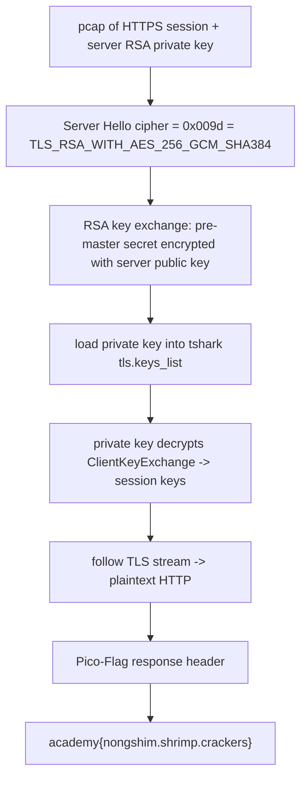

<h1 align="center">🔐 WebNet0</h1>
<p align="center">
  <b>picoCTF 2019 Forensics Write-Up</b>
</p>
<p align="center">
  
  
  
  
</p>
<p align="center">
  A Packet Capture, an RSA Private Key, and a Non-Forward-Secret Cipher Suite
</p>

---

# 📋 Environment

| Item       | Value                                                        |
| ---------- | ------------------------------------------------------------ |
| Event      | picoCTF 2019 (run on CyLab Security Academy)                 |
| Category   | Forensics                                                    |
| Author     | Jason                                                        |
| Handout    | `webnet0-capture.pcap`, `picopico.key.txt` (RSA private key) |
| Task       | Decrypt the captured TLS session and recover the flag        |
| Tools Used | `tshark` (Wireshark CLI)                                      |

---

# 🗺️ Overview

> A packet capture of an HTTPS session is given along with the server's RSA private key. The session was negotiated with a plain-RSA key-exchange cipher suite (no forward secrecy), so the private key alone is enough to decrypt the whole stream. Loading the key into Wireshark and following the TLS stream reveals the flag in a custom HTTP response header.

Steps:
* Confirm the negotiated cipher suite uses RSA key exchange
* Load the private key into `tshark` / Wireshark
* Follow the decrypted TLS stream and read the HTTP headers

---

# 📑 Table of Contents

1. [Why the Key Is Enough](#why-the-key-is-enough)
2. [Decrypting with tshark](#decrypting-with-tshark)
3. [Reading the Flag](#reading-the-flag)
4. [Flag](#-flag)
5. [Solution Summary](#solution-summary)
6. [Lessons and Takeaways](#lessons-and-takeaways)

---

# Why the Key Is Enough

The Server Hello picks the cipher suite for the connection. Here it is:

```text
tls.handshake.ciphersuite = 0x009d
= TLS_RSA_WITH_AES_256_GCM_SHA384
```

The `TLS_RSA_...` prefix is the whole point. With an RSA key-exchange suite, the client generates the pre-master secret, encrypts it with the server's **public** key, and sends it in the ClientKeyExchange message. Anyone holding the matching **private** key can decrypt that message, recover the pre-master secret, derive the session keys, and read the traffic.

> **In plain terms:** the browser locked the session key inside a box that only the server's private key can open. We have that private key, so we can open the box and read everything, even after the fact from a saved capture.

This would **not** work for an ephemeral suite (`TLS_ECDHE_...` or `TLS_DHE_...`), where the key exchange uses temporary values never sent on the wire. That is exactly the forward secrecy those suites provide. This capture uses static RSA, so the private key is sufficient.

---

# Decrypting with tshark

Point Wireshark's TLS dissector at the private key and follow the stream. The key list maps `any_ip, port, protocol, keyfile`:

```bash
tshark -r webnet0-capture.pcap \
  -o "tls.keys_list:0.0.0.0,443,http,picopico.key.txt" \
  -o "tls.desegment_ssl_records:TRUE" \
  -o "tls.desegment_ssl_application_data:TRUE" \
  -q -z follow,tls,ascii,0
```

In the Wireshark GUI the same thing is: Preferences > Protocols > TLS > "RSA keys list" (or "Pre-Shared-Key"/keylog on newer builds), add the key file, then right-click a packet > Follow > TLS Stream.

---

# Reading the Flag

The decrypted stream shows an ordinary HTTPS exchange. The flag is not in the page body; it is tucked into a custom response header on the CSS request:

```http
GET /starter-template.css HTTP/1.1
Host: ec2-18-223-184-200.us-east-2.compute.amazonaws.com
...

HTTP/1.1 200 OK
Date: Fri, 23 Aug 2019 15:56:36 GMT
Server: Apache/2.4.29 (Ubuntu)
Content-Encoding: gzip
Pico-Flag: academy{nongshim.shrimp.crackers}
Content-Length: 100
Content-Type: text/css
```

The `Pico-Flag` header carries it directly.

---

# 🚩 Flag

```text
academy{nongshim.shrimp.crackers}
```

---

# Solution Summary



---

# Lessons and Takeaways

* **Static RSA key exchange has no forward secrecy.** A `TLS_RSA_WITH_...` suite lets the server's long-term private key decrypt any past session recorded on the wire. This is precisely why modern TLS prefers ephemeral (EC)DHE suites.
* **Check the cipher suite first.** `0x009d` tells you immediately whether the private key will help. Against an ephemeral suite you would instead need a TLS key-log file, not the private key.
* **Wireshark decrypts natively.** No manual crypto is required; the TLS dissector derives the keys once the RSA key is loaded, and Follow > TLS Stream renders the plaintext.
* **The flag can hide in headers.** It was in a custom `Pico-Flag` response header, not the visible page, so read the full HTTP exchange rather than just rendered content.

---

Written by **TheDingo8MyBaby**
picoCTF 2019 • WebNet0 • flag: academy{nongshim.shrimp.crackers}
