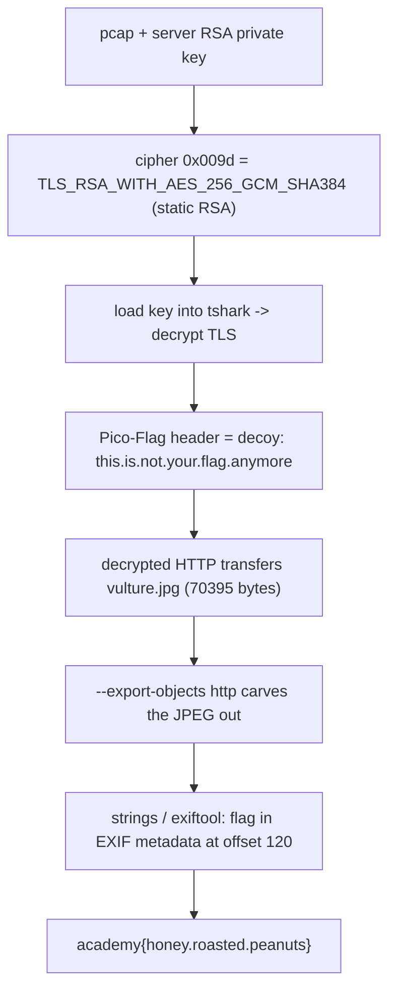

<h1 align="center">🦅 WebNet1</h1>
<p align="center">
  <b>picoCTF 2019 Forensics Write-Up</b>
</p>
<p align="center">
  
  
  
  
</p>
<p align="center">
  Decrypt the TLS Stream, Ignore the Decoy Header, Carve the Flag Out of a JPEG
</p>

---

# 📋 Environment

| Item       | Value                                                        |
| ---------- | ------------------------------------------------------------ |
| Event      | picoCTF 2019 (run on CyLab Security Academy)                 |
| Category   | Forensics                                                    |
| Author     | Jason                                                        |
| Handout    | `webnet1-capture.pcap`, `picopico.key.txt` (RSA private key) |
| Task       | Decrypt the captured TLS session and recover the real flag   |
| Tools Used | `tshark` (Wireshark CLI), `strings`, `exiftool`              |

---

# 🗺️ Overview

> Like its predecessor, this capture uses a static-RSA cipher suite, so the server's private key decrypts the whole session. The twist is that the obvious `Pico-Flag` HTTP header is a decoy reading `this.is.not.your.flag.anymore`. The real flag rides along inside a transferred image, `vulture.jpg`, sitting in its EXIF metadata. Export the image from the decrypted traffic and read the flag out of it.

Steps:
* Confirm the static-RSA cipher suite and load the key into Wireshark
* Export the HTTP objects from the decrypted stream
* Ignore the decoy header and pull the flag from the JPEG metadata

---

# 📑 Table of Contents

1. [Decrypting the Capture](#decrypting-the-capture)
2. [The Decoy Header](#the-decoy-header)
3. [Exporting the Image](#exporting-the-image)
4. [The Flag in the JPEG](#the-flag-in-the-jpeg)
5. [Flag](#-flag)
6. [Solution Summary](#solution-summary)
7. [Lessons and Takeaways](#lessons-and-takeaways)

---

# Decrypting the Capture

The Server Hello negotiates the same non-forward-secret suite as WebNet0:

```text
tls.handshake.ciphersuite = 0x009d
= TLS_RSA_WITH_AES_256_GCM_SHA384
```

With static RSA key exchange, the client encrypts the pre-master secret to the server's public key, so the matching private key recovers the session keys and decrypts the recorded traffic. Load the key into `tshark`:

```bash
tshark -r webnet1-capture.pcap \
  -o "tls.keys_list:0.0.0.0,443,http,picopico.key.txt" \
  -o "tls.desegment_ssl_records:TRUE" \
  -o "tls.desegment_ssl_application_data:TRUE" \
  -q -z follow,tls,ascii,0
```

> **In plain terms:** the session key was locked with the server's public key, and we hold the matching private key, so we can unlock and read the captured HTTPS exactly as WebNet0.

---

# The Decoy Header

The decrypted HTTP responses carry a `Pico-Flag` header, but it is bait:

```http
HTTP/1.1 200 OK
Server: Apache/2.4.29 (Ubuntu)
Pico-Flag: academy{this.is.not.your.flag.anymore}
Content-Type: text/css
```

The header itself tells you to look elsewhere. The same response set also fetches an image:

```http
GET /vulture.jpg HTTP/1.1
...
HTTP/1.1 200 OK
Content-Length: 70395
Content-Type: image/jpeg
```

---

# Exporting the Image

Wireshark can carve every transferred file out of the decrypted stream. `--export-objects http,<dir>` writes them to disk:

```bash
tshark -r webnet1-capture.pcap \
  -o "tls.keys_list:0.0.0.0,443,http,picopico.key.txt" \
  -o "tls.desegment_ssl_records:TRUE" \
  -o "tls.desegment_ssl_application_data:TRUE" \
  --export-objects "http,objs" -q
```

```text
objs/favicon.ico
objs/second.html
objs/starter-template.css
objs/vulture.jpg      <- 70395 bytes, JPEG 640x716
```

In the GUI this is File > Export Objects > HTTP, then save `vulture.jpg`.

---

# The Flag in the JPEG

A quick `strings` over the image surfaces the flag immediately:

```bash
strings vulture.jpg | grep academy
# academy{honey.roasted.peanuts}
```

It is not appended junk; it lives in the image's EXIF metadata. The flag sits at byte offset 120, right before the `ICC_PROFILE` APP2 marker (`ff e2`):

```text
... 00 00 00 01 'academy{honey.roasted.peanuts}' 00 00 ff e2 02 1c 'ICC_PROFILE' ...
```

`exiftool vulture.jpg` shows the same string embedded in the metadata block. So the flag is stored in the picture's EXIF data, which is exactly why the response header was a decoy.

---

# 🚩 Flag

```text
academy{honey.roasted.peanuts}
```

(The `Pico-Flag` header `academy{this.is.not.your.flag.anymore}` is a decoy.)

---

# Solution Summary



---

# Lessons and Takeaways

* **Decryption is only step one.** The static-RSA trick opens the traffic, but WebNet1 hides the flag one layer deeper, inside a transferred file rather than a header.
* **Treat obvious flags with suspicion.** A `Pico-Flag` header that literally says `not.your.flag.anymore` is a decoy; verify before submitting.
* **Carve the files, then inspect them.** Export Objects recovers every asset from the decrypted stream; run `strings`, `exiftool`, and `binwalk` on transferred images to find metadata-hidden data.
* **EXIF is a common stash.** The flag was in the JPEG's EXIF block, so always check image metadata, not just the pixels or appended bytes.

---

Written by **TheDingo8MyBaby**
picoCTF 2019 • WebNet1 • flag: academy{honey.roasted.peanuts}
