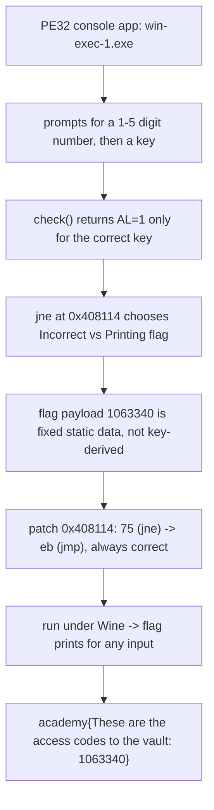

<h1 align="center">🪟 B1ll_Gat35</h1>
<p align="center">
  <b>picoCTF 2019 Reverse Engineering Write-Up</b>
</p>
<p align="center">
  
  
  
  
</p>
<p align="center">
  A Windows Console Binary, a Key Gate, and a One-Byte Branch Flip
</p>

---

# 📋 Environment

| Item       | Value                                                        |
| ---------- | ------------------------------------------------------------ |
| Event      | picoCTF 2019 (run on CyLab Security Academy)                 |
| Category   | Reverse Engineering                                          |
| Author     | Alex Bushkin                                                |
| Handout    | `win-exec-1.exe` (PE32 console, MSVC, not stripped)         |
| Task       | Reverse the Windows binary and print the flag               |
| Tools Used | `objdump`, `python` (`pefile`), Wine                         |

---

# 🗺️ Overview

> The program asks for a number of 1 to 5 digits, "initializes," then asks for a key to unlock the access codes. Enter the right key and it prints the flag; enter the wrong one and it says "Incorrect key." The flag payload is a fixed constant baked into the binary, revealed on the correct-key branch. Rather than reverse the obfuscated 64-bit key math, flip the single conditional jump that guards the flag-printing branch, then run the patched binary under Wine. The number and key turn out to be pure gatekeeping: the access code is the same no matter what you type.

Steps:
* Find the strings and the function that checks the key
* Flip the `jne` that chooses between "Incorrect" and "Printing flag"
* Run under Wine and read the constant flag

---

# 📑 Table of Contents

1. [Recon and Strings](#recon-and-strings)
2. [The Program Flow](#the-program-flow)
3. [The Key Gate](#the-key-gate)
4. [Patching the Branch](#patching-the-branch)
5. [Running It](#running-it)
6. [Flag](#-flag)
7. [Solution Summary](#solution-summary)
8. [Lessons and Takeaways](#lessons-and-takeaways)

---

# Recon and Strings

`win-exec-1.exe` is a 32-bit MSVC console app. Its strings lay out the whole game, including a leftover PDB path naming the author:

```text
C:\Users\abush\Desktop\pico-win-problems\win-exec-1.pdb
Input a number between 1 and 5 digits:
Number too big. Try again.
Initializing...
Enter the correct key to get the access codes:
Incorrect key. Try again.
Correct input. Printing flag:
academy{These are the access codes to the vault:
```

So the flag is assembled at runtime as `academy{These are the access codes to the vault: <value>}` and only printed after the key check passes.

---

# The Program Flow

The main routine reads a number, counts its digits, and gates on the count:

```asm
push   0x47b06c                 ; "Input a number between 1 and 5 digits: "
call   printf
... scanf("%d", &n) ...
; count digits of n by repeated /10
cmp    [digits], 0x5
jle    ok
push   0x47b098                 ; "Number too big. Try again."
...
ok:
push   0x47b0b4                 ; "Initializing..."
call   printf
... derive key state ...
push   0x47b0c8                 ; "Enter the correct key to get the access codes: "
call   printf
... fgets(buf, 100, stdin) ...
call   check                    ; returns AL = 1 if key correct
test   eax,eax
jne    correct                  ; <-- the gate
  push 0x47b0f8                 ; "Incorrect key. Try again."
  jmp  end
correct:
  push 0x47b114                 ; "Correct input. Printing flag: "
  call print_flag
```

> **In plain terms:** type a small number, then type a password. The password unlocks a printout. The number is only checked for how many digits it has; it does not change the secret.

---

# The Key Gate

The single instruction that decides everything is the `jne` right after the key check:

```asm
408112:  test eax,eax
408114:  75 0f    jne 0x408125     ; correct -> print flag
408116:           ...  "Incorrect key. Try again."
408125:           ...  "Correct input. Printing flag:"  + print_flag
```

The correct key is produced by an obfuscated 64-bit computation (MSVC incremental-link thunks, `%llu` formatting, custom operator routines). But the flag's access-code value is a fixed constant assembled from static data, not from the key. So there is no need to solve for the key: just force the branch.

---

# Patching the Branch

Flip the `jne` (`0x75`) at `0x408114` to an unconditional `jmp` (`0xeb`), so the flag branch is always taken:

```python
import pefile
pe = pefile.PE('win-exec-1.exe'); ib = pe.OPTIONAL_HEADER.ImageBase
def off(va):
    r = va - ib
    for s in pe.sections:
        if s.VirtualAddress <= r < s.VirtualAddress + s.Misc_VirtualSize:
            return s.PointerToRawData + (r - s.VirtualAddress)
d = bytearray(open('win-exec-1.exe','rb').read())
o = off(0x408114)
assert d[o] == 0x75          # jne
d[o] = 0xeb                  # jmp : always "correct"
open('win_patched.exe','wb').write(d)
```

---

# Running It

Under Wine, the patched binary prints the flag for any input, and the payload is identical every time, confirming the number and key are irrelevant to the secret:

```text
$ printf '1\nanything\n'   | wine win_patched.exe
academy{These are the access codes to the vault: 1063340}

$ printf '42\nfoo\n'       | wine win_patched.exe
academy{These are the access codes to the vault: 1063340}

$ printf '12345\nbar\n'    | wine win_patched.exe
academy{These are the access codes to the vault: 1063340}
```

Three different numbers, three wrong keys, one constant access code: `1063340`.

---

# 🚩 Flag

```text
academy{These are the access codes to the vault: 1063340}
```

---

# Solution Summary



---

# Lessons and Takeaways

* **Patch the gate, not the puzzle.** When a secret is printed on one side of a single conditional and the secret is not derived from the check, flipping that branch is faster than solving the key math.
* **Strings map the control flow.** "Initializing...", "Incorrect key", and "Printing flag" pinpointed the exact function and the branch to flip before any deep disassembly.
* **Prove constants by varying inputs.** Running the patched binary with several numbers and wrong keys showed the access code never changes, so `1063340` is genuinely baked in, not an artifact of the patch.
* **Wine runs Windows CTF binaries on Linux.** No Windows VM needed; a patched PE32 executes directly, which is far easier than emulating the full MSVC runtime by hand.
* **Leftover PDB paths leak context.** `C:\Users\abush\Desktop\pico-win-problems\win-exec-1.pdb` confirms the build origin and author, a reminder to strip debug paths from releases.

---

Written by **TheDingo8MyBaby**
picoCTF 2019 • B1ll_Gat35 • flag: academy{These are the access codes to the vault: 1063340}
