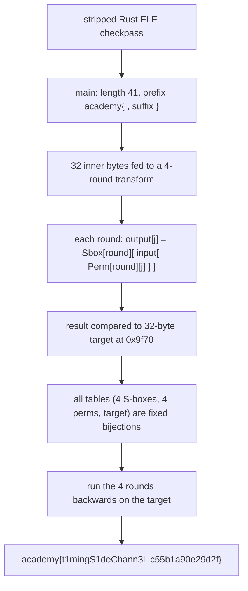

<h1 align="center">🔑 Checkpass</h1>
<p align="center">
  <b>picoCTF 2021 Reverse Engineering Write-Up</b>
</p>
<p align="center">
  
  
  
  
</p>
<p align="center">
  A Stripped Rust Binary, a Four-Round Substitution-Permutation Network, and Its Inverse
</p>

---

# 📋 Environment

| Item       | Value                                                        |
| ---------- | ------------------------------------------------------------ |
| Event      | picoCTF 2021 (run on CyLab Security Academy)                 |
| Category   | Reverse Engineering                                          |
| Author     | Jay Bosamiya                                                |
| Handout    | `checkpass` (64-bit PIE Rust ELF, stripped)                 |
| Task       | Recover the password (the flag)                             |
| Tools Used | `objdump`, a few lines of Python                             |

---

# 🗺️ Overview

> `./checkpass <password>` validates its argument. The password must be exactly 41 bytes, shaped `academy{` + 32 characters + `}`. The 32 inner characters are run through a four-round substitution-permutation network (SPN) and the result is compared byte-for-byte to a 32-byte target in `.rodata`. Every component (the four S-boxes, the four permutations, and the target) is a fixed table baked into the binary, and each is a bijection, so the whole transform is invertible. Running the target backwards through the four rounds yields the inner characters directly.

Steps:
* Find the length and format gate (`academy{...}`, 41 bytes)
* Identify the per-round transform as S-box substitution plus a position permutation
* Read the four S-boxes, four permutations, and the target out of the binary
* Invert the four rounds

---

# 📑 Table of Contents

1. [The Format Gate](#the-format-gate)
2. [The Round Function](#the-round-function)
3. [The Full Transform](#the-full-transform)
4. [Inverting It](#inverting-it)
5. [Flag](#-flag)
6. [Solution Summary](#solution-summary)
7. [Lessons and Takeaways](#lessons-and-takeaways)

---

# The Format Gate

The verdict strings (`Invalid length`, `Invalid password`, `Success`) lead straight to the checks in `main`. Before any crypto, the binary enforces the flag shape:

```asm
cmp QWORD PTR [rax+0x28], 0x29        ; length must be 0x29 = 41  -> else "Invalid length"
movabs rax, 0x7b796d6564616361        ; "academy{"  (little-endian)
cmp QWORD PTR [rbx], rax              ; first 8 bytes must be "academy{"  -> else "Invalid password"
cmp BYTE PTR [rbx+0x28], 0x7d         ; last byte must be '}'            -> else "Invalid password"
...
movups xmm0, [rbx]                    ; load the 32 inner bytes (indices 8..39)
movups xmm1, [rbx+0x10]
```

So the password is `academy{` + **32 inner bytes** + `}` = 41 bytes, and only those 32 inner bytes feed the transform.

> **In plain terms:** the program first checks the wrapper: the right total length, the `academy{` prefix, and the `}` suffix. Only the 32 characters between the braces are actually scrambled and checked.

---

# The Round Function

The transform routine is called four times (round = 0,1,2,3), and each round does two things to the 32-byte buffer:

1. **Substitution.** Each byte is replaced through a 256-entry S-box for that round, located at `.rodata` offset `0x8470 + round*256`:

```asm
movzx ecx, BYTE PTR [rsi+i]           ; c = buf[i]
lea   rax, [0x8470]                   ; S-box base
add   rax, rdx                        ; rdx = round<<8  -> S-box[round]
movzx ecx, BYTE PTR [rcx+rax]         ; c = Sbox[round][c]
```

2. **Permutation.** The substituted bytes are then shuffled by position, using a 32-entry index table for that round at `0x9fb0 + round*256` (entries are 8-byte indices):

```asm
mov   rcx, QWORD PTR [rdx+rax+off]    ; rax = 0x9fb0, rdx = round<<8 ; index = Perm[round][j]
movzx ecx, BYTE PTR [rsp+rcx-0x28]    ; read the substituted scratch at that index
mov   BYTE PTR [rdi+j], cl            ; write to output position j
```

Putting the two together, one round is:

```text
output[j] = Sbox[round][ input[ Perm[round][j] ] ]
```

> **In plain terms:** each round swaps every character for another via a lookup table, then rearranges the character positions. That is a classic substitution-permutation network, the same shape AES uses.

---

# The Full Transform

Four rounds are applied in sequence, and the 32-byte result is compared to a fixed 32-byte target at `0x9f70`:

```text
x = inner_bytes
for round in 0,1,2,3:
    x = [ Sbox[round][ x[Perm[round][j]] ] for j in 0..31 ]
require x == target        # else "Invalid password"
```

Each of the four S-boxes is a permutation of `0..255`, each of the four position tables is a permutation of `0..31`, and the target is fixed, so the entire map from inner bytes to target is a bijection. That means it inverts.

---

# Inverting It

Pull the tables straight out of the binary (here `.rodata`'s virtual address equals its file offset) and run the four rounds backwards:

```python
import struct
data   = open('checkpass','rb').read()
sbox   = [list(data[0x8470+r*256 : 0x8470+r*256+256]) for r in range(4)]
perm   = [[struct.unpack_from('<Q', data, 0x9fb0+r*256+j*8)[0] for j in range(32)] for r in range(4)]
target = list(data[0x9f70:0x9f70+32])

def inv_sbox(s):
    iv = [0]*256
    for i, v in enumerate(s): iv[v] = i
    return iv
sinv = [inv_sbox(s) for s in sbox]

y = target[:]
for r in (3, 2, 1, 0):
    t = [sinv[r][y[j]] for j in range(32)]     # undo substitution
    x = [0]*32
    for j in range(32):
        x[perm[r][j]] = t[j]                    # undo permutation
    y = x
print("academy{" + bytes(y).decode() + "}")
# academy{t1mingS1deChann3l_c55b1a90e29d2f}
```

The inner bytes come out as readable leetspeak, `t1mingS1deChann3l` ("timing side channel") with a hex tag, and feeding the full string back to the binary prints `Success`.

---

# 🚩 Flag

```text
academy{t1mingS1deChann3l_c55b1a90e29d2f}
```

---

# Solution Summary



---

# Lessons and Takeaways

* **A bijective checker inverts.** When a password is validated by transforming it and comparing to a constant, and every step is a permutation (S-box or position shuffle), you never brute-force; you run the pipeline in reverse.
* **Recognize the SPN shape.** Per-round table substitution followed by a position permutation is a substitution-permutation network. Spotting it tells you immediately that each round, and thus the whole thing, is invertible.
* **Read the format gate first.** The `academy{` prefix, `}` suffix, and 41-byte length check scoped the problem to exactly 32 unknown bytes before any crypto needed inverting.
* **Everything was in the binary.** The four S-boxes, the four permutations, and the target are static tables in `.rodata`, so the solve is pure data extraction plus a reverse pass, with no execution required.

---

Written by **TheDingo8MyBaby**
picoCTF 2021 • Checkpass • flag: academy{t1mingS1deChann3l_c55b1a90e29d2f}
