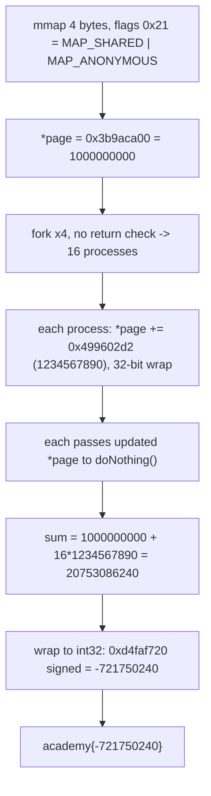

<h1 align="center">🍴 Forky</h1>
<p align="center">
  <b>picoCTF 2019 Reverse Engineering Write-Up</b>
</p>
<p align="center">
  
  
  
  
</p>
<p align="center">
  Four Forks, One Shared Page, and a Counter That Climbs Sixteen Times
</p>

---

# 📋 Environment

| Item       | Value                                                             |
| ---------- | ---------------------------------------------------------------- |
| Event      | picoCTF 2019 (run on CyLab Security Academy)                      |
| Category   | Reverse Engineering                                               |
| Author     | Samuel                                                           |
| Handout    | `vuln` (32-bit PIE ELF, not stripped)                            |
| Task       | Find the last integer passed to `doNothing()`                    |
| Flag Form  | `academy{IntegerYouFound}`                                       |
| Tools Used | `objdump`, and a short arithmetic check                          |

---

# 🗺️ Overview

> The binary writes a starting number into a memory page, calls `fork()` four times, then every resulting process adds a fixed constant to that number and hands the result to `doNothing()`. The catch is the page is mapped **shared**, so all the processes hammer the same counter. The last integer passed is the counter after all sixteen additions, truncated to 32 bits.

Steps:
* Read the `mmap` flags and spot `MAP_SHARED`
* Recover the starting value and the per-process constant
* Count the processes: four `fork()` calls with no return-value check means `2^4` = 16
* Add the constant sixteen times to the shared counter, modulo `2^32`

---

# 📑 Table of Contents

1. [The Shared Page](#the-shared-page)
2. [The Constants](#the-constants)
3. [Four Forks, No Branch](#four-forks-no-branch)
4. [What doNothing Receives](#what-donothing-receives)
5. [Computing the Last Value](#computing-the-last-value)
6. [Flag](#-flag)
7. [Solution Summary](#solution-summary)
8. [Lessons and Takeaways](#lessons-and-takeaways)

---

# The Shared Page

`main` calls `mmap`. In cdecl the arguments are pushed right to left, so reading them back off the stack:

```asm
push   0x0           ; offset = 0
push   0xffffffff    ; fd     = -1
push   [ebp-0x10]    ; flags  = 0x21
push   [ebp-0x14]    ; prot   = 0x3   (PROT_READ | PROT_WRITE)
push   0x4           ; length = 4 bytes
push   0x0           ; addr   = NULL
call   mmap@plt
mov    [ebp-0xc],eax ; save the returned pointer
```

The flags value `0x21` is the whole trick:

```text
0x21 = 0x20 (MAP_ANONYMOUS) | 0x01 (MAP_SHARED)
```

> **In plain terms:** a normal variable gets copied when a program forks, so each child has its own private version. This page is mapped **shared**, so every child and the parent all see and write the *same* four bytes. There is one counter, not sixteen separate ones.

Right after the map, the starting value is written in:

```asm
mov    DWORD PTR [eax],0x3b9aca00   ; *page = 1000000000
```

---

# The Constants

Two magic numbers drive the result:

| Hex          | Decimal        | Role                                 |
| ------------ | -------------- | ------------------------------------ |
| `0x3b9aca00` | `1000000000`   | starting value written to the page   |
| `0x499602d2` | `1234567890`   | added by every process               |

The add appears as an `lea` (a common way the compiler encodes `+ constant`):

```asm
mov    eax,DWORD PTR [ebp-0xc]      ; eax = page ptr
mov    eax,DWORD PTR [eax]          ; eax = *page
lea    edx,[eax+0x499602d2]         ; edx = *page + 1234567890
mov    eax,DWORD PTR [ebp-0xc]
mov    DWORD PTR [eax],edx          ; *page = edx   (32-bit store)
```

All of this is 32-bit arithmetic in a 4-byte slot, so every write wraps modulo `2^32`.

---

# Four Forks, No Branch

```asm
call   fork@plt
call   fork@plt
call   fork@plt
call   fork@plt
```

Four `fork()` calls, back to back, and **nothing checks the return value** (no `test eax,eax` / `jne` after any of them). So parent and child alike fall straight through to the next fork:

```text
1 process
  -> fork -> 2
  -> fork -> 4
  -> fork -> 8
  -> fork -> 16
```

Sixteen processes reach the increment, and each performs exactly one `+= 1234567890` on the one shared counter.

> **In plain terms:** every `fork()` doubles the number of running copies. Doing it four times gives `2 x 2 x 2 x 2` = 16 copies, and because nobody exits or branches, all 16 run the same add on the same shared number.

---

# What doNothing Receives

`doNothing` just stores its argument and returns; it is only there to make the passed value visible:

```asm
0000119d <doNothing>:
    mov    eax,DWORD PTR [ebp+0x8]   ; read the argument
    mov    DWORD PTR [ebp-0x4],eax   ; store it, do nothing else
    ret
```

Each process reads the counter it just updated and passes that to `doNothing`:

```asm
mov    eax,DWORD PTR [ebp-0xc]
mov    eax,DWORD PTR [eax]           ; eax = *page (post-increment)
push   eax
call   doNothing
```

So the sequence of values handed to `doNothing`, across the 16 increments of the shared counter, climbs by `1234567890` each time. The **last** one is the counter after all sixteen additions.

---

# Computing the Last Value

```text
start        = 1000000000
per process  = 1234567890
processes    = 2^4 = 16

arithmetic   = 1000000000 + 16 * 1234567890 = 20753086240
```

That sum does not fit in the counter's 4-byte slot, so it wraps modulo `2^32`, and
`doNothing` takes its parameter as a **signed** `int`. The final value is that wrap
read as signed:

```text
20753086240 mod 2^32 = 3573217056 = 0xd4faf720
0xd4faf720 as signed int32          = -721750240
```

The last integer passed to `doNothing()` is **-721750240**.

A quick check reproduces it:

```python
start, add = 0x3b9aca00, 0x499602d2
v = (start + 16*add) & 0xffffffff        # 3573217056  (0xd4faf720)
signed = v - 2**32 if v >= 2**31 else v  # -721750240
print(signed)
```

---

# 🚩 Flag

```text
academy{-721750240}
```

---

# Solution Summary



---

# Lessons and Takeaways

* **`MAP_SHARED` survives `fork()`.** A private page would give each process its own counter and a boring answer; the `0x21` flag is what makes all 16 increments land on one value.
* **Count forks by doubling.** With no branch on the return value, `n` sequential `fork()` calls produce `2^n` processes, and here every one of them runs the same code path.
* **Mind width and sign.** The sum `20753086240` does not fit in the 4-byte slot, so it wraps to `0xd4faf720`. Because `doNothing` takes a signed `int`, that reads as `-721750240`, which is the accepted answer. The unsigned reading (`3573217056`) and the untruncated sum (`20753086240`) are both wrong here.
* **`doNothing` is a probe, not logic.** It exists only to surface the value; the real computation is the shared-counter accumulation before the call.

---

Written by **TheDingo8MyBaby**
picoCTF 2019 • Forky • flag: academy{-721750240}
