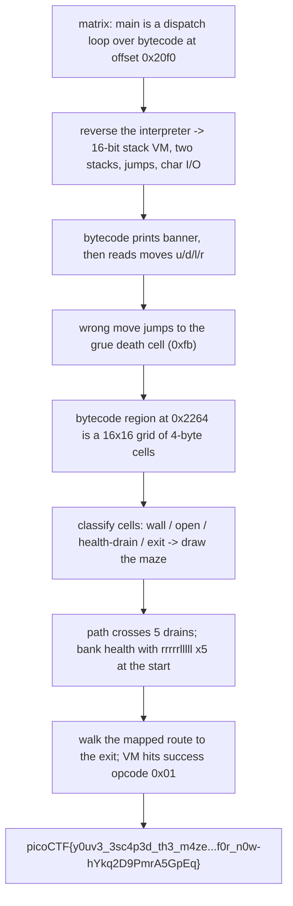

<h1 align="center">🟩 MATRIX</h1>
<p align="center">
  <b>picoMini by redpwn (2021) Reverse Engineering Write-Up</b>
</p>
<p align="center">
  
  
  
  
</p>
<p align="center">
  Reversing a Hand-Rolled Stack VM to Reveal a Maze, and Banking Health to Walk It
</p>

---

# 📋 Environment

| Item       | Value                                                              |
| ---------- | ----------------------------------------------------------------- |
| Event      | picoMini by redpwn 2021 (run on CyLab Security Academy)            |
| Category   | Reverse Engineering                                              |
| Difficulty | Hard                                                             |
| Author     | asphyxia                                                         |
| Handout    | `matrix` (64-bit ELF, PIE, stripped)                            |
| Task       | Feed the right moves to a custom VM so it prints the flag        |
| Tools Used | `objdump`, a hex view of the binary, a short Python parser       |

---

# 🗺️ Overview

> `matrix` looks tiny, but almost none of its logic is in native code. The real program is bytecode for a small hand-written stack machine, stored as data inside the binary, and the native `main` is just a dispatch loop that walks that bytecode one opcode at a time. Reversing the dispatcher gives us the full instruction set: push, pop, add, subtract, swap, two stacks, a couple of jumps, and read and write a character. The bytecode prints the "Welcome to the M A T R I X" banner, then reads single characters and only accepts `u`, `d`, `l`, and `r`. Anything else jumps to a death cell and prints "You were eaten by a grue." Those four letters are moves, and the bulk of the bytecode is a 16 by 16 grid of four-byte cells that is really a maze: most cells are walls that kill you, a handful drain a health counter, and one is the exit. Extracting and drawing that grid turns the whole thing into a visible maze. The last twist is the health counter: the path crosses several draining cells, so before setting out we bank health by bouncing right and left at the start, then walk the mapped route to the exit, and the VM prints the flag.

Steps:
* Find that `main` is a dispatch loop over bytecode stored at a fixed address, not real logic
* Reverse the dispatcher into an opcode table: stack ops, two stacks, jumps, character I/O
* See that only `u`, `d`, `l`, `r` are accepted and that a wrong move jumps to the "grue" death cell
* Extract the 16 by 16 grid of four-byte cells and classify each as wall, open, drain, or exit
* Bank enough health at the start, follow the mapped route to the exit, and read the flag

---

# 📑 Table of Contents

1. [A Binary with No Real Logic](#a-binary-with-no-real-logic)
2. [Reversing the Dispatcher](#reversing-the-dispatcher)
3. [The Instruction Set](#the-instruction-set)
4. [Moves, Not a Password](#moves-not-a-password)
5. [Extracting the Maze](#extracting-the-maze)
6. [The Health Counter and the Path](#the-health-counter-and-the-path)
7. [The Solve](#the-solve)
8. [Flag](#-flag)
9. [Solution Summary](#solution-summary)
10. [Lessons and Takeaways](#lessons-and-takeaways)

---

# A Binary with No Real Logic

`checksec`-style facts are unremarkable: a stripped 64-bit PIE that imports only `fgets`, `getc`, `putc`, `puts`, `fopen`, `fclose`, `malloc`, and `free`. The only strings of note are `Have a flag!` and `flag.txt`, so the program clearly reads the flag from a file and prints it once some condition is met.

The native entry, after the usual `__libc_start_main` dance, is one function. It allocates two `0x800`-byte buffers, loads the address of a data blob, and then spins in a loop calling a single helper until that helper returns zero:

```asm
1178:  mov  rsi, rbp            ; &status
       mov  rdi, rbx           ; &vm_state
       call step               ; the interpreter
       test al, al
       jne  1178               ; loop while step() != 0
```

After the loop it checks two status words, and only if both are zero does it run the branch that prints `Have a flag!` and streams `flag.txt` out character by character. So winning means driving that interpreter to a specific end state. The interesting code is not here; it is in the data the interpreter walks.

> **In plain terms:** the program barely does anything on its own. It just runs a little made-up computer whose entire program lives in the binary's data, and we win by making that little computer reach a particular finish.

---

# Reversing the Dispatcher

The helper (call it `step`) is the whole virtual machine. It takes a pointer to a small state structure:

```text
state[0]  code base pointer   (the bytecode blob, at offset 0x20f0)
state[1]  program counter     (a 16-bit offset into the bytecode)
state[2]  main stack top       (values are 16-bit, pushed two bytes at a time)
state[3]  secondary stack top
state[4]  getc thunk           (reads one char from stdin)
state[5]  putc thunk           (writes one char to stdout)
```

Each call reads the opcode at the current program counter, advances the counter, and dispatches through a jump table for opcodes up to `0x34`, with a separate tail for `0x80`, `0x81`, `0xc0`, and `0xc1`:

```asm
movzx eax, WORD [rbx+8]       ; pc
movzx eax, BYTE [rdi+rax]     ; opcode = code[pc]
cmp   al, 0x34
ja    .high                   ; 0x80/0x81/0xc0/0xc1
movsxd rax, DWORD [table + opcode*4]
add   rax, table
jmp   rax                     ; switch
```

Walking each case gives the full instruction set.

> **In plain terms:** one small function is the entire processor. It fetches the next instruction from the data blob, does one simple thing, and returns, and the outer loop keeps calling it. Decoding that function tells us the language the maze is written in.

---

# The Instruction Set

The machine is a 16-bit stack VM with two stacks and character I/O:

```text
0x00  no-op / status check
0x01  success  (ends the run in the winning state -> flag is printed)
0x10  dup      (push a copy of the top)
0x11  pop
0x12  add      (a = pop, b = pop, push b + a)
0x13  sub      (a = pop, b = pop, push b - a)
0x14  swap     (swap the top two)
0x20  move the top of the main stack onto the secondary stack
0x21  move the top of the secondary stack onto the main stack
0x30  jmp      (pop a value, set the program counter to it)
0x31  jz       (pop dest, pop cond ; if cond == 0, jump to dest)
0x80  push the next 1 byte, advance pc by 2
0x81  push the next 2 bytes, advance pc by 3
0xc0  read one character from stdin and push it
0xc1  pop a value and print it as a character
```

Only `0x30` and `0x31` change control flow by more than a step, so they are the branches and the computed jumps. Everything else nudges the program counter forward by one to three bytes. That is enough to read the program.

> **In plain terms:** it is a pocket calculator with a program counter. It can push numbers, do arithmetic, shuffle two stacks, jump around, and read and print letters. The two jump instructions are what turn a flat list of bytes into a maze.

---

# Moves, Not a Password

The bytecode opens by pushing the banner text one byte at a time (in reverse) and printing it with `0xc1`, which is the `Welcome to the M A T R I X` and `Can you make it out alive?` message. Then it reads a character with `0xc0` and tests it against four values by subtracting and using `jz`:

```text
read char
push 0x75 ('u'); sub; jz  -> up handler
push 0x64 ('d'); sub; jz  -> down handler
push 0x6c ('l'); sub; jz  -> left handler
push 0x72 ('r'); sub; jz  -> right handler
push 0xfb;  jmp            -> death cell ("You were eaten by a grue")
```

So the input is not a password, it is a stream of moves: `u`, `d`, `l`, `r`. Any other character jumps straight to offset `0xfb`, the death routine. Each valid move adjusts a position and jumps into a large region of the bytecode that is laid out as a grid.

> **In plain terms:** the program only understands up, down, left, and right. We are steering something through a map, and a single bad letter feeds us to the grue.

---

# Extracting the Maze

That grid starts at offset `0x2264` and runs in four-byte cells. Each cell is one of a few fixed patterns, and the pattern says what stepping onto the cell does:

```text
81 fb 00 30   push 0xfb, jmp   -> death  (a wall)
30 00 00 00   jmp              -> a normal open step
81 74 05 30   push 0x574, jmp  -> a cell that drains health
81 7f 05 30   push 0x57f, jmp  -> another draining cell
81 85 05 30   push 0x585, jmp  -> the exit
```

There are exactly 256 cells, which is 16 by 16. Reading them straight out of the binary and drawing walls as `#`, open cells as space, draining cells as `+`, and the exit as `$` renders the maze:

```text
################
#     +# #+  # #
####+### ### # #
#          # # #
## # ##### # + #
#  # #+  # # # #
# ## ### # # # #
# #      # # # #
# # ###### # # #
# #        # # #
# ### ###### # #
#   #  +  #  # #
# ###  #  # #  #
# #   ### # #+##
# #    #  + #  #
##############$#
```

You start at the open corner near the top left and have to reach the `$` at the bottom right, and the `+` cells along the way are the catch.

> **In plain terms:** the thousand-odd bytes after the input check are just a picture. Pulled out of the file and drawn, they are a 16 by 16 maze with walls, an exit in the far corner, and a few trap cells that bite.

---

# The Health Counter and the Path

Stepping onto a `+` cell does not kill you outright; it subtracts from a health value the VM keeps on the main stack. If that value is already used up, the drain is fatal. The route to the exit crosses five of these drains, so a naive shortest path dies partway through.

Health is banked at the very start. From the entrance, each step to the right increments the counter, and stepping back left does not spend it, so bouncing right and left in the opening corridor accumulates health without moving anywhere dangerous. Five round trips of `rrrrrlllll` leave the counter high enough to absorb all five drains on the way out. After banking, we follow the open corridors of the map to the exit:

```text
bank health :  rrrrrlllll  rrrrrlllll  rrrrrlllll  rrrrrlllll  rrrrrlllll
walk to exit:  rrr dd rrrrrr dddddd lllll dd rrrr ddd rr uuu r uuuuuuu rr dddddddd l dd rd
```

Concatenated, that is the full input.

> **In plain terms:** the trap cells drain a hidden life meter, and the way to the door passes five of them. So we first pace back and forth at the entrance to stock up life, which going right adds and going left keeps, then walk the safe corridors to the exit.

---

# The Solve

The whole input is the five banking cycles followed by the mapped route:

```text
rrrrrlllllrrrrrlllllrrrrrlllllrrrrrlllllrrrrrlllllrrrddrrrrrrddddddlllllddrrrrdddrruuuruuuuuuurrddddddddlddrd
```

Feed it to the service and the VM reaches the `0x01` success opcode, which satisfies the two status checks in `main`, so it opens `flag.txt` and prints it:

```sh
echo 'rrrrrlllllrrrrrlllllrrrrrlllllrrrrrlllllrrrrrlllllrrrddrrrrrrddddddlllllddrrrrdddrruuuruuuuuuurrddddddddlddrd' \
  | nc mars.cylabacademy.net 31259
```

```text
Welcome to the M A T R I X
Can you make it out alive?
Congratulations, you made it!
Have a flag!
picoCTF{y0uv3_3sc4p3d_th3_m4ze...f0r_n0w-hYkq2D9PmrA5GpEq}
```

> **In plain terms:** one line of moves, banking first and then walking the route, carries us to the exit, and the machine hands over the flag.

---

# 🚩 Flag

```text
picoCTF{y0uv3_3sc4p3d_th3_m4ze...f0r_n0w-hYkq2D9PmrA5GpEq}
```

---

# Solution Summary



---

# Lessons and Takeaways

* **When the native code is tiny, the program is probably data.** `main` here only allocates buffers and loops over a helper, which is the tell that the real logic is bytecode for a custom machine. Reversing the one interpreter function unlocks the entire program at once.
* **Recover the instruction set before anything else.** Turning the dispatcher into a clean opcode table (stack ops, two stacks, two jumps, character I/O) is what makes the thousand bytes of bytecode readable instead of hopeless.
* **Constrained input is a strong hint.** The bytecode accepts only `u`, `d`, `l`, `r` and punishes anything else, which reframes the whole challenge from guessing a password to steering through a map.
* **Structured data wants to be drawn.** The grid is 256 fixed-shape cells, which is 16 by 16; classifying each cell and printing it turns an opaque byte region into a maze you can read at a glance.
* **Watch for hidden resources, not just walls.** The naive route dies because the path drains a life counter the VM tracks on its stack. Spotting that mechanic, and that moving right banks life while moving left keeps it, is the difference between a path that looks right and one that actually survives.

---

Written by **TheDingo8MyBaby**
picoMini by redpwn 2021 • MATRIX • flag: picoCTF{y0uv3_3sc4p3d_th3_m4ze...f0r_n0w-hYkq2D9PmrA5GpEq}
