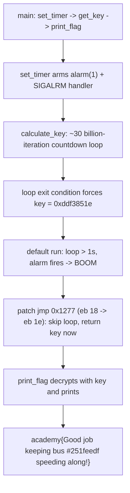

<h1 align="center">🏎️ Need For Speed</h1>
<p align="center">
  <b>picoCTF 2019 Reverse Engineering Write-Up</b>
</p>
<p align="center">
  
  
  
  
</p>
<p align="center">
  A One-Second Alarm, a Thirty-Billion-Iteration Delay Loop, and a Two-Byte Patch
</p>

---

# 📋 Environment

| Item       | Value                                                        |
| ---------- | ------------------------------------------------------------ |
| Event      | picoCTF 2019 (run on CyLab Security Academy)                 |
| Category   | Reverse Engineering                                          |
| Author     | Alexander Bushkin                                            |
| Handout    | `need-for-speed` (64-bit PIE ELF, not stripped)             |
| Task       | Recover the flag before the timer kills the process          |
| Tools Used | `objdump`, a two-byte binary patch, and the binary itself    |

---

# 🗺️ Overview

> The program sets a `SIGALRM` timer for one second, then computes a decryption key inside a deliberately enormous countdown loop and prints the flag. The loop takes far longer than one second, so the alarm fires first and the process aborts with "Not fast enough. BOOM!" The fix is to remove the delay (or the timer) so the key computation finishes and the flag prints. The key the loop is engineered to arrive at is fixed, so it can also be read straight from the disassembly.

Steps:
* Read `main` and see the `set_timer` then `get_key` then `print_flag` sequence
* Read `calculate_key` and notice the loop's exit value is a constant
* Neutralize the delay so the flag prints in time

---

# 📑 Table of Contents

1. [Program Flow](#program-flow)
2. [The Timer](#the-timer)
3. [The Delay Loop and the Final Key](#the-delay-loop-and-the-final-key)
4. [Beating the Clock](#beating-the-clock)
5. [Flag](#-flag)
6. [Solution Summary](#solution-summary)
7. [Lessons and Takeaways](#lessons-and-takeaways)

---

# Program Flow

`main` is a simple four-call sequence:

```asm
call   header       ; prints the banner
call   set_timer    ; arms a 1-second SIGALRM
call   get_key      ; computes the key (the slow part)
call   print_flag   ; decrypts and prints using the key
```

`get_key` calls `calculate_key`, stores the result in the global `key`, and `print_flag` passes that `key` to `decrypt_flag` before printing the decrypted `flag`.

> **In plain terms:** the program starts a one-second stopwatch, then does a slow calculation to unlock the flag. If the stopwatch runs out before the calculation is done, it self-destructs. The whole challenge is to make the calculation beat the clock.

---

# The Timer

`set_timer` installs `alarm_handler` for signal `0xe` (14 = `SIGALRM`) and arms `alarm(1)`:

```asm
mov    edi,0xe                 ; SIGALRM
lea    rsi,[rip+alarm_handler]
call   __sysv_signal@plt
...
mov    edi,0x1
call   alarm@plt               ; fire in 1 second
```

When the second is up, `alarm_handler` prints "Not fast enough. BOOM!" and exits.

---

# The Delay Loop and the Final Key

`calculate_key` looks like a computation but is really a stall:

```asm
mov    DWORD PTR [rbp-0x8],0xddf3851e   ; key = 0xddf3851e
mov    DWORD PTR [rbp-0x4],0x0          ; i = 0
jmp    check
loop:
    mov    DWORD PTR [rbp-0x8],0xbbe70a3c   ; reset key
inner:
    sub    DWORD PTR [rbp-0x8],0x1          ; key--
    cmp    DWORD PTR [rbp-0x8],0xddf3851e
    jne    inner                            ; spin until key == 0xddf3851e
    add    DWORD PTR [rbp-0x4],0x1          ; i++
check:
    cmp    DWORD PTR [rbp-0x4],0x7
    jle    loop                             ; repeat for i = 0..7
    mov    eax,DWORD PTR [rbp-0x8]          ; return key
    ret
```

Each pass sets the key to `0xbbe70a3c` and decrements a 32-bit value until it wraps around to `0xddf3851e`. That is about 3.7 billion decrements per pass, times eight passes, roughly **30 billion** iterations. That is the stall.

But the loop's only exit condition is `key == 0xddf3851e`, so whatever happens in between, the returned value is always that constant:

```text
final key = 0xddf3851e
```

> **In plain terms:** the loop is theater. It spends billions of steps counting down to a number that was already sitting in the code. The answer to "what is the final key?" is just the number the countdown is racing toward: `0xddf3851e`.

---

# Beating the Clock

Since the delay is the only obstacle, remove it. `calculate_key` already loads the correct return value (`0xddf3851e`) into the key slot on its very first instruction, so redirecting the initial `jmp` straight to the `ret` block skips all 30 billion iterations and returns the right key instantly.

The jump at `0x1277` is `eb 18` (jump to the loop check). Changing the displacement to `0x1e` points it at the return instead:

```python
data = bytearray(open("need-for-speed","rb").read())
off = 0x1277
assert data[off:off+2] == bytes([0xeb, 0x18])   # jmp +0x18 -> loop check
data[off+1] = 0x1e                               # jmp +0x1e -> the ret block
open("nfs_patched","wb").write(data)
```

Running the patched binary, the key computation finishes immediately and the flag prints before the alarm:

```text
Keep this thing over 50 mph!
============================
Creating key...
Finished
Printing flag:
academy{Good job keeping bus #251feedf speeding along!}
```

Other equally valid routes: `LD_PRELOAD` a stub `alarm()` that returns without arming, NOP out the `call alarm@plt` in `set_timer`, or attach with GDB, run `alarm(0)`, and let it finish.

---

# 🚩 Flag

```text
academy{Good job keeping bus #251feedf speeding along!}
```

Final key: `0xddf3851e`.

---

# Solution Summary



---

# Lessons and Takeaways

* **A timer plus a slow loop is an artificial deadline, not real crypto.** The "speed" theme is a self-destruct alarm racing a stall loop; kill either side and the flag falls out.
* **Read the loop's exit condition, not its body.** `calculate_key` churns for billions of steps but can only leave with `key == 0xddf3851e`, so the final key is readable straight from the `cmp`.
* **The smallest fix is often one jump.** The function already loads the answer on entry, so a single displacement byte turns a 30-billion-iteration wait into an instant return.
* **Know several ways to defang a timer.** Patching the loop, NOPing the `alarm` call, `LD_PRELOAD`ing an `alarm` stub, or zeroing the alarm in a debugger all work; pick whichever is quickest for the binary in front of you.

---

Written by **TheDingo8MyBaby**
picoCTF 2019 • Need For Speed • flag: academy{Good job keeping bus #251feedf speeding along!}
