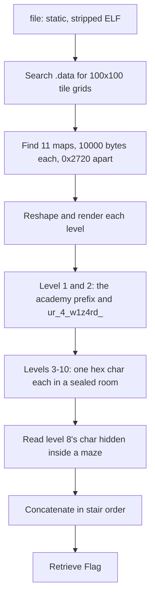

<h1 align="center">🧙 Wizardlike</h1>
<p align="center">
  <b>picoCTF 2022 Reverse Engineering Write-Up</b>
</p>
<p align="center">
  
  
  
</p>
<p align="center">
  Map Data in .data, ASCII-Art Rooms, and Reading the Flag Without Playing
</p>

---

# 📋 Environment

| Item       | Value                                               |
| ---------- | --------------------------------------------------- |
| Event      | picoCTF 2022                                         |
| Category   | Reverse Engineering                                  |
| Difficulty | Hard                                                 |
| Author     | LT 'syreal' Jones                                    |
| Handout    | `game`, a statically linked x86-64 ELF              |
| Tools Used | file, strings, Python (numpy, Pillow)               |
| Techniques | Static data carving, tile-grid rendering, ASCII art |

---

# 🗺️ Overview

> *You'd have to be a real wizard to make any progress in this sorry excuse for a dungeon! '.' is floor, '#' are walls, '<' are stairs up, and '>' are stairs down.*

Wizardlike is a terminal dungeon crawl. The flag is painted across the levels as floor-and-wall art, but the rooms holding it are walled off from the player. The intended solve is to patch your position and teleport into them. Instead, the level maps live in the binary as plain tile grids, so we can carve them out and read the flag directly.

The steps:
* Find the map grids in the binary
* Render each level as an image
* Read the flag fragments off the walls

The hint "you can teleport to anywhere on the map" confirms the flag sits in unreachable rooms. We skip movement entirely and read the raw map data.

---

# 📑 Table of Contents

1. [Step 1 - Identify the Binary](#step-1---identify-the-binary)
2. [Step 2 - Locate the Map Grids](#step-2---locate-the-map-grids)
3. [Step 3 - Render Each Level](#step-3---render-each-level)
4. [Step 4 - Read the Flag](#step-4---read-the-flag)
5. [Full Solve Script](#full-solve-script)
6. [Attack Chain Summary](#attack-chain-summary)
7. [Lessons and Takeaways](#lessons-and-takeaways)

---

# Step 1 - Identify the Binary

```text
$ file game
game: ELF 64-bit LSB executable, x86-64, statically linked, stripped
```

Statically linked and stripped. Rather than reverse the movement code, we look at the data the game draws from.

---

# Step 2 - Locate the Map Grids

The maps are 100x100 tile grids made of `.`, `#`, `<`, `>`, and spaces. Searching the file for long runs of those bytes finds eleven blocks of exactly 10,000 bytes (100 x 100), evenly spaced 0x2720 apart starting at `0x107100`:

```text
run at 0x107100 len 10000   (level 0)
run at 0x109820 len 10000   (level 1)
run at 0x10bf40 len 10000   (level 2)
...
run at 0x11f840 len 10000   (level 10)
```

Each block is one level's full map. The `<` and `>` stairs in each block confirm the level order runs top to bottom.

---

# Step 3 - Render Each Level

Reshaping each 10,000-byte block to 100x100 and drawing floors light, walls dark makes the hidden rooms readable. Levels 1 and 2 hold text banners; levels 3 through 10 each hold one character in a small room, some tucked inside mazes.

The rooms are far from the start position and sealed off, which is exactly why the challenge expects teleporting. On the page they are just pixels.

---

# Step 4 - Read the Flag

Reading the rooms in order:

| Level | Room contents |
| ----- | ------------- |
| 1     | `academy{`    |
| 2     | `ur_4_w1z4rd_` |
| 3     | `4`           |
| 4     | `C`           |
| 5     | `A`           |
| 6     | `9`           |
| 7     | `0`           |
| 8     | `4` (inside a maze) |
| 9     | `9`           |
| 10    | `2` and `}`   |

Level 8 is the tricky one: its character sits in a bordered room buried in a full maze, easy to miss. Level 10 carries the last hex digit and the closing brace.

Concatenated, the levels spell the flag.

---

# Full Solve Script

```python
import numpy as np
from PIL import Image

data = open("game", "rb").read()

# Eleven 100x100 maps, 10000 bytes each, spaced 0x2720 apart.
starts = [0x107100 + i * 0x2720 for i in range(11)]

for i, s in enumerate(starts):
    grid = np.frombuffer(data[s:s + 10000], np.uint8).reshape(100, 100)

    img = np.zeros((100, 100), np.uint8)
    img[grid == ord(".")] = 255      # floor
    img[grid == ord("#")] = 90       # wall
    img[grid == ord(">")] = 200
    img[grid == ord("<")] = 200

    # Crop to the content so the rooms are easy to read.
    ys, xs = np.where(grid != ord(" "))
    if len(xs):
        crop = img[ys.min():ys.max()+1, xs.min():xs.max()+1]
        h, w = crop.shape
        Image.fromarray(crop).resize((w*8, h*8), Image.NEAREST).save(f"level_{i}.png")
```

Open the eleven PNGs and read the rooms:

```text
academy{ + ur_4_w1z4rd_ + 4 C A 9 0 4 9 2 + }
```

---

# 🚩 Flag

```text
academy{ur_4_w1z4rd_4CA90492}
```

---

# Attack Chain Summary



---

# Lessons and Takeaways

* **Data beats gameplay.** The flag was static level data, not runtime state. Carving the maps skipped the entire dungeon crawl and the teleport patch.
* **Grids give themselves away.** Long runs of `.` `#` `<` `>` with a round size like 10,000 bytes are a 100x100 map. Even spacing across the file marks each level.
* **Render, do not squint.** Drawing tiles as pixels turns unreadable byte dumps into legible ASCII-art rooms.
* **Check the mazes.** One hex digit was walled inside a maze room. Every level held a character, so none could be skipped.

---

Written by **TheDingo8MyBaby**
picoCTF 2022 • Wizardlike
