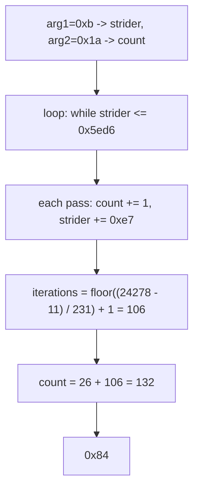

<h1 align="center">🔁 asm2</h1>
<p align="center">
  <b>picoCTF 2019 Reverse Engineering Write-Up</b>
</p>
<p align="center">
  
  
  
  
</p>
<p align="center">
  A Counting Loop, One Comparison, and Closed-Form Arithmetic
</p>

---

# 📋 Environment

| Item       | Value                                                        |
| ---------- | ------------------------------------------------------------ |
| Event      | picoCTF 2019 (run on CyLab Security Academy)                 |
| Category   | Reverse Engineering                                          |
| Difficulty | Hard                                                         |
| Author     | Sanjay C.                                                    |
| Handout    | `test.S` (32-bit x86 Intel-syntax disassembly of `asm2`)     |
| Task       | Compute `asm2(0xb, 0x1a)` and submit it as hex                |
| Tools Used | pen, paper, and a five-line Python check                     |

---

# 🗺️ Overview

> Given the disassembly of `asm2`, work out its return value for the arguments `(0xb, 0x1a)` and submit that value in hexadecimal (`0x...`). No binary is run; the answer comes from reading the assembly.

The function keeps two counters. One starts at the second argument and is bumped by one each pass. The other starts at the first argument and is bumped by a fixed stride until it passes a threshold. The loop is really a "how many strides fit under the ceiling" question, so the return value is the start counter plus that iteration count.

Steps:
* Map the two arguments onto the two local variables
* Read the loop as `while counter <= 0x5ed6`
* Count how many `+0xe7` strides run before the exit
* Add that count to the starting value

---

# 📑 Table of Contents

1. [Stack Layout](#stack-layout)
2. [The Loop](#the-loop)
3. [Counting the Iterations](#counting-the-iterations)
4. [Computing the Return Value](#computing-the-return-value)
5. [Flag](#-flag)
6. [Solution Summary](#solution-summary)
7. [Lessons and Takeaways](#lessons-and-takeaways)

---

# Stack Layout

The prologue reserves 16 bytes, then copies both arguments into locals:

```asm
push   ebp
mov    ebp,esp
sub    esp,0x10
mov    eax,DWORD PTR [ebp+0xc]   ; eax = arg2 = 0x1a
mov    DWORD PTR [ebp-0x4],eax   ; count = 0x1a
mov    eax,DWORD PTR [ebp+0x8]   ; eax = arg1 = 0xb
mov    DWORD PTR [ebp-0x8],eax   ; strider = 0xb
```

In the 32-bit cdecl convention the arguments sit above the saved frame pointer: `[ebp+0x8]` is the first, `[ebp+0xc]` the second. Naming the locals by what they do:

| Location    | Name      | Seeded from | Role                                  |
| ----------- | --------- | ----------- | ------------------------------------- |
| `[ebp+0x8]` | `arg1`    | `0xb`       | first argument                        |
| `[ebp+0xc]` | `arg2`    | `0x1a`      | second argument                       |
| `[ebp-0x4]` | `count`   | `arg2`      | return value, incremented by 1        |
| `[ebp-0x8]` | `strider` | `arg1`      | loop counter, incremented by `0xe7`   |

> **In plain terms:** the second argument (`0x1a` = 26) is the tally that gets returned. The first argument (`0xb` = 11) is a separate counter that climbs in fixed steps toward a finish line. Every step it takes, the tally goes up by one.

---

# The Loop

```asm
        jmp    <asm2+31>              ; check the condition first
<+20>:  add    DWORD PTR [ebp-0x4],0x1    ; count += 1
<+24>:  add    DWORD PTR [ebp-0x8],0xe7   ; strider += 0xe7 (231)
<+31>:  cmp    DWORD PTR [ebp-0x8],0x5ed6 ; compare strider with 24278
<+38>:  jle    <asm2+20>                  ; loop while strider <= 0x5ed6
<+40>:  mov    eax,DWORD PTR [ebp-0x4]     ; return count
        leave
        ret
```

The `jmp` at the top means the condition is tested **before** the first increment. So the body runs once for every value of `strider` that is `<= 0x5ed6` at the check point, and `count` returns holding its start value plus the number of body executions.

In plain arithmetic:

```text
count   = 0x1a  = 26      (start)
strider = 0xb   = 11      (start)
stride  = 0xe7  = 231
ceiling = 0x5ed6 = 24278
```

---

# Counting the Iterations

At each check, `strider = 11 + 231 * n` for `n = 0, 1, 2, ...`. The body runs whenever that value is `<= 24278`:

```text
11 + 231 * n <= 24278
231 * n       <= 24267
n             <= 105.05...
```

So `n` runs `0 ... 105`, which is **106** body executions. The last pass that runs has `strider = 11 + 231 * 105 = 24266` (still `<= 24278`); the next check sees `24266 + 231 = 24497 > 24278` and falls through to the return.

---

# Computing the Return Value

`count` starts at 26 and is incremented once per body execution:

```text
count = 26 + 106 = 132 = 0x84
```

A quick check confirms the hand trace:

```python
def asm2(a, b):
    count, strider = b, a
    while strider <= 0x5ed6:
        count += 1
        strider += 0xe7
    return count

print(hex(asm2(0xb, 0x1a)))   # 0x84
```

---

# 🚩 Flag

```text
0x84
```

Submitted as the hexadecimal value, not the usual `academy{...}` format.

---

# Solution Summary



---

# Lessons and Takeaways

* **Match arguments to locals before tracing.** `[ebp+0x8]` becomes `strider`, `[ebp+0xc]` becomes `count`; note that the second argument is the one that gets returned.
* **A top-of-loop `jmp` means test-first.** The condition is checked before the first increment, so the count is exact rather than off-by-one.
* **A fixed-stride loop is a division.** Instead of stepping 106 times, solve `strider_start + stride * n <= ceiling` for `n`, then the answer is `count_start + (n + 1)`.
* **Hand-derive, then verify in code.** The closed form gives the answer directly; a five-line script is the fast confirmation, not the method.

---

Written by **TheDingo8MyBaby**
picoCTF 2019 • asm2 • answer: 0x84
