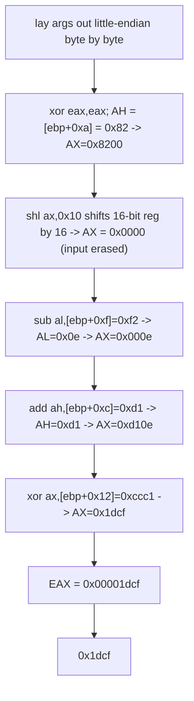

<h1 align="center">🧩 asm3</h1>
<p align="center">
  <b>picoCTF 2019 Reverse Engineering Write-Up</b>
</p>
<p align="center">
  
  
  
  
</p>
<p align="center">
  Partial Registers, Little-Endian Stack Bytes, and a Shift That Erases Its Own Input
</p>

---

# 📋 Environment

| Item       | Value                                                             |
| ---------- | ---------------------------------------------------------------- |
| Event      | picoCTF 2019 (run on CyLab Security Academy)                      |
| Category   | Reverse Engineering                                               |
| Difficulty | Hard                                                             |
| Author     | Sanjay C.                                                        |
| Handout    | `test.S` (32-bit x86 Intel-syntax disassembly of `asm3`)         |
| Task       | Compute `asm3(0xc682a0b0, 0xf2b059d1, 0xccc1df85)` and submit as hex |
| Tools Used | pen, paper, and a Unicorn emulation cross-check                   |

---

# 🗺️ Overview

> Given the disassembly of `asm3`, work out its return value for the three arguments and submit it in hexadecimal (`0x...`). No binary is run against the server; the answer comes from reading the assembly.

The whole function is eight arithmetic instructions on the sub-registers of `EAX` (`AX`, `AH`, `AL`). The catch is that it indexes **individual bytes** part-way into the stacked arguments, so the first job is to lay the three 32-bit arguments out as little-endian bytes and read off exactly which byte each instruction touches. There is also one deliberate trap: `shl ax,0x10` shifts a 16-bit register by 16 bits, which throws the value away entirely.

Steps:
* Lay the three arguments out as little-endian bytes on the stack
* Map each `[ebp+off]` reference to a specific byte or word
* Trace the `AH`/`AL`/`AX` arithmetic, respecting the shift trap
* Read the final `AX`, which is the return value

---

# 📑 Table of Contents

1. [The Stack Bytes](#the-stack-bytes)
2. [Which Byte Each Instruction Reads](#which-byte-each-instruction-reads)
3. [Instruction Trace](#instruction-trace)
4. [The Shift Trap](#the-shift-trap)
5. [Final Computation](#final-computation)
6. [Flag](#-flag)
7. [Solution Summary](#solution-summary)
8. [Lessons and Takeaways](#lessons-and-takeaways)

---

# The Stack Bytes

In 32-bit cdecl the three arguments sit above the saved frame pointer, four bytes each, stored **little-endian** (least significant byte at the lowest address). Writing each argument out byte by byte:

| Argument | Value        | `+0x8/0xc/0x10` | `+0x9/0xd/0x11` | `+0xa/0xe/0x12` | `+0xb/0xf/0x13` |
| -------- | ------------ | --------------- | --------------- | --------------- | --------------- |
| arg1     | `0xc682a0b0` | `b0`            | `a0`            | `82`            | `c6`            |
| arg2     | `0xf2b059d1` | `d1`            | `59`            | `b0`            | `f2`            |
| arg3     | `0xccc1df85` | `85`            | `df`            | `c1`            | `cc`            |

So the full byte map by stack offset:

```text
[ebp+0x8]=b0  [ebp+0x9]=a0  [ebp+0xa]=82  [ebp+0xb]=c6     ; arg1
[ebp+0xc]=d1  [ebp+0xd]=59  [ebp+0xe]=b0  [ebp+0xf]=f2     ; arg2
[ebp+0x10]=85 [ebp+0x11]=df [ebp+0x12]=c1 [ebp+0x13]=cc    ; arg3
```

> **In plain terms:** each argument is a 4-byte number, but the computer stores those bytes back-to-front. The function does not use the whole numbers, it reaches in and grabs single bytes from the middle of them. So the first move is to spell out every byte and label its address.

---

# Which Byte Each Instruction Reads

Cross-referencing the operands against the byte map:

| Operand              | Resolves to  | Value             |
| -------------------- | ------------ | ----------------- |
| `BYTE PTR [ebp+0xa]` | byte 2 of arg1 | `0x82`          |
| `BYTE PTR [ebp+0xf]` | byte 3 of arg2 | `0xf2`          |
| `BYTE PTR [ebp+0xc]` | byte 0 of arg2 | `0xd1`          |
| `WORD PTR [ebp+0x12]`| bytes 2..3 of arg3 (little-endian) | `0xccc1` |

---

# Instruction Trace

Following `EAX` and its sub-registers step by step:

```asm
xor    eax,eax                  ; EAX = 0x00000000
mov    ah,BYTE PTR [ebp+0xa]    ; AH = 0x82   -> AX = 0x8200
shl    ax,0x10                  ; AX <<= 16   -> AX = 0x0000   (see trap below)
sub    al,BYTE PTR [ebp+0xf]    ; AL = 0x00 - 0xf2 = 0x0e (borrow) -> AX = 0x000e
add    ah,BYTE PTR [ebp+0xc]    ; AH = 0x00 + 0xd1 = 0xd1 -> AX = 0xd10e
xor    ax,WORD PTR [ebp+0x12]   ; AX = 0xd10e ^ 0xccc1 = 0x1dcf
nop
pop    ebp
ret                             ; return value in EAX = 0x00001dcf
```

---

# The Shift Trap

The one instruction to be careful with is `shl ax,0x10`. `AX` is 16 bits wide and the shift count is `0x10` = 16. Shifting a register left by its own full width pushes **every** bit out the top, so `AX` becomes `0x0000`. The `0x82` that was just loaded into `AH` is wiped out and never affects the result.

> **In plain terms:** it loads a value, then immediately shoves it so far left that all of it falls off the edge. That first `mov ah, ...` is a red herring; after the shift, `AX` is back to zero.

Verified on a real execution engine rather than trusting the manual's "undefined" note for over-width shifts:

```python
# Unicorn emulation of the exact bytes, cdecl frame with the three args
# ... emu_start ...  ->  EAX = 0x1dcf
```

---

# Final Computation

Only the low 16 bits (`AX`) are ever built up; the upper half of `EAX` stays `0` from the initial `xor`. The last two operations decide the answer:

```text
AX after sub/add = 0xd10e
WORD [ebp+0x12]  = 0xccc1

0xd10e ^ 0xccc1:
  d10e = 1101 0001 0000 1110
  ccc1 = 1100 1100 1100 0001
  xor  = 0001 1101 1100 1111 = 0x1dcf

EAX = 0x0000_1dcf
```

---

# 🚩 Flag

```text
0x1dcf
```

Submitted as the hexadecimal value, not the usual `academy{...}` format.

---

# Solution Summary



---

# Lessons and Takeaways

* **Spell out the stack bytes first.** Byte-granular references like `[ebp+0xa]` only make sense once each argument is written out little-endian; guessing which byte is which is where this challenge bites.
* **`WORD PTR` pulls two adjacent little-endian bytes.** `[ebp+0x12]` is `c1 cc` in memory, which reads as `0xccc1`, not `0xc1cc`.
* **Watch partial-register width on shifts.** `shl ax,0x10` shifts by the register's full 16-bit width and clears it, so the earlier `mov ah,...` is a decoy. When over-width shift behavior matters, confirm it on a real CPU or emulator instead of assuming.
* **Only `AX` matters here.** The upper half of `EAX` is zeroed once and never touched, so the return is simply the final `AX`.

---

Written by **TheDingo8MyBaby**
picoCTF 2019 • asm3 • answer: 0x1dcf
