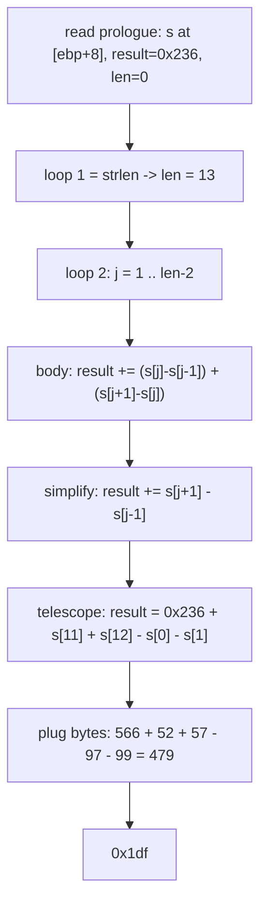

<h1 align="center">🧮 asm4</h1>
<p align="center">
  <b>picoCTF 2019 Reverse Engineering Write-Up</b>
</p>
<p align="center">
  
  
  
  
</p>
<p align="center">
  Reading x86 by Hand, a Telescoping Sum, and a Two-Character Answer
</p>

---

# 📋 Environment

| Item       | Value                                                        |
| ---------- | ------------------------------------------------------------ |
| Event      | picoCTF 2019 (run on CyLab Security Academy)                 |
| Category   | Reverse Engineering                                          |
| Difficulty | Hard                                                         |
| Author     | Sanjay C.                                                    |
| Handout    | `test.S` (32-bit x86 AT&T/Intel disassembly of `asm4`)      |
| Task       | Compute `asm4("academy_0a649")` and submit it as hex         |
| Tools Used | pen, paper, and a three-line Python check                    |

---

# 🗺️ Overview

> Given the disassembly of a single 32-bit function `asm4`, work out its return value for the input `"academy_0a649"` and submit that value in hexadecimal (`0x...`). No binary is run; the answer comes from reading the assembly.

The function does two things: it measures the string's length, then walks the interior characters accumulating a running total that starts at `0x236`. The accumulator update looks like it touches three characters per step, but the algebra collapses: each step reduces to a single difference, and the whole loop telescopes down to the string's endpoints.

Steps:
* Recover the stack layout and name each local variable
* Read loop 1 as `strlen`
* Read loop 2 as an accumulator over `s[j+1] - s[j-1]`
* Telescope the sum and plug in the bytes

---

# 📑 Table of Contents

1. [Stack Layout](#stack-layout)
2. [Loop 1: String Length](#loop-1-string-length)
3. [Loop 2: The Accumulator](#loop-2-the-accumulator)
4. [Telescoping the Sum](#telescoping-the-sum)
5. [Plugging In the Bytes](#plugging-in-the-bytes)
6. [Flag](#-flag)
7. [Solution Summary](#solution-summary)
8. [Lessons and Takeaways](#lessons-and-takeaways)

---

# Stack Layout

The prologue sets up the frame and reserves 16 bytes:

```asm
push   ebp
mov    ebp,esp
push   ebx
sub    esp,0x10
```

The one argument, the string pointer, sits at `[ebp+0x8]`. The hint says to **treat the Array argument as a pointer**, so `[ebp+0x8]` is the base address of the string and `[ebp+0x8] + k` is the address of character `k`. Naming the locals by how the code uses them:

| Location   | Name       | Role                                   |
| ---------- | ---------- | -------------------------------------- |
| `[ebp+0x8]`| `s`        | pointer to the input string            |
| `[ebp-0x10]`| `result`  | accumulator, seeded to `0x236`         |
| `[ebp-0xc]` | `len`     | character counter (becomes the length) |
| `[ebp-0x8]` | `j`       | index for the main loop                |

> **In plain terms:** the function is handed the address where the text begins. Adding a number to that address steps forward one letter at a time, and reading the byte at that address gives that letter's numeric code.

Initial values:

```asm
mov    DWORD PTR [ebp-0x10],0x236   ; result = 0x236
mov    DWORD PTR [ebp-0xc],0x0      ; len = 0
```

---

# Loop 1: String Length

```asm
        jmp    <asm4+27>
<+23>:  add    DWORD PTR [ebp-0xc],0x1     ; len++
<+27>:  mov    edx,DWORD PTR [ebp-0xc]     ; edx = len
        mov    eax,DWORD PTR [ebp+0x8]     ; eax = s
        add    eax,edx                     ; eax = s + len
        movzx  eax,BYTE PTR [eax]          ; al = s[len]
        test   al,al
        jne    <asm4+23>                   ; loop while s[len] != 0
```

This is a textbook `strlen`: increment `len` until the byte at `s[len]` is the NUL terminator. For `"academy_0a649"` that gives:

```text
len = 13
```

---

# Loop 2: The Accumulator

`j` starts at `1`, and the loop runs while `j < len - 1`:

```asm
<+42>:  mov    DWORD PTR [ebp-0x8],0x1     ; j = 1
        jmp    <asm4+134>
...
<+134>: mov    eax,DWORD PTR [ebp-0xc]     ; eax = len
        sub    eax,0x1                     ; eax = len - 1
        cmp    DWORD PTR [ebp-0x8],eax
        jl     <asm4+51>                   ; continue while j < len-1
```

The body computes two differences and adds both to `result`. Reading it in order:

```asm
; ebx = result + (s[j] - s[j-1])
movsx  edx,al        ; edx = s[j]
...
movsx  eax,al        ; eax = s[j-1]
sub    edx,eax       ; edx = s[j] - s[j-1]
mov    eax,DWORD PTR [ebp-0x10]  ; eax = result
lea    ebx,[edx+eax*1]           ; ebx = result + (s[j] - s[j-1])

; eax = (s[j+1] - s[j]) + ebx
movsx  edx,al        ; edx = s[j+1]
...
movsx  eax,al        ; eax = s[j]
sub    edx,eax       ; edx = s[j+1] - s[j]
mov    eax,edx
add    eax,ebx       ; eax = ebx + (s[j+1] - s[j])
mov    DWORD PTR [ebp-0x10],eax  ; result = ...
```

So each pass performs:

```text
result += (s[j] - s[j-1]) + (s[j+1] - s[j])
```

The `s[j]` cancels inside that expression, so each pass is really:

```text
result += s[j+1] - s[j-1]
```

---

# Telescoping the Sum

With `len = 13`, the loop runs `j = 1, 2, ... , 11`. Summing `s[j+1] - s[j-1]` over that range, every interior term appears once with a plus and once with a minus and cancels. Only the two highest indices and the two lowest survive:

```text
result = 0x236 + s[11] + s[12] - s[0] - s[1]
```

> **In plain terms:** although the loop looks like it stirs the whole string together, the middle letters all cancel out. The final number depends only on the first two letters and the last two letters, plus the starting constant.

---

# Plugging In the Bytes

Index the string and take ASCII codes:

| idx | 0  | 1  | 2  | 3  | 4  | 5  | 6  | 7  | 8  | 9  | 10 | 11 | 12 |
| --- | -- | -- | -- | -- | -- | -- | -- | -- | -- | -- | -- | -- | -- |
| chr | a  | c  | a  | d  | e  | m  | y  | _  | 0  | a  | 6  | 4  | 9  |
| dec | 97 | 99 | 97 |100 |101 |109 |121 | 95 | 48 | 97 | 54 | 52 | 57 |

Only `s[0]`, `s[1]`, `s[11]`, `s[12]` matter (`0x236` = 566):

```text
result = 566 + s[11] + s[12] - s[0] - s[1]
       = 566 +  52   +  57   -  97   -  99
       = 479
       = 0x1df
```

A quick check confirms the hand trace:

```python
s = "academy_0a649"
result = 0x236
for j in range(1, len(s) - 1):
    result += (ord(s[j]) - ord(s[j-1])) + (ord(s[j+1]) - ord(s[j]))
print(hex(result))   # 0x1df
```

---

# 🚩 Flag

```text
0x1df
```

Submitted as the hexadecimal value, not the usual `academy{...}` format.

---

# Solution Summary



---

# Lessons and Takeaways

* **Name the stack slots first.** Turning `[ebp-0x10]`, `[ebp-0xc]`, `[ebp-0x8]` into `result`, `len`, `j` makes the two loops readable at a glance.
* **A `movzx`/`test`/`jne` walk over a pointer is `strlen`.** Recognizing that pattern instantly gives you `len` without tracing every byte.
* **Simplify the accumulator before you compute it.** The body reads as three character accesses, but `(s[j]-s[j-1]) + (s[j+1]-s[j])` collapses to `s[j+1]-s[j-1]`, and the loop then telescopes to four endpoint bytes.
* **Hand-trace, then verify in code.** The algebra gives the answer directly; a three-line script is the fast confirmation, not the method.

---

Written by **TheDingo8MyBaby**
picoCTF 2019 • asm4 • answer: 0x1df
