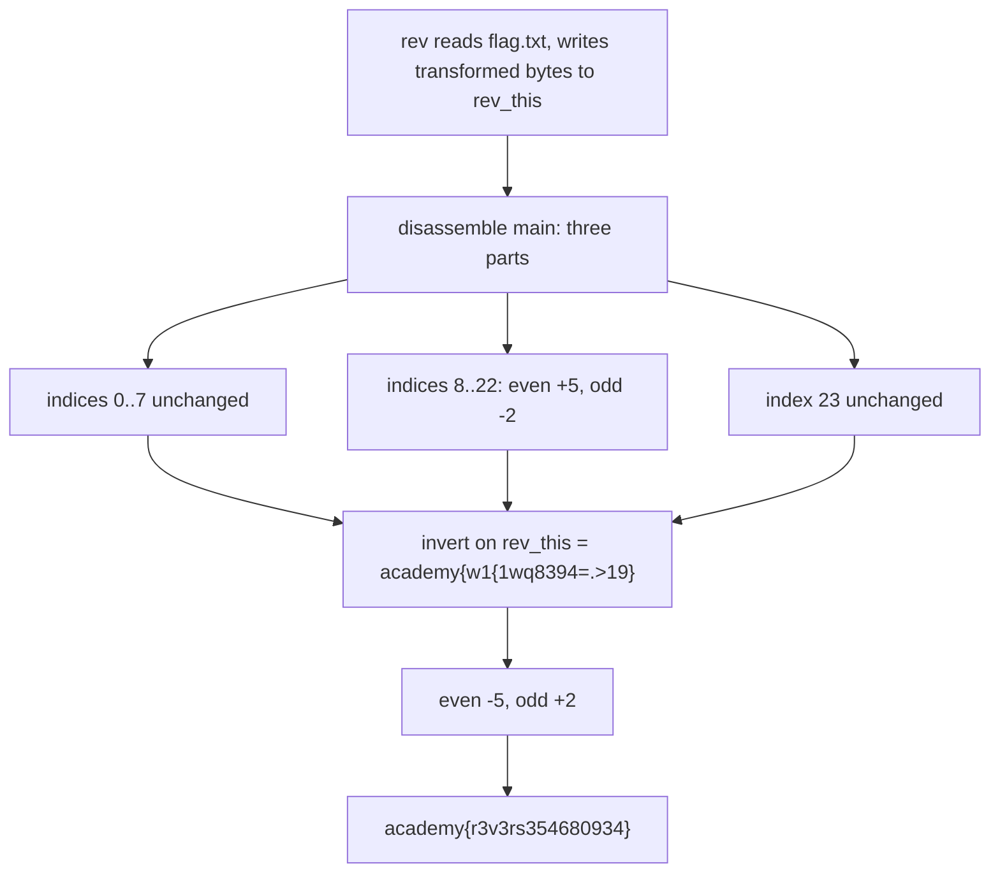

<h1 align="center">🔁 reverse_cipher</h1>
<p align="center">
  <b>picoCTF 2019 Reverse Engineering Write-Up</b>
</p>
<p align="center">
  
  
  
  
</p>
<p align="center">
  A Per-Index Byte Transform and Its One-Line Inverse
</p>

---

# 📋 Environment

| Item       | Value                                                        |
| ---------- | ------------------------------------------------------------ |
| Event      | picoCTF 2019 (run on CyLab Security Academy)                 |
| Category   | Reverse Engineering                                          |
| Author     | Danny Tunitis                                               |
| Handout    | `rev` (64-bit ELF), `rev_this` (its output)                 |
| Task       | Reverse the transform to recover the flag                   |
| Tools Used | `objdump`, a few lines of Python                             |

---

# 🗺️ Overview

> The binary reads `flag.txt`, runs each byte through a position-dependent transform, and writes the result to `rev_this`. We already hold `rev_this` = `academy{w1{1wq8394=.>19}`. Reading `main` shows the transform: the first eight bytes and the last byte pass through untouched, and the middle bytes are shifted by `+5` at even indices and `-2` at odd indices. Inverting that (subtract 5 at even, add 2 at odd) turns `rev_this` back into the flag.

Steps:
* Disassemble `main` and read the character loops
* Note which indices are untouched and which are shifted
* Apply the inverse shift to `rev_this`

---

# 📑 Table of Contents

1. [What the Binary Does](#what-the-binary-does)
2. [The Transform](#the-transform)
3. [Inverting It](#inverting-it)
4. [Verification](#verification)
5. [Flag](#-flag)
6. [Solution Summary](#solution-summary)
7. [Lessons and Takeaways](#lessons-and-takeaways)

---

# What the Binary Does

`main` opens `flag.txt` for reading and `rev_this` for writing, then `fread`s up to `0x18` = 24 bytes of the flag into a stack buffer and writes transformed bytes one at a time with `fputc`. It runs in three parts: an untouched prefix, a shifted middle, and an untouched final byte.

```asm
mov    DWORD PTR [rbp-0x8],0x0      ; i = 0
; --- loop 1: indices 0..7, copied unchanged ---
movzx  eax,BYTE PTR [rbp+rax-0x50]  ; c = buf[i]
call   fputc                        ; write c as-is
cmp    DWORD PTR [rbp-0x8],0x7
jle    ...                          ; while i <= 7
```

> **In plain terms:** the program copies the text file out character by character, but scrambles the middle section as it goes. The first eight characters and the very last one are copied straight through.

---

# The Transform

The middle loop runs indices 8 through 22 and branches on whether the index is even or odd:

```asm
; --- loop 2: indices 8..22 ---
mov    eax,[rbp-0xc]        ; i
and    eax,0x1
test   eax,eax
jne    odd                  ; i odd?
  add   BYTE PTR [rbp-0x1],0x5   ; even index: c += 5
  jmp   write
odd:
  sub   BYTE PTR [rbp-0x1],0x2   ; odd index:  c -= 2
write:
  call  fputc
cmp    DWORD PTR [rbp-0xc],0x16  ; while i <= 22
jle    ...
; --- index 23: copied unchanged ---
```

So the encoding is:

```text
index 0..7   : out = flag              (unchanged)
index 8..22  : even i -> out = flag + 5
               odd  i -> out = flag - 2
index 23     : out = flag              (unchanged)
```

---

# Inverting It

Reverse each rule on the known output `rev_this`:

```python
out = "academy{w1{1wq8394=.>19}"
flag = []
for i, ch in enumerate(map(ord, out)):
    if i <= 7 or i == 23:      flag.append(ch)        # unchanged
    elif i % 2 == 0:           flag.append(ch - 5)    # undo +5
    else:                      flag.append(ch + 2)    # undo -2
print(bytes(flag).decode())
# academy{r3v3rs354680934}
```

---

# Verification

Re-encoding the recovered flag reproduces `rev_this` exactly, confirming the inverse is correct:

```text
academy{r3v3rs354680934}   --(+5 even / -2 odd on 8..22)-->   academy{w1{1wq8394=.>19}
```

For example index 8 `r`(114) + 5 = `w`(119), index 9 `3`(51) - 2 = `1`(49), and so on through index 22.

---

# 🚩 Flag

```text
academy{r3v3rs354680934}
```

---

# Solution Summary



---

# Lessons and Takeaways

* **Position-dependent ciphers invert per position.** The only trick is the even/odd index split; once that is read off the `and 0x1 / test / jne`, each rule reverses independently.
* **Untouched ranges matter.** Eight prefix bytes and the final byte pass through unchanged, so only indices 8..22 need inverting; treating the whole string uniformly would corrupt the ends.
* **You already have the ciphertext.** `rev_this` is the program's output, so there is no need to run anything; read the transform statically and apply its inverse.
* **Verify by re-encoding.** Pushing the recovered flag back through the forward transform must reproduce `rev_this`, which is a cheap, total correctness check.

---

Written by **TheDingo8MyBaby**
picoCTF 2019 • reverse_cipher • flag: academy{r3v3rs354680934}
