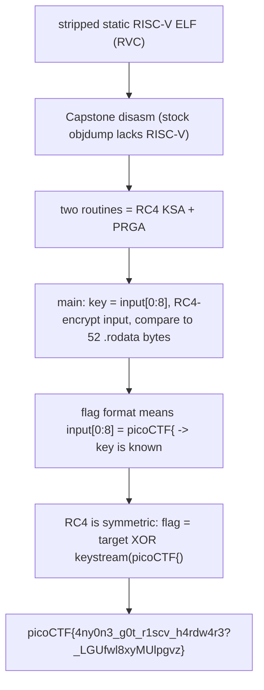

<h1 align="center">🧮 riscy business</h1>
<p align="center">
  <b>picoMini by redpwn Reverse Engineering Write-Up</b>
</p>
<p align="center">
  
  
  
  
</p>
<p align="center">
  A Stripped RISC-V Binary, Hand-Rolled RC4, and a Key Hiding in Plain Sight
</p>

---

# 📋 Environment

| Item       | Value                                                        |
| ---------- | ------------------------------------------------------------ |
| Event      | picoMini by redpwn (run on CyLab Security Academy)           |
| Category   | Reverse Engineering                                          |
| Author     | asphyxia                                                    |
| Handout    | `riscy` (1304-byte static RISC-V ELF, RVC, stripped)         |
| Task       | Reverse the checker and recover the flag                     |
| Tools Used | Capstone (RISC-V disassembly), a few lines of Python         |

---

# 🗺️ Overview

> The binary is a tiny statically-linked RISC-V (RV64GC) executable. It reads your input, uses the **first 8 bytes as an RC4 key**, RC4-encrypts the whole input in place, and compares the result against a 52-byte blob baked into `.rodata`. The twist is self-referential: the key is part of the flag. But every picoCTF flag begins with exactly eight characters, `picoCTF{`, so the key is known. RC4 is symmetric, so decrypting the target blob with key `picoCTF{` yields the flag directly.

Steps:
* Disassemble the RISC-V code (system `objdump` lacks RISC-V, so use Capstone)
* Recognize the two routines as RC4 KSA and PRGA
* See that the key is the input's first 8 bytes and the target is 52 bytes of `.rodata`
* Decrypt the target with key `picoCTF{`

---

# 📑 Table of Contents

1. [Getting a RISC-V Disassembly](#getting-a-risc-v-disassembly)
2. [Two Routines: RC4](#two-routines-rc4)
3. [What main Does](#what-main-does)
4. [The Key Is the Flag Prefix](#the-key-is-the-flag-prefix)
5. [Decrypting the Target](#decrypting-the-target)
6. [Flag](#-flag)
7. [Solution Summary](#solution-summary)
8. [Lessons and Takeaways](#lessons-and-takeaways)

---

# Getting a RISC-V Disassembly

`file` reports `ELF 64-bit LSB, UCB RISC-V, RVC, statically linked, stripped`. The stock `objdump` here cannot disassemble RISC-V (`can't disassemble for architecture UNKNOWN`), so Capstone with the RISC-V + compressed mode does the job:

```python
import capstone
md = capstone.Cs(capstone.CS_ARCH_RISCV,
                 capstone.CS_MODE_RISCV64 | capstone.CS_MODE_RISCVC)
for ins in md.disasm(text_bytes, 0x10078):
    print(hex(ins.address), ins.mnemonic, ins.op_str)
```

The strings give away the shape: "Got yourself a flag for me?", "You need to take some more riscs than that.", "That was a bit too riscy for me!", "Success!".

---

# Two Routines: RC4

Two subroutines sit before `main`:

**KSA (`0x10080`)** initializes `S[i] = i` for `i = 0..255`, then runs the RC4 key schedule:

```text
for i in 0..255:
    j = (j + S[i] + key[i % keylen]) & 0xff
    swap S[i], S[j]
```

**PRGA (`0x100d2`)** keeps its `i`/`j` counters in `S[256]`/`S[257]` and returns one keystream byte per call:

```text
i = (i + 1) & 0xff
j = (j + S[i]) & 0xff
swap S[i], S[j]
return S[(S[i] + S[j]) & 0xff]
```

That is standard RC4, implemented by hand in assembly.

> **In plain terms:** the program contains a complete RC4 cipher. RC4 turns a key into an endless stream of pseudo-random bytes, and "encrypting" just XORs your data with that stream. Crucially, XOR undoes itself, so the same key both encrypts and decrypts.

---

# What main Does

`main` (`0x10112`) does the following with system calls (RISC-V `ecall`, `a7` = syscall number: 63 read, 64 write, 93 exit):

```text
write(stdout, "You've gotten yourself into some riscy business...")
read input (up to 64 bytes, stopping at newline)   -> buffer, length-1 in s0
if length <= 8: print "...take some more riscs than that." ; exit   # need > 8 chars
KSA(sbox, key = input,  keylen = 8)                 # key = first 8 input bytes
for each input byte b (keystream k from PRGA):
    b ^= k                                          # RC4 encrypt in place
compare the encrypted input against 52 bytes at 0x10210 (.rodata)
    equal   -> "Success!"
    not     -> "That was a bit too riscy for me!"
```

The key register setup is explicit: `a2 = 8` (key length), `a1 = input`, `a0 = sbox`, then `jal` to the KSA. So the RC4 key is literally the first eight bytes of whatever you type.

---

# The Key Is the Flag Prefix

The comparison target is `flag_encrypted == rodata[0x10210 : 0x10210+52]`, where `flag_encrypted[k] = flag[k] XOR keystream[k]` and the keystream comes from `key = flag[0:8]`. That looks circular, until you remember the flag format: every picoCTF flag starts with

```text
picoCTF{      <- exactly 8 characters
```

So `flag[0:8] = "picoCTF{"` is the RC4 key, and it is known without running anything. RC4 is symmetric, so:

```text
flag[k] = target[k] XOR keystream_from("picoCTF{")[k]
```

---

# Decrypting the Target

Pull the 52-byte target out of `.rodata` (file offset `0x210`) and RC4-decrypt it with the known key:

```python
target = open('riscy','rb').read()[0x210:0x210+52]

def rc4(key, n):
    S = list(range(256)); j = 0
    for i in range(256):
        j = (j + S[i] + key[i % len(key)]) & 0xff
        S[i], S[j] = S[j], S[i]
    out = []; i = j = 0
    for _ in range(n):
        i = (i + 1) & 0xff; j = (j + S[i]) & 0xff
        S[i], S[j] = S[j], S[i]
        out.append(S[(S[i] + S[j]) & 0xff])
    return out

ks = rc4(b"picoCTF{", 52)
print(bytes(target[k] ^ ks[k] for k in range(52)))
# b'picoCTF{4ny0n3_g0t_r1scv_h4rdw4r3?_LGUfwl8xyMUlpgvz}'
```

The first eight bytes decrypt back to `picoCTF{`, which confirms the key guess was right and the whole flag fell out.

---

# 🚩 Flag

```text
picoCTF{4ny0n3_g0t_r1scv_h4rdw4r3?_LGUfwl8xyMUlpgvz}
```

---

# Solution Summary



---

# Lessons and Takeaways

* **Reach for Capstone on exotic ISAs.** When `objdump` cannot handle RISC-V (or ARM Thumb, MIPS, etc.), Capstone with the right arch/mode flags disassembles it in a few lines.
* **Recognize RC4 by shape.** A 256-byte table initialized to `0..255`, a key-schedule swap loop, and a two-counter generator returning `S[(S[i]+S[j])&0xff]` is RC4, no matter the instruction set.
* **Known plaintext breaks self-referential checks.** The key looked unknowable because it was part of the secret, but the fixed `picoCTF{` prefix is exactly eight bytes, which is the whole key. Always check whether the flag format hands you material.
* **XOR ciphers are symmetric.** Once the key is known, "encrypt" and "decrypt" are the same operation, so the baked-in ciphertext decrypts straight to the flag with no search.

---

Written by **TheDingo8MyBaby**
picoMini by redpwn • riscy business • flag: picoCTF{4ny0n3_g0t_r1scv_h4rdw4r3?_LGUfwl8xyMUlpgvz}
